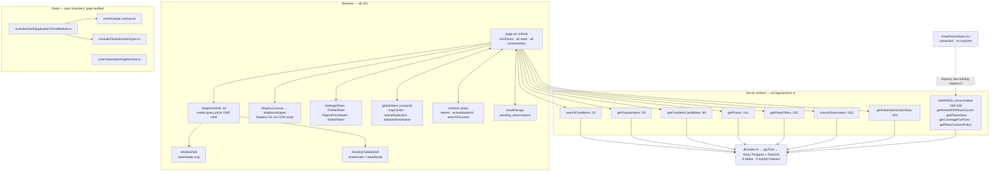

# WetinDey — the app map

> **What this is.** An honest map of what this application actually is, as
> opposed to what it intends to be. Every claim below carries a `file:line`.
> Where I could not verify something, it says so.

## Provenance and a warning about staleness

This map was assembled from eight subsystem surveys, six flow traces, and an
adversarial refutation pass — **all of which were run against an older tree**.
While writing, I re-verified every claim against:

- **HEAD `98f6a86`** ("Resolve theme before paint; hide scrollbars everywhere")
- plus an **uncommitted working tree**: `src/app/actions.ts` modified (+241
  lines), `src/app/_components/AreaPickerSheet.tsx` untracked
- snapshot taken **2026-07-16 ~15:26**

Three things follow, and they matter more than any single defect:

1. **The critical defect that dominated the surveys is fixed.** Every survey and
   every flow trace led with "all 30 places resolve to `{lng:0, lat:0}` — the map
   is empty, distance is always `0m`". That was true. It is not true now. Commit
   `6f465d1` ("Fix every location in the app being (0,0)") replaced the WKT regex
   with an EWKB decoder at `src/db/schema/index.ts:18-37`. I verified the decoder
   independently: fed the exact hex the driver returns for Festac Market
   (`0101000020E6100000FDA4DAA7E3310A402BF697DD93E71940`) through the algorithm at
   `src/db/schema/index.ts:22-36`, it yields `{lng: 3.27436, lat: 6.47615}` —
   matching the `ST_AsText()` ground truth the survey recorded. **It is not a
   defect and does not appear in section 6.** Anything in the traces that was
   downstream of it — empty map, unclickable stacked pins, garbage haversine — has
   to be re-read with that in mind, and I have done so below.
2. **The tree moved while I was mapping it.** `AreaPickerSheet.tsx` did not exist
   when I listed `src/` and existed four tool-calls later (mtime 15:25). Someone
   or something is writing this repo right now. Treat line numbers as a snapshot.
3. **The uncommitted work is aimed squarely at `docs/USER-FLOW.md` §1 and §4.**
   Four new server actions (`getAreasWithPlaceCounts`, `getPlacesNear`,
   `getCoverageForPoint`, `getPlaceContactPolicy`, `src/app/actions.ts:369-558`)
   and one new sheet. **None of it is wired.** `grep -rn "AreaPickerSheet" src/`
   returns only the file itself; each of the four actions greps to its own
   definition and nothing else. It is real, thoughtful, and currently inert.

Where the map is uncertain, section 9 says so.

---

## 1. What this app is

WetinDey is a single-page, map-first web app that shows crowd-reported street-food
prices for a south-west Lagos pilot (Festac / Amuwo Odofin / Satellite Town / Ojo),
seeded with 9 areas, 30 places, 11 items and 178 offers. A shopper searches an item
by canonical name or local-language alias, sees which markets have it and at what
price, and can report a price back through a `+` sheet.

It is one route (`/`), one client component (`src/app/page.tsx`, 1018 lines), and
one data-access file (`src/app/actions.ts`) between the UI and Postgres.

The part `docs/USER-FLOW.md:36-40` calls "the whole product" — asking the person
who actually went whether the answer was right — does not exist in any form.

---

## 2. Architecture at a glance

There is **no server component in the data path**. `src/app/page.tsx:1` is
`"use client"`; `src/app/layout.tsx` renders it; every byte of data arrives via
`"use server"` actions called from client effects and handlers. `src/app/actions.ts:3`
is the **only** file in the app that imports `db`.

The dead subgraph is not decoration: `FoodModule.ts` contains the only real trust
model in the repo (age-decayed confidence, a 72h freshness policy), and
`reportingMachine.ts` contains the only state machine for the report flow. The
live code reimplements neither.

---

## 3. The data model

Nine tables in one file, `src/db/schema/index.ts`, in three honest layers:

- **taxonomy** — `items` → `item_aliases` / `item_variants` → `units`
- **geography** — `areas` → `places` (both carry PostGIS `geography` points)
- **evidence** — `sources` → `observations` (immutable raw reports) →
  `offers_current` (a hand-maintained projection, rewritten inline by
  `submitObservation`, `src/app/actions.ts:267-297`)

The design is sound. The wiring is where it fails. Roughly a third of the defined
columns are never read.

### Read vs merely defined

| Column | State | Evidence |
|---|---|---|
| `offers_current.trustLevel` (`:193`) | **write-only** | 3 writes (`actions.ts:275`, `:293`, `seed.ts:263`), 0 reads. Also redundant: `seed.ts:262-263` derives it from the same `randomConfidence` as `freshnessState`. |
| `offers_current.expiresAt` (`:195`) | **write-only** | `actions.ts:234, 277, 295`, `seed.ts:265`. Never in a `WHERE`. |
| `observations.moderationStatus` (`:176`) | **write-only** | Defaults `pending`; the only writer (`actions.ts:217`) hardcodes `approved`. No read path filters it. |
| `sources.reliabilityScoreInternal` (`:158`), `.status` (`:157`) | **write-only** | Seeded 98/85/75 (`seed.ts:191-193`). `actions.ts:191-195` selects only `sources.id`. |
| `units.code`, `.dimension`, `.canonicalQuantity` (`:146-149`) | **write-only** | Only `units.displayName` is ever selected (`actions.ts:111`, `:161`, `:309`). No cross-unit ₦/kg normalisation is possible. |
| `item_aliases.normalizedAlias`, `.weight` (`:129-130`) | **write-only** | Search matches raw `alias` (`actions.ts:39`) and orders by nothing. |
| `places.verificationStatus` (`:97`) | **write-only** | Never reaches the UI. |
| `item_variants.active` (`:140`) | **never read or written** | See D14. |
| `areas.*` | **newly read, but unwired** | Was write-only; the uncommitted `actions.ts:369-393` and `:452-504` now query it. No caller yet. |
| `places.contactVisibility` (`:98`), `.openingInformation` (`:96`) | **newly read, but unwired** | Same — `actions.ts:531-558`. |
| `areas.parentAreaId` (`:80`), `item_variants.attributes` (`:139`), `observations.notes` (`:177`), `.rawPayload` (`:178`), `units.notes` (`:150`) | **never referenced at all** | Zero hits outside the schema and migrations. |
| `offers_current.currency`, `observations.currency` | **write-only** | UI hardcodes NGN (`page.tsx:505-512`). |

**Indexes:** `grep -c "CREATE INDEX" src/db/migrations/*.sql` → `0` and `0`. Primary
keys and five `slug`/`code` uniques exist (implicit btrees); no FK index, and **no
GIST index on `places.location` or `areas.center`**. Note the uncommitted comment at
`actions.ts:398-401` claims `ST_DWithin` "uses the spatial index" — there is no
spatial index to use.

---

## 4. Every surface

One route. Everything is a presented surface, per `docs/USER-FLOW.md:139-141`.

| Surface | Reached from | Where |
|---|---|---|
| Map (base layer, always mounted) | root | `page.tsx:539-546`, `AdaptiveShell.tsx:49-51` |
| Location pill "Showing Festac" | map chrome | `page.tsx:556-560` — a `div`+`span`, **not a control** |
| Theme toggle | map chrome | `page.tsx:562-571` — works |
| Results sheet (mobile bottom sheet / desktop left sidebar) | always | `page.tsx:574`, `AdaptiveShell.tsx:57-73` |
| Popular items grid | landing, no query | `page.tsx:636-670` |
| Search results | typing | `page.tsx:687-702` |
| Offers list for an item | tapping an item card | `page.tsx:706-786` |
| Offer detail panel | tapping an offer/pin | `page.tsx:791-882` — **desktop only** |
| Place detail panel | tapping a neutral pin | `page.tsx:884-957` — **desktop only** |
| Report a price | `+` button `page.tsx:589-596` | `ReportPriceSheet`, `page.tsx:990-1015` |
| Profile hub | avatar `page.tsx:598-606` | `ProfileSheet.tsx` |
| Settings (language / theme / radius) | Profile → Settings | `SettingsSheet.tsx` |
| Area picker | **nothing** | `AreaPickerSheet.tsx` exists, has no importer |

The offer/place detail panels are the only surface that renders freshness,
confidence and data source. `AdaptiveShell.tsx:59-63` passes `detailNode` to
`DesktopTabletShell` only; `MobileShell.tsx:6-11` has no such prop. On a phone —
the product's own stated form factor — those three dimensions do not exist.

`ProfileSheet.tsx` renders "My reports", "Saved markets", "Report a problem" and
"About" as `disabled` rows, which is honest. "Change area" (`ProfileSheet.tsx:66-72`)
is **not** disabled — it has `onClick={() => {}}` and `detail="Festac"`, and
`ListRow.tsx:29-36` renders any row with an `onClick` as an enabled `<button>` with
a chevron. `docs/USER-FLOW.md:69` describes this row as "disabled". It is not; it is
a live-looking control that does nothing.

---

## 5. The flows

My input carried six flow traces; three arrived truncated. Rows 1-3 are the traces
I received, **corrected against the current tree** (their original verdicts were
written before the `(0,0)` fix and are, in places, obsolete). Rows 4-6 I traced
myself from the source cited.

| Flow | Verdict | The short version |
|---|---|---|
| **find-a-price** | **partial** (was `broken`) | Map centres on Festac and — since `6f465d1` — pins now land on real coordinates. Alias search works (`actions.ts:32,39`). What still fails: search-result cards render "No price yet / Check again" because `searchFoodItems` returns only the `itemCard` projection (`actions.ts:8-17`) with no price or freshness, while `ItemCard.tsx` defaults the missing fields; the offers query filters on variant and nothing else (`actions.ts:118`) — no radius, no expiry, no availability; there is no `ORDER BY`, so "compare" has no ranking; distance still reads `0m away` for the first result (D2); and three of the five comparison dimensions never reach a phone. |
| **report-a-price** | **partial** | The write genuinely works end to end: `page.tsx:480` → `actions.ts:206-219` inserts a real observation and rewrites `offers_current`. But the availability answer is discarded (D4), the unit picker is unscoped (D12), the variant picker can never change anything (11 items, 11 variants, `seed.ts:105-115`, auto-selected at `page.tsx:341-348`), and the refresh is theatre: `getPlaces()` at `page.tsx:487` carries no price data, `popularItems` is never re-fetched (only call site `page.tsx:269`), `placeOffers` is never re-fetched. Report from the landing screen and **nothing on screen changes**. |
| **act-on-a-result** | **not-built** | There is no "Get it" affordance anywhere. Six `<Button>`s — `page.tsx:754`, `:760`, `:871`, `:875`, `:943`, `:947` — carry an icon, a translated label and **no `onClick`**. They render enabled and depress on tap. No platform maps hand-off, no `navigator.share`, no contact model. `docs/USER-FLOW.md:81` calls this correctly. |
| **change-location** (traced here) | **not-built** | `mapCenter` starts at `PRIMARY_LOCATION` (`globalStore.ts:29-30`). `selectedAreaName` is the literal `"Festac"` (`globalStore.ts:33`); its setter `setSelectedAreaName` (`:39`) is **never called** — grep returns only the two declaration lines, so the label is immutable at runtime. The pill is not a button (`page.tsx:556-560`). `userLocation` (`globalStore.ts:31`) is never written by anything in `page.tsx`. `AreaPickerSheet.tsx` would fix all of this and has no importer. |
| **settings** (traced here) | **partial** | Language and theme work: `SettingsSheet.tsx:78-101` → `page.tsx:978-988`, and `TRANSLATIONS` (`page.tsx:87-196`) covers en/pidgin/yoruba. Neither is persisted (no `localStorage` write for either; the only `localStorage` key in the app is `pending_observations`). The radius slider (`SettingsSheet.tsx:103-124`) changes a number no query reads (D11). |
| **offline-report** (traced here) | **partial** | Queue-to-`localStorage` and replay on `online` are real (`page.tsx:456-477`, `:296-338`). Three faults: the branch keys on `navigator.onLine` (`page.tsx:456`), which is `true` on a connected-but-dead link — the exact Nigerian failure — so the report throws into `page.tsx:500` and is dropped, not queued; the queue is cleared only after the whole loop (`page.tsx:319`), so a mid-loop failure replays the already-committed entries (D8); and `syncOfflineEntries` re-runs on every `selectedItem` change (dep array `page.tsx:338`) while calling itself at `:335`. |

---

## 6. Confirmed defects

Only defects that survived adversarial refutation **and** that I re-verified against
the current tree. The null-island defect is excluded: it is fixed (see Provenance).
Severities are the post-refutation ones, which corrected several claims downward.

### High

**D1 — `expiresAt` is written by two paths and enforced by none.**
`src/app/actions.ts:234` (compute), `:277`, `:295` (store); `src/db/seed.ts:265`.
Those four writes plus the column declaration (`schema/index.ts:195`) and the DDL are
the *only* occurrences in `src/`. It appears in no `WHERE`. All three readers are
unfiltered: `getPopularItems` filters `items.active` only (`actions.ts:76`),
`getFoodItemCandidates` filters variants only (`actions.ts:118`), `getPlaceOffers`
filters `placeId` only (`actions.ts:167`). There is no cron and no route handler.
**Consequence:** nothing ever expires. Compounding it, `freshnessState` never decays —
`submitObservation` hardcodes `"confirmed"` (`actions.ts:274`, `:292`) and nothing
downgrades it, so a green "Confirmed" pill (`page.tsx:838-852`) is a one-way ratchet.
*The refutation pass corrected the framing:* the "89 of 178 offers already expired"
figure is a seed artifact (`seed.ts:265` derives expiry from a backdated `observedAt`;
production always writes `now+72h`), so no user is acting on a stale vendor price
*today*. The enforcement gap is live production code and fires as soon as real data
ages past 72h.

**D2 — Distance is measured from the wrong point, and the first result always reads "0m away".**
`page.tsx:401-403`: on item select, `setMapCenter({lat: candidates[0].lat, lng: candidates[0].lng})`.
`page.tsx:414`: on marker select, `setMapCenter(match.location)`. Distance is then
`getHaversineDistance(mapCenter.lat, mapCenter.lng, offer.lat, offer.lng)` at
`page.tsx:732` (list) and `:804` / `:895` (detail). **Consequence:** the map recentres
onto the first offer, so that offer measures zero from itself and renders "0m away"
(`geospatial.ts:44-47`), and every other offer is measured from *that market*, not from
the user. This is independent of the geography fix and survives it. Distance-from-user
needs `userLocation`, which `globalStore.ts:31` declares and nothing writes.

**D3 — `supportingObservationCount` is fabricated, and the UI renders it as a percentage.**
`src/db/seed.ts:266` writes `1 + Math.floor(Math.random() * 4)` while `seed.ts:241-250`
inserts exactly **one** observation per offer. `actions.ts:135` computes
`confidenceScore: r.offer.supportingObservationCount * 10`; `page.tsx:857` prints it as
`{...}%`. A read-only query over all 178 live offers (run in the survey pass) found
138/178 diverging from their real observation count — every offer has exactly one real
observation. **Consequence:** a fabricated evidence claim on the product's core value
proposition. It never self-corrects: `actions.ts:278` does
`supportingObservationCount: offer.supportingObservationCount + 1`, incrementing the
fictional base, even though the same function already queries the real observations two
statements earlier (`actions.ts:240-250`). *Refutation note:* the RNG caps at 4, so the
displayed value today is only ever 10-40% — the fabrication currently makes prices look
*less* corroborated, not more. The score is also uncapped: an eleventh report renders
"110%", exactly as `docs/USER-FLOW.md:168-170` anticipates.

**D4 — Reporting "out of stock" produces "Confirmed Available".**
The segmented control (`ReportPriceSheet.tsx:138-162` → `page.tsx:1009`) sets
`availabilityState` faithfully, and `actions.ts:270`/`:288` stores it. Then both
branches hardcode `freshnessState: "confirmed", trustLevel: "high"`
(`actions.ts:274-275`, `:292-293`) regardless. `getFoodItemCandidates` never selects
`availabilityState` (`actions.ts:120-137`) and never filters on it (`:118`), surfacing
`freshnessState` as `confidenceLevel` (`:134`) instead — which `page.tsx:846-850` renders
as "Confirmed Available". **Consequence:** reporting "No, e don finish" writes a priced,
green, "Confirmed Available" offer. The form also refuses to submit without a price
(`page.tsx:434`), so the user must invent one to report an empty stall. Half the control
is decorative, and the report makes the data worse than silence. Separately,
`getPlaceOffers` fetches `availabilityState` (`actions.ts:176`) and `page.tsx:916-933`
never renders it.

### Medium

**D5 — The price recompute has no time window, despite a comment saying "recent".**
Comment `actions.ts:239` says "Fetch recent prices"; the query at `:240-250` filters on
`itemVariantId`, `unitId`, `placeId`, `availabilityState` — **no `observedAt` bound**.
`:259-264` takes `Math.min`/`Math.max` over the whole set. Nothing ever prunes
`observations` (grep for `delete|prune|purge|cron` in `src/`: zero hits).
**Consequence:** the range only ever widens; one anomalous ₦300 report pins `priceMin`
forever; `priceKind` latches to `"Range"` on the first disagreement and can never return
to `"Exact"` — and the row is still stamped `confirmed` with `lastObservedAt = now`
(`:274-276`). Today the seed inserts exactly one observation per offer, so every window
holds 1-2 rows and the result is correct; this is guaranteed decay proportional to
submission volume, not a live wrong number.

**D6 — `submitObservation` hardcodes maximum trust for every submission.**
`actions.ts:274-275` and `:292-293`, as above. `actions.ts:191-195` selects only
`sources.id` — `reliabilityScoreInternal` is not even in the projection. There is no
auth (no `middleware.ts`), no rate limit, and `:217` hardcodes
`moderationStatus: "approved"`, overriding the schema's own `pending` default
(`schema/index.ts:176`). **Consequence:** one anonymous entry permanently promotes a
seeded `caution`/`low` offer to `confirmed`/`high` and repaints the pin.
`docs/USER-FLOW.md:133` and open question 3 already name this as the hook for the future
trust model, which blunts the framing — but the UI makes a positive truth claim
("Confirmed") on one unverified entry today.

**D7 — A successful submission can report "Submission failed. Try again."**
`page.tsx:479-503`: the `try` wraps both the write *and* the refresh
(`getPlaces()` at `:487`, `getFoodItemCandidates()` at `:490`). A throw from either lands
in `catch` at `:500`. **Consequence:** the observation is committed, the user is told it
failed, they resubmit — producing a second observation and a second increment of
`supportingObservationCount` (`actions.ts:278`), inflating the confidence score for a
price reported once. Related: `res.success` is a hardcoded literal (`actions.ts:300`), so
the `if` at `page.tsx:481` can never be false, and `setIsSubmitting(false)` sits inside
the truthy branch rather than a `finally`.

**D8 — Offline sync re-submits entries that already committed.**
`page.tsx:314-316` loops `await submitObservation(item)`; `:319` clears the queue only
after the loop; `:328` swallows the error and leaves the queue intact.
**Consequence:** if entry 4 of 5 throws, the first 3 have committed but all 5 survive in
`localStorage` and replay on the next `online` event — duplicating observations and
triple-incrementing their counts. Each failure round multiplies.

**D9 — Three loading states hang forever when the DB is down; there is no error boundary.**
`actions.ts` has exactly one `throw` (`:199`) and no `try/catch`. Only the mount effect
catches (`page.tsx:286-291`). The other three call sites do not: `page.tsx:354-358`
(place offers), `:378-382` (search), `:392-404` (offers). `find src -name 'error.tsx' -o
-name 'global-error.tsx'` returns nothing. **Consequence:** tapping a pin leaves the
skeleton at `page.tsx:911-915` spinning permanently; typing leaves `:672-677` spinning;
selecting an item leaves `:700` spinning. The flag that gates retry is the flag that
never resets, so there is no way back. Only the first page load degrades honestly.

**D10 — Escape closes the whole report form, not the picker you opened.**
`ModalSheet.tsx:41-46` handles Escape with `e.stopPropagation()` and registers on
`document` (`:57`). `ModalSheet` does not portal, so an open `SheetPicker`'s ModalSheet
(`SheetPicker.tsx:80`) is nested inside the ReportPriceSheet's ModalSheet and **both**
handlers are on `document`. `stopPropagation` does not stop other listeners on the same
node — that needs `stopImmediatePropagation`. **Consequence:** pressing Escape to back out
of the market picker closes the picker *and* the form, discarding everything typed.

**D11 — `activeRadiusKm` reaches no query.**
Declared `globalStore.ts:13`, defaulted `:32`, set `:38`; read at `page.tsx:208` and
passed to `SettingsSheet.tsx:114`. That is the complete set. No action signature takes a
radius (`getPlaces`, `actions.ts:141-152`, has no `WHERE`, no `LIMIT`).
**Consequence:** dragging "Search radius" from 1km to 20km changes nothing on screen — an
inert control that claims to be a filter. `docs/USER-FLOW.md:76` already says so. The
uncommitted `getPlacesNear` (`actions.ts:403-431`) would fix it and has no caller.

**D12 — The unit picker is unscoped: "50kg bag of Palm Oil" is accepted.**
`ReportPriceSheet.tsx:113` passes `p.units` unfiltered — all 9 units for every item — with
no scoping by variant or by `units.dimension` (`schema/index.ts:148`). `page.tsx:434`
validates presence only. The default is `metadata.units[0].id` (`page.tsx:285`), the first
row of an unordered `db.select()` (`actions.ts:309`), so a user who never touches the
picker reports against an arbitrary unit. **Consequence:** incoherent pairs are written
straight into `offers_current` and rendered as real prices.

**D13 — `getPopularItems` understates the price ceiling.**
`actions.ts:65-66`: `priceFrom: min(priceMin)` over all offers, `priceTo: max(priceMax)` —
but `priceMax` is NULL for every `Exact` offer (`actions.ts:291`, `seed.ts:259-261`;
`schema/index.ts:190` is nullable), and SQL `max()` skips NULLs. The interval's endpoints
come from different populations. Live check: exactly 2 of 11 items diverge — sweet-potato
₦1,890 shown vs ₦1,934 true, yellow-garri ₦4,050 vs ₦4,127. Correct expression:
`max(coalesce(priceMax, priceMin))` — the idiom the dead `FoodModule.ts:205` already uses.
**Consequence:** today a 2% understatement on the landing grid (`ItemCard.tsx:83-84`). The
sharper latent case, not yet triggered: an item whose offers are all `Exact` yields
`priceTo = NULL`, and `ItemCard.tsx:85` then presents the cheapest stall's price as *the*
price.

**D14 — `offers_current` has no unique constraint on its natural key.**
`migrations/0000_careless_piledriver.sql:61-77` declares only `id uuid PRIMARY KEY`;
`schema/index.ts:182-198` has no `uniqueIndex`/composite PK; `meta/0001_snapshot.json`
confirms empty `uniqueConstraints`. `grep -rn "db.transaction\|onConflict" src/` → zero.
`submitObservation` reads at `actions.ts:222-232` and inserts at `:284` with no
transaction. **Consequence:** two concurrent reports for the same
(variant, unit, place) both miss and both insert. The duplicate stacks on one map point
and `page.tsx:517`'s `.find()` picks whichever row returns first — a nondeterministic
price with the conflicting record invisible. Live duplicate count is 0, so it is latent.
It matters for **ordering**: `ON CONFLICT` cannot be added until the constraint exists,
and the constraint gets harder to add once production accumulates duplicates. The offline
flush (`page.tsx:315`) is the most plausible trigger.

**D15 — `submitObservation` takes unvalidated client input straight into an INSERT.**
`actions.ts:183-189` is typed but not validated; `:203` `Math.round(data.priceAmount * 100)`
flows into the INSERT at `:206-219`. The only guards are client-side
(`page.tsx:434-443`), and a server action is a public HTTP endpoint. `zod` is a declared
dependency and `grep -rn "from \"zod\"" src/` returns nothing. **Consequence:**
`priceAmount: -5000` inserts a negative price and sets `priceMin` negative (`:294`);
`priceAmount: 1e12` overflows the `integer` column (`schema/index.ts:170`) into an
unhandled Postgres error which, per D9, has no boundary to land in. Bad UUIDs fail safe on
the FK constraints.

### Low

**D16 — `trustLevel` is written three times and read zero times.**
`schema/index.ts:193`; writes at `actions.ts:275`, `:293`, `seed.ts:263`. Six total
occurrences repo-wide, all declaration/DDL/write. `getFoodItemCandidates` fetches it over
the wire via `offer: offersCurrent` (`actions.ts:109`) and drops it at `:127-136`. It also
carries no independent information — `seed.ts:262-263` writes the same `randomConfidence`
to both it and `freshnessState`. Nothing breaks; a declared pillar of the trust model
reads as implemented and is inert.

**D17 — `freshnessState` is assigned by `Math.random()` in the seed.**
`seed.ts:238` picks uniformly from `confidenceLevels` (`:216`) with no reference to
`observedAtDate` (`:235`), and writes it verbatim at `:262`. It also drives
`availabilityState` (`:245`, `:258`), so ~1/3 of seeded offers are randomly "unavailable".
This is a dev fixture, not shipped logic — no application line is wrong. But the pilot DB
is essentially 100% seed-derived, so **every trust dot on the map**
(`MapboxCanvas.tsx:129-131`) and the freshness pill (`page.tsx:838-848`) is currently
meaningless, which is the exact claim `docs/USER-FLOW.md:107` says the colour carries.

**D18 — Seeding is non-deterministic.**
Unseeded `Math.random()` at `seed.ts:223, 224, 231, 232, 234, 237, 238, 266`. `:223` uses
`sort(() => 0.5 - Math.random())`, an inconsistent comparator — not a valid shuffle, so
early variants are over-represented. `:47-55` unconditionally `TRUNCATE ... CASCADE`s all
nine tables first, so the prior state is unrecoverable. **Consequence:** a data-shaped bug
cannot be reproduced after re-seeding. Real but small: the file never executes at runtime,
and the repo has no tests to invalidate (no `*.test.*`, no `__tests__`). Incidental: the
comment at `:222` says "4-6 random food items"; the code yields 5-7.

**D19 — The seed's expiry comment contradicts its arithmetic.**
`seed.ts:265`: `new Date(observedAtDate.getTime() + 72 * 3600 * 1000), // expires in 7 days`.
72h is 3 days. `actions.ts:234` uses the same arithmetic with a correct comment. No 7-day
window exists anywhere. Dormant today (the column has no readers, D1) — the hazard is that
it misleads whoever wires expiry up later. `docs/USER-FLOW.md:166-167` already flags it as
an open question.

**D20 — "Data Source" is a hardcoded string the schema cannot correct.**
`actions.ts:133`: `sourceType: "Community"`, rendered verbatim at `page.tsx:862-864`. The
DB knows better — 3 source types with reliability 98/85/75 (`seed.ts:190-193`) and every
observation carries a real `sourceId` (`seed.ts:237`). **Consequence:** every user is told
the price came from "Community" regardless of truth. Unlike the other hardcodes this cannot
be fixed in the query layer alone: `offers_current` (`schema/index.ts:182-198`) has no
`sourceId` column at all.

**D21 — Zero explicit indexes; no GIST on either geography column.**
`grep -c "CREATE INDEX" src/db/migrations/*.sql` → 0, 0. Postgres does not auto-index FK
columns; `getPlaceOffers` filters `offers_current.place_id` (`actions.ts:167`) on an
unindexed column. `WETINDEY_BIBLE.md:3262-3264` mandates GiST indexes for geography fields
and `:3274-3281` lists required observation indexes; none exist. At 178 offers the planner
would ignore them anyway — this is scaling debt against the project's own written spec, not
a live defect. It becomes live the moment `getPlacesNear` (`actions.ts:403-431`, currently
unwired) ships, since its own comment (`:398-401`) claims an index that is not there.

**D22 — `item_variants.active` is never filtered — and neither is `items.active` on any offer path.**
`schema/index.ts:140` defaults true. Repo-wide grep for `itemVariants.active`: **zero** —
never read, never written. `getFoodItemCandidates` selects variants on `itemId` alone
(`actions.ts:97`) and joins offers with no active predicate (`:117`);
`getInitialSubmissionData` (`:308`) does not even select the column. *The refutation pass
corrected the reviewer here:* the claimed workaround — "deactivate the parent item" — also
fails, because `getPlaceOffers` joins through to `items` (`actions.ts:164-165`) and filters
on `placeId` alone (`:167`). `items.active` is honoured only on the search and popular
surfaces (`:35`, `:76`) and on **no** offer-read path. Not currently triggerable: no
`update(items)`/`update(itemVariants)` exists anywhere in `src/`, so `active=false` is
reachable only by hand-editing the DB.

**D23 — Redundant and dead payload.**
`page.tsx:266-271` runs `getPlaces()` and `getInitialSubmissionData()` in the same
`Promise.all`; the latter's `select id, name from places` (`actions.ts:306`) is a strict
column-subset of the former. `getInitialSubmissionData` also eagerly loads the entire
report taxonomy — 4 unbounded SELECTs, no `LIMIT` — on the critical path of every first
paint, for a sheet most visitors never open. Values computed, shipped over the RSC wire and
consumed by nobody: `lastObservedAt` (`actions.ts:71`, `:85`), `description` (`:12`),
`imageSourceUrl` (`:16`), and `observationId` (`:300`) — for which `:219` calls
`.returning()` to fetch an entire row that `page.tsx:481` never reads.

**D24 — TLS certificate verification is disabled on every DB connection.**
`src/db/index.ts:9`: `ssl: { rejectUnauthorized: false }`, commented "Required for
serverless database SSL connections". The comment is not accurate — Neon serves a
publicly-trusted certificate. **Consequence:** connections encrypt but do not authenticate
the server. `src/db/seed.ts` opens its own Pool with the same setting. The comment makes it
look researched, so it is unlikely to be revisited.

**D25 — Validation errors are hardcoded English inside a fully translated form.**
`page.tsx:435` ("Please fill out all fields."), `:441` ("Please enter a valid price
amount."), `:501` ("Submission failed. Try again.") never route through `TRANSLATIONS`
(`page.tsx:87-196`). A Yorùbá or Pidgin user hits an English wall. The message is also
field-agnostic across four pickers, and `submitError` is cleared only at the top of
`handlePriceSubmit` (`:430`) — never on close (`:992`) — so a failed submit leaves a stale
red banner waiting when the sheet is reopened.

---

## 7. Dead code

Every claim here is `grep -rn <name> src/` returning only the file's own definition.

| File | Why it hurts |
|---|---|
| `src/modules/food/application/FoodModule.ts` | **The only real trust model in the repo**: age-decayed confidence (`:159-172`), a `{expirationHours: 72, staleHours: 24}` freshness policy (`:139-176`), ranking by `confidenceScore` (`:239`), and the `priceMax ?? priceMin` idiom (`:205`) that D13 needs. It reads a hardcoded fixture (`FOOD_DATABASE_ITEMS :14`, `FOOD_DATABASE_OBSERVATIONS :23`), not the DB. Every trust defect above (D1, D3, D6) is fixed *in this file* and by nothing that runs. |
| `src/core/module-contract.ts` | Transitively dead — sole importer is `FoodModule.ts:11`. Defines `WetinDeyModule`, `TrustAssessment`, `FreshnessPolicy`, `Candidate`. |
| `src/modules/food/domain/types.ts` | Transitively dead — sole importer is `FoodModule.ts:12`. |
| `src/core/state/reportingMachine.ts` | A complete xstate machine for `idle → acquiringLocation → fillingDetails → submitting → success/offlineQueue`, including the `SUBMIT_OFFLINE` and `SUBMIT_ERROR` transitions the report flow needs. Zero importers; `xstate` + `@xstate/react` are dependencies serving only this file. `page.tsx:246-258` hand-rolls the flow in six `useState` booleans instead — which is why success/error/offline can be simultaneously stale (D25). Its `acquiringLocation` state confirms geolocation was designed into reporting and never wired. |
| `src/app/_components/AreaPickerSheet.tsx` | **Untracked, written minutes ago.** Imports `getAreasWithPlaceCounts` and `getCoverageForPoint`; calls `navigator.geolocation` (`:137`) — the only such call in the app. No importer. |
| `src/app/actions.ts:369-558` | **Uncommitted.** `getAreasWithPlaceCounts`, `getPlacesNear`, `getCoverageForPoint`, `getPlaceContactPolicy`. Each greps to its own definition (plus `AreaPickerSheet`, itself dead). |
| `zod` | Declared in `package.json`; `grep -rn "from \"zod\"" src/` → nothing. Unused, while D15 stands. |
| `src/db/queries/.gitkeep`, `src/db/seed/.gitkeep`, `src/db/schema/.gitkeep` | Empty scaffold. No query layer was built — queries live in `src/app/actions.ts`. `src/db/seed/` name-collides with the real `src/db/seed.ts`. |

---

## 8. What it would take to finish

Ordered by dependency, against `docs/USER-FLOW.md`'s own plan. `docs/USER-FLOW.md:1-4`
already says the target flow is "not yet built"; this is the honest edit of its ordering
now that the geography bug is gone.

**0. Land what is already written.** `actions.ts:369-558` + `AreaPickerSheet.tsx` are
uncommitted and unwired. They implement `USER-FLOW.md` §1 (location as a first-class
object) and open §4 (contact policy). Wire the sheet to the pill (`page.tsx:556-560`) and
the "Change area" row (`ProfileSheet.tsx:66-72`), or the work rots. Note `getPlacesNear`'s
comment claims a spatial index that does not exist — add the GIST index in the same change
(D21).

**1. Truth in the trust signals (D1, D3, D6, D17, D20).** Everything above them is a price
lookup; `USER-FLOW.md:36-40` is right that the loop is the product, but a loop that feeds a
fabricated confidence score makes things worse. Concretely: filter on `expiresAt`; derive
`freshnessState` from `lastObservedAt` on read rather than pinning it at write; recompute
`supportingObservationCount` from the observations `actions.ts:240-250` already fetches;
add `sourceId` to `offers_current` so `actions.ts:133` can stop lying. `FoodModule.ts`
already contains all of this — decide (open question 3) whether to wire it or delete it.

**2. `USER-FLOW.md` §1 — location.** Depends on step 0. Then: write `userLocation`
(`globalStore.ts:31`), stop reassigning `mapCenter` to the first result (D2), persist the
last area, honour `activeRadiusKm` via `getPlacesNear` (D11), and call
`setSelectedAreaName` (`globalStore.ts:39`) at least once.

**3. `USER-FLOW.md` §2 — search resolves down to a unit.** Currently masked: the seed gives
each item exactly one variant, so the picker can never change anything. It will mis-merge
silently the moment a second variant is added — `getFoodItemCandidates` ORs across *all*
variants (`actions.ts:101-104`, `:118`). Fix the projection at the same time: search-result
cards render "No price yet" because `searchFoodItems` returns the bare `itemCard` shape
(`actions.ts:8-17`), so the one path the flow tells the user to take looks emptier than the
landing grid.

**4. `USER-FLOW.md` §3 — the comparable row.** Blocked on `detailNode` reaching
`MobileShell` (`AdaptiveShell.tsx:59-73`), on distance being real (D2), on confidence being
real (step 1), and on there being any `ORDER BY` at all (`actions.ts:107-118`).

**5. `USER-FLOW.md` §4 — "Get it".** Six inert buttons become an action sheet. `SheetPicker.tsx:33`
already quotes the HIG line this needs. `getPlaceContactPolicy` (step 0) is the honest
foundation: `contactVisibility` defaults to `private`, no seed sets it otherwise, and there
is no channel column — so the truthful answer today is "this seller has not agreed to be
contacted", which is what the surface should say.

**6. `USER-FLOW.md` §5 — close the loop.** The reason the product exists, and the only step
here that needs everything above it.

**Orthogonal, cheap, do them whenever:** D9 (an `error.tsx` + three `try/catch`es), D7
(move the refresh out of the submit `try`), D10 (`stopImmediatePropagation` or portal the
sheet), D15 (`zod` is already installed), D12 (scope units by `dimension`), D25 (route the
three strings through `TRANSLATIONS`), D19 (a two-word comment fix).

---

## 9. Open questions

1. **Who else is writing this repo?** `AreaPickerSheet.tsx` appeared mid-session
   (mtime 15:25). `actions.ts` has 241 uncommitted lines. If a parallel effort is
   underway, this map is a snapshot and sections 6-8 will drift. This is the first
   thing to resolve, because it determines whether the rest is actionable.
2. **Is `offers_current` meant to stay hand-maintained?** It is rewritten inline by one
   server action with no transaction (`actions.ts:267-297`) — which is what makes D14 and
   D5 dangerous. A materialized view or a trigger would make both go away structurally.
   A human should decide before more logic accretes in `submitObservation`.
3. **`FoodModule.ts`: wire it or delete it?** It holds the trust model the repo documents
   and does not run. Right now the codebase describes a decay-based trust system in code
   that nothing imports while the live path fakes it with `count * 10`. Either choice is
   defensible; the current state is not.
4. **`units.dimension` + `canonicalQuantity` — dropped or not yet built?** They are exactly
   the columns needed for cross-unit normalisation (₦/kg across a 50kg bag and a 1kg
   measure), which is arguably the single most valuable thing a price map can do. Nothing
   reads them.
5. **`docs/USER-FLOW.md` open question 2 is still open**, and the seed comment (D19) is why
   it looks ambiguous. 72h is the only window in the code (`actions.ts:234`). Someone
   should just say so in the doc.
6. **Was the map ever visually confirmed after `6f465d1`?** I verified the EWKB decoder
   arithmetically against the known-good Festac coordinate and I trust that. I did **not**
   launch the app — this was a read-only pass. Sixty seconds with the running app would
   confirm that pins now land over Lagos and would also settle whether D2's "0m away" is as
   visible as I believe.
7. **React 19's behaviour for a rejected promise inside `startTransition`.** D9's
   stuck-skeleton consequence follows from the code regardless. Whether the rejection
   additionally escalates to a root-level crash — with no `error.tsx` to catch it — I did
   not test and will not assert.
8. **Three of the six flow traces arrived truncated.** I re-traced change-location,
   settings and offline-report myself from the source cited in section 5, but at less depth
   than the three I received. If the originals exist, they may carry findings this map does
   not.
