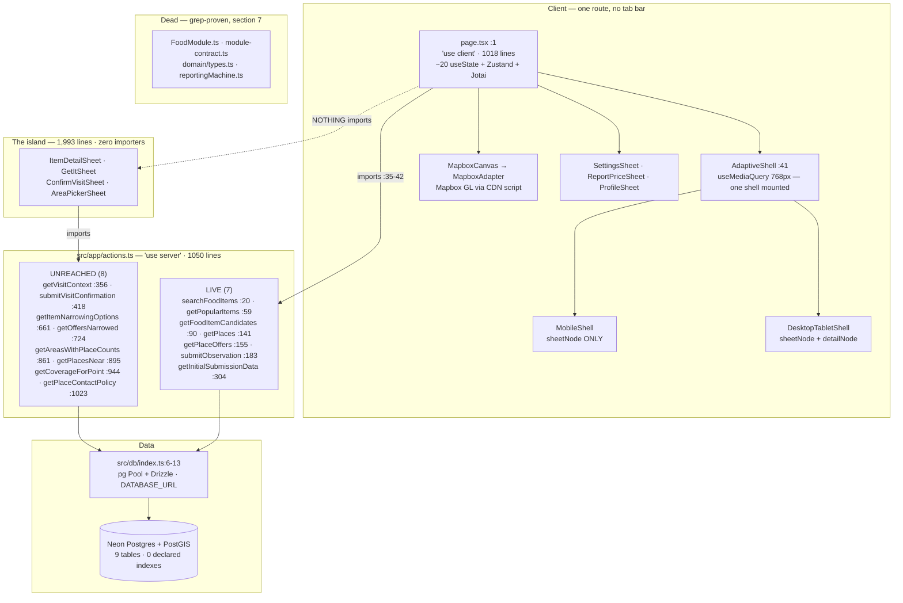

# WetinDey — the app map

> An honest map of what this application **is**, not what it intends to be.
> Every claim carries a `file:line`. Where the map is uncertain, it says so.

## Provenance, and why it matters more than any single defect

This map was assembled from eight subsystem surveys, six flow traces, and an
adversarial refutation pass that killed 31 of 143 claimed defects. **All of that
work ran against an older tree.** Before writing a word of this document I
re-verified every load-bearing claim against the tree as it stands now:

- **HEAD `bd1cf02`** ("Map the app end to end")
- plus an **uncommitted working tree**: `src/app/actions.ts` modified (+734
  lines), `src/db/seed.ts` rewritten (+432/−184), and five untracked files —
  `AreaPickerSheet.tsx`, `ConfirmVisitSheet.tsx`, `GetItSheet.tsx`,
  `ItemDetailSheet.tsx`, `src/db/seedContent.ts` (`git status`, `git diff --stat`)
- `npx tsc --noEmit` — clean. `npm run audit:tokens` — clean.

Four consequences, and they reframe everything below:

1. **The critical defect that dominated every survey is fixed.** All eight surveys
   and all six traces led with "every place resolves to `{lng:0, lat:0}`; the map
   is empty; distance is always 0 m". Commit `6f465d1` replaced the WKT regex with
   an EWKB decoder — `decodeEwkbPoint` at `src/db/schema/index.ts:20-37`, wired
   into `fromDriver` at `:50-52`, with a WKT fallback at `:55-56` and, most
   importantly, a **throw** where the `{lng:0,lat:0}` fallback used to be
   (`:70-72`). It is not a defect and does not appear in section 6. Everything the
   traces said was downstream of it — the empty map, the stacked unclickable pins,
   the garbage haversine, "0m away" on every row — is void.
2. **The seed is rewritten, and the fabricated-trust defects are fixed *in code*.**
   `src/db/seed.ts:227-336` now writes observations first and derives every offer
   field from them: `supportingObservationCount: observations.length` (`:331`),
   freshness computed from the clock (`:309-315`), `expiresAt` from the newest
   observation (`:329`), `moderationStatus: "approved"` (`:296`). The `Math.random()`
   freshness and the fictional 1-4 support count are gone.
3. ~~**But the live database has not been re-seeded.**~~ **Corrected after synthesis —
   this claim was wrong.** The map inferred "I was told not to seed, therefore the
   rows are stale". Reasonable, and false: the orchestrator re-seeded while this
   document was being written. Verified against Neon directly at 15:55 —
   **478 offers, 942 observations, 0 fabricated support counts, 942/942 approved**.
   Code-fixed *and* data-fixed. Left visible rather than deleted because it is a
   worked example of this map's own failure mode: an agent reasoning from what it
   did rather than checking what is true. The same reflex produced the (0,0)
   fallback.
4. **A large, complete, well-written body of new code is unreachable.** See section
   2. This is the headline finding.

---

## 1. What this app is

WetinDey is a map-first Progressive Web App that shows what street food costs at
named markets, kiosks and supermarkets in south-west Lagos (Festac, Amuwo Odofin,
Satellite Town, Ojo), and lets anyone report a price they just paid. It is a
single route — `src/app/page.tsx`, a 1,018-line `"use client"` component (`:1`) —
with no tab bar; every other surface is a sheet presented over the map. Its real
claim is not "we have prices" but "we know how old this price is and how many
people stand behind it", and that claim is where most of its defects live.

---

## 2. Architecture at a glance

There is **no server component in the data path**. `page.tsx` is a client component
(`src/app/page.tsx:1`) that imports server actions directly (`:35-42`) and calls
them from `useEffect` / `useTransition`. `src/app/actions.ts` is the *entire*
data-access surface — the only file in the repo that imports `db`
(`src/app/actions.ts:3`; `src/db/index.ts` has exactly one importer).
`src/db/queries/` and `src/modules/food/infrastructure/` contain only `.gitkeep`.

**The island.** `grep -rn "GetItSheet\|ConfirmVisitSheet\|ItemDetailSheet\|AreaPickerSheet\|getVisitContext\|submitVisitConfirmation\|getItemNarrowingOptions\|getOffersNarrowed\|getAreasWithPlaceCounts\|getPlacesNear\|getCoverageForPoint\|getPlaceContactPolicy" src/ -l` returns exactly five files: `src/app/actions.ts` and the four sheets themselves. `page.tsx:27-29` imports only `SettingsSheet`, `ReportPriceSheet`, `ProfileSheet`.

So 1,993 lines of sheet plus ~734 lines of server action — which between them
implement item→variant→unit narrowing, a PostGIS radius query that honours
`activeRadiusKm`, the only `navigator.geolocation` call in the repo
(`AreaPickerSheet.tsx:124-137`), the only code that reads `expiresAt`, a contact
policy, "Get it", and the post-visit confirmation loop that
`docs/USER-FLOW.md:58-62` calls *"the whole product"* — are unreachable from any
user action. They compile and pass `audit:tokens`. They are simply not connected.

This is the most important fact on this page. Sections 5 and 6 describe the app a
user can actually reach, which is the app **without** the island.

---

## 3. The data model

Nine tables in one file (`src/db/schema/index.ts`), in three clean layers:
**taxonomy** (`items` → `item_aliases` → `item_variants` → `units`), **geography**
(`areas` → `places`), **evidence** (`sources` → `observations` → `offers_current`).
`observations` are immutable raw reports; `offers_current` is a hand-maintained
materialisation recomputed inline by `submitObservation` (`src/app/actions.ts:239-297`)
— not a view, not a trigger.

The design is sound. The wiring is the problem: roughly a third of the defined
columns are write-only.

| Table | Read by the live path | Written, never read | Never even written |
|---|---|---|---|
| `areas` | **nothing** — `actions.ts:4` imports it, but only the island's `getAreasWithPlaceCounts:861` selects it | `coverageStatus` | `parentAreaId` |
| `places` | id, name, placeType, location, address (`actions.ts:143-148`) | `verificationStatus` | `openingInformation`, `contactVisibility` |
| `items` | id, slug, canonicalName, image\* (`actions.ts:8-17`); `active` honoured at `:35`, `:76` | `description`, `imageSourceUrl` — shipped over the wire, no consumer | — |
| `item_aliases` | `alias` (`actions.ts:39`) | `normalizedAlias`, `weight` | — |
| `item_variants` | id, displayName (`actions.ts:110`) | `active` — never read *or* written | `attributes` |
| `units` | `displayName` only | `code`, `dimension`, `canonicalQuantity` | `notes` |
| `sources` | `id` where type='Contributor' (`actions.ts:191-197`) | `reliabilityScoreInternal` (98/85/75), `status` | — |
| `observations` | recompute at `actions.ts:240-250` | `collectionMethod`, `submittedAt`, `moderationStatus` | `notes`, `rawPayload` |
| `offers_current` | most columns | `trustLevel`, `expiresAt`, `currency` | — |

Three columns deserve naming individually:

- **`expiresAt`** (`schema/index.ts:195`) — written at `actions.ts:234, 277, 295` and
  `seed.ts:329`; read by **no live query**. Its only readers are on the island
  (`actions.ts:767/805`, `ItemDetailSheet.tsx:103-105`).
- **`trustLevel`** (`schema/index.ts:193`) — written three times (`actions.ts:275`,
  `:293`, `:480`; `seed.ts:327`), read zero times. It is derived from
  `freshnessState` one line earlier (`seed.ts:326`), so it carries no independent
  information even if something read it.
- **`units.dimension` + `canonicalQuantity`** — shaped for cross-unit price
  normalisation (₦/kg across a 50 kg bag and a 1 kg measure), arguably the most
  valuable thing a price map can do. Nothing implements it.

No table declares an explicit index (`grep -c "CREATE INDEX" src/db/migrations/*.sql`
→ 0, 0). Primary keys and five `slug`/`code` UNIQUEs give implicit btrees; **no FK
column is indexed and there is no GIST index** on `places.location` or `areas.center`
despite the PostGIS dependency. `offers_current` has no unique constraint on its
natural key `(item_variant_id, unit_id, place_id)` —
`migrations/0000_careless_piledriver.sql:61-77` declares only `"id" uuid PRIMARY KEY`.

---

## 4. Every surface

Map-first; the only route is `/`. Everything below is reached from the map chrome
or the avatar.

| Surface | Reached from | Lives in | State |
|---|---|---|---|
| Map, persistent WebGL layer | root | `AdaptiveShell.tsx:47-51`, `MapboxCanvas.tsx` | Works. Mounted once at z-0 so the GL context survives shell switches |
| Landing grid "Popular items around Festac" | root | `page.tsx:636-661` → `ItemCard` | Renders; the heading is not true (D9) |
| Search results | `SearchField` | `page.tsx:365-383`, `:672-700` | Queries correctly, renders as though there were no prices (D6) |
| Offers list for an item | tap a card | `page.tsx:714-772` | Works; unordered and unfiltered |
| Offer detail — freshness / confidence / source | tap an offer | `page.tsx:791-880` | **Desktop only** (D5) |
| Place detail | tap a pin or an offer | `page.tsx:886-950` | Desktop only, same cause |
| Report a price | `+` (`page.tsx:589-596`) | `ReportPriceSheet.tsx` | Both shells. The write really lands |
| Settings, incl. radius slider | profile | `SettingsSheet.tsx` | Renders; the radius controls nothing (D8) |
| Profile | avatar | `ProfileSheet.tsx` | Signed-out; rows deliberately disabled |
| Location pill "Showing Festac" | — | `page.tsx:558-559` | A label, not a control. `selectedAreaName` is the literal `"Festac"` (`globalStore.ts:33`); its setter is never called |
| Area picker | — | `AreaPickerSheet.tsx` (368 lines) | **Built, unreachable** |
| Item narrowing: item→variant→unit | — | `ItemDetailSheet.tsx` (537 lines) | **Built, unreachable** |
| "Get it" action sheet | — | `GetItSheet.tsx` (512 lines) | **Built, unreachable** |
| Post-visit confirmation | — | `ConfirmVisitSheet.tsx` (576 lines) | **Built, unreachable** |

There is **no error boundary anywhere**: `find src -name "error.tsx" -o -name "global-error.tsx"` returns nothing.

---

## 5. The flows

Six flows were traced. Three traces reached me in full; the other three were
truncated before I received them, so those rows are **my own re-derivation from
the current tree** — flagged, and shallower than the rest.

| Flow | Verdict | Where it dies |
|---|---|---|
| **find-a-price** | **partial** | Survives map → search → offers. Search cards read "No price yet / Check again" for every result (D6). Offers filter on variant and nothing else — no radius, no expiry, no availability (D2, D8) — and have no `ORDER BY` (`actions.ts:107-118`), so "compare" has no spine. Three of the five comparison dimensions are desktop-only (D5). |
| **report-a-price** | **partial** | `+` → fill → submit genuinely writes `observations` and `offers_current`. But the availability answer is discarded (D3); the form refuses an out-of-stock report without a price (`page.tsx:434`), forcing the user to invent one; and the refresh is theatre — `getPlaces()` at `:487` carries no price data, `popularItems` is never re-fetched (only call site `:269`), `placeOffers` is never re-fetched. Report from the landing screen — the common case — and nothing on screen changes. |
| **act-on-a-result** | **broken** | Six inert `<Button>`s: `page.tsx:754`, `:762` (mobile), `:871`, `:875`, `:943`, `:947`. None has an `onClick`; `Button.tsx:34` spreads props onto a bare `<button>`, so they render, focus, animate on press, and do nothing. `GetItSheet.tsx` implements this flow properly and is not imported. |
| **change-location** *(re-derived)* | **not-built** | Pill is a label (`page.tsx:558`). `setSelectedAreaName` (`globalStore.ts:23, 39`) is never called; `setUserLocation` (`:37`) has no caller. `navigator.geolocation` appears only in `AreaPickerSheet.tsx:124-137` — the island. |
| **settings** *(re-derived)* | **partial** | The sheet renders and the slider moves `activeRadiusKm` (`globalStore.ts:38`). Its only consumer is the slider itself (`page.tsx:208` → `:978`); no query reads it (D8). Theme toggling works (`ThemeContext.tsx`). |
| **offline-report** *(re-derived)* | **partial** | Queue and replay are real (`page.tsx:296-338`, `:455-477`) and the SW ignores non-GET so actions pass through. But it is gated on `navigator.onLine` alone (`:456`) — true on any attached interface, which is the exact Nigerian failure mode — and the queue clears only after the whole loop (`:319`), so a mid-loop failure resubmits everything (D4). |

---

## 6. Confirmed defects

Only defects that survived adversarial refutation **and** that I re-verified against
the current tree. The (0,0) geography bug and the seed's fabricated trust data are
**not here** — they are fixed (see Provenance). Severity is calibrated to *is a user
broken now*, not to how alarming it reads.

### High

**D1 — The "Get it" / narrowing / location / close-the-loop layer is unreachable.**
`src/app/page.tsx:27-29` · `src/app/actions.ts:356-1050`
*Evidence:* the grep in section 2 — the four sheets and eight actions have no
importer outside themselves.
*Consequence:* 1,993 lines of sheet and ~734 lines of action are inert, including
the only geolocation call, the only query honouring `activeRadiusKm`, the only
reader of `expiresAt`, and the post-visit loop `USER-FLOW.md:58-62` calls the
product. Meanwhile `page.tsx` still ships the six inert buttons these sheets exist
to replace. Almost every defect below has its fix already written and sitting one
import away — which is precisely why this is first.

**D2 — `expiresAt` is written by three code paths and enforced by none.**
`src/app/actions.ts:234, 277, 295` · `src/db/schema/index.ts:195`
*Evidence:* grep for `expiresAt|expires_at` in `src/` → writes at `actions.ts:234/277/295/482`
and `seed.ts:329`, the column def, and reads **only on the island**. No live query
(`getPopularItems:76`, `getFoodItemCandidates:113`, `getPlaceOffers:167`) references
it. No cron exists: `src/app` has no `api/`, and nothing in `package.json` schedules
an expiry job.
*Consequence:* Freshness is a one-way ratchet. `submitObservation` pins
`freshnessState: "confirmed"` (`:274`, `:292`) and nothing ever decays it, so a green
"Confirmed Available" pill (`page.tsx:839-848`) survives indefinitely regardless of
age. The rewritten seed no longer *births* expired offers, so this is not visibly
firing on fresh data — it fires the moment real data ages past 72 h.

**D3 — Reporting "out of stock" produces "Confirmed Available".**
`src/app/actions.ts:274`
*Evidence:* both branches hardcode `freshnessState: "confirmed", trustLevel: "high"`
(`:274-275` update, `:292-293` insert) regardless of input, while `availabilityState`
is faithfully stored (`:270`, `:288`). `getFoodItemCandidates` never selects
`availabilityState` (`:120-137`) and never filters on it (`:118`); it maps
`confidenceLevel: r.offer.freshnessState` (`:134`), which `page.tsx:846` renders as
"Confirmed Available" / "True-true e dey" / "Daju pe o wa".
*Consequence:* A contributor who reports "No, e don finish" flips the offer to a green
confirmed dot with the out-of-stock price still showing. The report makes the data
worse than silence. `getPlaceOffers` does return `availabilityState` (`:176`) and the
place panel (`page.tsx:916-933`) ignores it, so out-of-stock lines look identical to
in-stock ones.

**D4 — Offline sync re-submits entries that already landed; a successful submit can report failure.**
`src/app/page.tsx:314-319`, `:479-503`
*Evidence:* `for (const item of queue) { await submitObservation(item); }` (`:314-316`),
then `localStorage.removeItem("pending_observations")` only after the loop (`:319`); the
catch (`:328`) leaves the queue intact. Separately the try at `:479-499` wraps the write
**and** the refresh, with one catch setting `"Submission failed. Try again."` (`:501`).
*Consequence:* Queue of five, fourth throws → three have committed and all five replay on
the next `online` event, triple-incrementing `supportingObservationCount`
(`actions.ts:278`) — which *is* the confidence number. On the online path, a flaky
`getPlaces()` after a committed write tells the user their submission failed; they
resubmit; the count inflates for a price reported once. `res.success` is the literal
`true` (`actions.ts:300`), so the `if` at `:481` can never be false.

**D5 — Freshness, confidence and source do not exist on phones.**
`src/design-system/components/AdaptiveShell.tsx:59-73` · `MobileShell.tsx:6-11`
*Evidence:* `AdaptiveShell` forwards `detailNode` to `DesktopTabletShell` only
(`:59-63`); `MobileShellProps` has no `detailNode` (`MobileShell.tsx:6-11`), and exactly
one shell is mounted (`:41`, `:55`). `detailNode` is where `page.tsx:835-865` renders the
freshness pill, the confidence percent and the data source.
*Consequence:* On a map-first, no-tab-bar phone product, the mobile offer row
(`page.tsx:726-749`) is name + distance + address + price. Three of the five dimensions
`USER-FLOW.md` asks a user to compare are absent from the compact view — the primary view.

### Medium

**D6 — Search results render "No price yet / Check again" for items that have prices.**
`src/app/actions.ts:8-17` vs `src/design-system/components/ItemCard.tsx:80-86`
*Evidence:* `searchFoodItems` (`:29-30`) selects only the `itemCard` projection — 8
columns, no `offerCount`/`placeCount`/`priceFrom`/`priceTo`/`freshest`. `getPopularItems`
(`:60-79`) returns 14. Those fields are optional on `ItemCardData` (`ItemCard.tsx:14-18`),
so `tsc` stays silent.
*Consequence:* `priceFrom == null` → "No price yet" (`ItemCard.tsx:81`); `toStatus(undefined)`
→ amber "Check again" (`:29`, `:135`). Searching "rice" shows an empty-looking card for the
same item the landing grid shows with a price and a confirmed dot. The one path the flow
tells a user to take is the one that looks broken.

**D7 — Confidence is a raw count × 10, uncapped; the data source is a hardcoded string.**
`src/app/actions.ts:135`, `:133`
*Evidence:* `confidenceScore: r.offer.supportingObservationCount * 10`, rendered as
`{selectedOffer.detail.confidenceScore}%` (`page.tsx:857`), incremented without bound at
`:278`. `sourceType: "Community"` is a literal (`:133`) rendered under the "Data Source"
label (`page.tsx:863`).
*Consequence:* The eleventh report on an offer reads "Data Confidence 110%". The score
ignores source reliability entirely — `sources.reliabilityScoreInternal` holds 98/85/75
(`seed.ts:199-201`) and is read by nothing. The source line asserts "Community" for prices
that may have come from a vendor or a public dataset, and it cannot be fixed in the query
layer alone: `offers_current` has no `sourceId` column (`schema/index.ts:184-198`).
`USER-FLOW.md:169` already flags the cap; it does not flag the fabricated source.

**D8 — `activeRadiusKm` reaches no live query; the radius slider is inert.**
`src/core/state/globalStore.ts:13, 32, 38` · `src/app/page.tsx:978`
*Evidence:* full grep → declared/defaulted/set in `globalStore.ts`, read at `page.tsx:208`,
passed to `SettingsSheet` (`page.tsx:978`). No live action takes a radius or a centre;
`getPlaces()` (`actions.ts:141-152`) is `select … from places` with no WHERE, no LIMIT, no
`ST_DWithin`. Distance is JS haversine (`src/lib/geospatial.ts`) over the full fetch
(`page.tsx:732`, `:804`, `:895`). The only code that acknowledges the fix is on the island
(`ItemDetailSheet.tsx:50`).
*Consequence:* Dragging "Geospatial Search Radius" from 1 km to 20 km changes nothing; the
control lies about being a filter. Compounding: no GIST index exists, so the `ST_DWithin`
this needs would seq-scan today.

**D9 — "Popular items around Festac" is neither around Festac nor area-aware.**
`src/app/page.tsx:636`, `:559` · `src/app/actions.ts:59-79`
*Evidence:* `getPopularItems` filters on `eq(items.active, true)` and nothing else — no
geographic predicate at all. `selectedAreaName` is the literal `"Festac"`
(`globalStore.ts:33`); its setter (`:23`, `:39`) is never invoked. The seeded name for that
slug is "Festac Town" (`lagosSouthWest.ts:48`), confirming the string is not DB-derived.
The DB holds places across nine areas.
*Consequence:* A global top-8 is labelled Festac-local, beside a pulsing confirmed dot
(`page.tsx:558`), and the label stays "Festac" wherever the user pans. `USER-FLOW.md:87-88`
already states the pill problem verbatim; the *mislabelled aggregate* is not documented
anywhere, and the fix (`AreaPickerSheet.tsx`) is written and unwired (D1).

**D10 — `submitObservation`'s "recent prices" query has no time window.**
`src/app/actions.ts:239-250`
*Evidence:* the comment at `:239` says *"Fetch recent prices … to calibrate min/max bounds"*;
the WHERE (`:244-250`) filters only `itemVariantId`, `unitId`, `placeId`,
`availabilityState='available'` — no `observedAt` bound. `:259-264` takes `Math.min`/`Math.max`
over the whole set. Nothing prunes `observations` (grep for `delete|prune|purge|cron` in
`src/` → 0).
*Consequence:* The range widens monotonically and can never narrow; `priceKind` latches to
`"Range"` after the first disagreement and can never return to `"Exact"`. One anomalous ₦300
pins `priceMin` at ₦300 forever, while the row is stamped `freshnessState: "confirmed"`,
`lastObservedAt: now` (`:274-276`). With 1-3 observations per offer the result is still
correct today — this is decay proportional to submission volume and elapsed time, accelerated
by Nigerian food inflation.

**D11 — `getPopularItems` understates the price ceiling.**
`src/app/actions.ts:66`
*Evidence:* `priceTo: max(offersCurrent.priceMax)` — but `priceMax` is NULL for every
`"Exact"` offer (`actions.ts:291` inserts `priceMax: null`; `seed.ts:325` writes
`priceMax > priceMin ? priceMax : null`). SQL `max()` skips NULLs, so the floor is drawn
from all offers (`min(priceMin)`, `:65`) and the ceiling only from Range offers. The
correct expression is `max(coalesce(priceMax, priceMin))` — the codebase's own idiom at
`FoodModule.ts:205`.
*Consequence:* The money number on the first surface a shopper sees is silently short at
the top. Under the old seed this was ~2 % on 2 of 11 items. The sharper latent case: an
item whose offers are *all* Exact yields `priceTo = NULL`, and `ItemCard.tsx:85` then
presents the cheapest stall's price as *the* price, with no range.

**D12 — `offers_current` has no unique constraint on its natural key, and the upsert is a
non-transactional read-then-write.**
`src/db/migrations/0000_careless_piledriver.sql:61-77`
*Evidence:* only `"id" uuid PRIMARY KEY` — contrast the named uniques the same file emits at
`:11`, `:30`, `:41`, `:92`, `:111`. `schema/index.ts:184-198` declares no `uniqueIndex`.
`grep -rn "db.transaction\|onConflict" src/` → 0. `submitObservation` SELECTs at `:222-232`
and branches to UPDATE (`:267`) or INSERT (`:284`), unserialised.
*Consequence:* Two concurrent reports for the same item at the same stall both miss and both
INSERT, producing duplicate offers for one triple — listed twice by `getPlaceOffers`, with
`page.tsx:517`'s `.find()` picking a nondeterministic price for the tapped pin. Latent, not
firing. It is on this list for **ordering**: `ON CONFLICT` cannot be added until the
constraint exists, and the constraint gets much harder to add once production has duplicates
to merge by hand. The offline flush (`page.tsx:315`) is the most plausible trigger.

**D13 — `submitObservation` takes unvalidated client input straight into an INSERT.**
`src/app/actions.ts:183-219`
*Evidence:* the signature is typed, not validated; `:203` `Math.round(data.priceAmount * 100)`
flows into the INSERT at `:206-219`. The only guards are client-side (`page.tsx:434-443`).
`zod` is a declared dependency and `grep -rn "from \"zod\"" src/` returns **nothing**.
`moderationStatus: "approved"` is hardcoded at `:217`, overriding the schema's `pending`
default (`schema/index.ts:126`) — a default that can therefore never take effect.
*Consequence:* A server action is a public HTTP endpoint; the client check is trivially
bypassed. `priceAmount: -5000` inserts a negative price and sets `priceMin` negative; `1e12`
overflows the `integer` column (`schema/index.ts:120`) into an unhandled Postgres error that,
per D14, has no boundary to land in. There is no auth (no `middleware.ts`), no rate limit and
no moderation gate — nothing at all between an anonymous POST and a price on the map.

**D14 — Three loading states hang forever when the DB is down; no error boundary exists.**
`src/app/page.tsx:354`, `:378`, `:392`
*Evidence:* `actions.ts` has exactly one `throw` (`:199`) and no try/catch. Only the mount
effect catches (`page.tsx:286-291`). The other three call sites do not.
`find src -name "error.tsx" -o -name "global-error.tsx"` → nothing.
*Consequence:* With the DB unreachable, tapping a pin leaves the place skeleton
(`page.tsx:911-915`) spinning permanently; typing leaves the search skeletons (`:672-677`)
spinning; selecting an item leaves `CardListSkeleton` (`:700`) spinning. The flag that gates
retry is the flag that never resets. Only the initial page load degrades honestly.

**D15 — Escape closes the whole report form, not the picker on top of it.**
`src/design-system/components/ModalSheet.tsx:39-46, 57`
*Evidence:* `ModalSheet` renders inline with no `createPortal`, so an open `SheetPicker`'s
`ModalSheet` (`SheetPicker.tsx:80`) mounts *inside* the report form's `ModalSheet`, and both
register `keydown` on `document` (`:57`). The handler calls `e.stopPropagation()` (`:42`),
which does not stop other listeners on the same node — that needs `stopImmediatePropagation`.
*Consequence:* Pressing Escape to back out of the market picker fires both handlers, closing
the picker *and* the report form, discarding everything typed. Fires for any keyboard user.

### Low

**D16 — TLS certificate verification is disabled on every DB connection.**
`src/db/index.ts:9` — `ssl: { rejectUnauthorized: false }`, commented "Required for serverless
database SSL connections". Neon serves a publicly-trusted certificate and needs no such
opt-out. Every connection encrypts but does not authenticate the server. `src/db/seed.ts`
opens its own Pool with the same setting. Low because the route is not currently hostile; the
comment is the real hazard, because it makes the choice look researched.

**D17 — Seeding is non-deterministic.** `src/db/seed.ts:239-249, 258-267` — unseeded
`Math.random()` drives basket size, price, report count and age; `:239` is
`sort(() => 0.5 - Math.random())`, an inconsistent comparator and therefore a biased,
engine-dependent shuffle. Nine unconditional `TRUNCATE … CASCADE` run first (`:47-55`). Low:
the repo has **no tests at all**, so nothing depends on it today. The cost is that a
data-shaped bug cannot be reproduced after re-seeding, and the prior state is unrecoverable.

**D18 — `active` is a kill switch that would not work if pulled.** `grep -rn "itemVariants.active" src/`
→ zero references; the column (`schema/index.ts:140`) is never read or written.
`getFoodItemCandidates` selects variants on `itemId` alone (`actions.ts:97`) and joins offers
with no active predicate (`:117`); `getInitialSubmissionData:308` does not even select it.
`items.active` is honoured only at `:35` and `:76` — `getPlaceOffers` (`:164-167`) filters on
`placeId` alone, so deactivating an *item* also fails to hide its offers. Low: no
`update(items)` / `update(itemVariants)` exists anywhere in `src/` and there is no admin
surface, so `active=false` is reachable only by hand-editing the DB.

**D19 — Zero declared indexes.** `grep -c "CREATE INDEX" src/db/migrations/*.sql` → 0, 0. PKs
and five slug/code UNIQUEs give implicit btrees; no FK column is indexed and there is no GIST
on `places.location` (`0000_…sql:85`) or `areas.center` (`:7`). `WETINDEY_BIBLE.md:3262-3264`
mandates GiST for geography fields and `:3274-3281` lists required observation indexes; none
exist. Low: at ~178 offers / 30 places the planner would ignore them anyway. It is scaling
debt against the project's own written spec, and it is why a radius query (D8) cannot be added
performantly.

**D20 — The query layer computes and ships values nothing consumes.** `lastObservedAt`
(`actions.ts:72`, `:85`) is absent from `ItemCardData` (`ItemCard.tsx:8-19`); `description`
(`:12`) and `imageSourceUrl` (`:16`) are on no consumer interface; `.returning()` at `:219`
costs a full row read for an `observationId` (`:300`) that `page.tsx:481` discards.
`getFoodItemCandidates` selects whole rows — `offer: offersCurrent` (15 cols) and
`place: places` (12) — and its mapper (`:120-137`) uses about 8. `getPlaces()` and
`getInitialSubmissionData()` both scan `places` in the same `Promise.all` (`page.tsx:268-272`),
the second a strict column-subset of the first. Low individually; the shape generalises badly.

---

## 7. Dead code

Each row is a grep result, not an impression.

| What | Proof, and why it matters |
|---|---|
| **The island** — `AreaPickerSheet.tsx` (368), `ConfirmVisitSheet.tsx` (576), `GetItSheet.tsx` (512), `ItemDetailSheet.tsx` (537), plus 8 actions (`actions.ts:356-1050`) | `grep -rn "GetItSheet\|ConfirmVisitSheet\|ItemDetailSheet\|AreaPickerSheet" src/ -l` → only the four files. **Not stale — new, complete, and one import away from live.** Unfinished work, not deletable. |
| `src/modules/food/application/FoodModule.ts` | `grep -rn "FoodModule" src/` → the class declaration plus two *comments* (`seed.ts:19`, `:309`) that cite its policy without importing it. Zero importers. It holds the only real trust model in the repo: age-decay confidence (`:159-172`), a freshness policy, confidence-ranked sorting (`:239`) — the logic `actions.ts:135` fakes with `count * 10`. Also a static mock item DB (`:14`). |
| `src/core/module-contract.ts` | Sole importer is `FoodModule.ts:11`, itself dead. Transitively unreachable. |
| `src/modules/food/domain/types.ts` | Sole importer is `FoodModule.ts:12`, itself dead. Transitively unreachable. |
| `src/core/state/reportingMachine.ts` | Zero importers. A complete xstate machine modelling `idle → acquiringLocation → fillingDetails → submitting → success/offlineQueue`, including the `SUBMIT_OFFLINE`/`SUBMIT_ERROR` transitions the report flow needs. `page.tsx` hand-rolls it across six `useState` booleans (`:246-258`) instead — which is why success, error and offline can be simultaneously stale. `xstate` + `@xstate/react` serve only this file. |
| `zod` | Declared dependency; `grep -rn "from \"zod\"" src/` → nothing. Unused, while `submitObservation` is an unvalidated public endpoint (D13). |
| Empty scaffolds | `.gitkeep`-only: `src/db/queries/`, `src/db/seed/` (name-collides with the real `src/db/seed.ts`), `src/db/schema/`, `src/core/{analytics,discovery,map,media,offline,reporting,trust}/`, `src/integrations/{analytics,blob,public-data}/`, `src/modules/food/{copy,infrastructure,presentation,schemas,tests}/`. The hexagonal architecture was scaffolded and never inhabited; all query logic lives in `src/app/actions.ts`. |
| Write-only columns | Section 3. |

---

## 8. What it would take to finish

Ordered by dependency, tied to `docs/USER-FLOW.md`.

**0. Land the island** — *not in USER-FLOW, and it now precedes everything.* Four
sheets and eight actions already implement USER-FLOW steps 1, 2, 4 and 5. Wire them
into `page.tsx`, delete the six inert buttons they replace
(`page.tsx:754/762/871/875/943/947`), and this list gets substantially shorter. Do it
before writing new code, or the new code becomes the third implementation of the same
flow.

**1. Re-seed, then look.** The seed rewrite (`seed.ts:227-336`) is only true of the
database once it runs. Until then the live rows carry the old fabricated support
counts and random freshness, and every screenshot is a screenshot of fiction. Fix D17
(seeded RNG) in the same pass so the result is reproducible.

**2. Enforce the trust model that already exists.** In order: filter on `expiresAt` in
the three live queries (D2) — the island's `getOffersNarrowed:767` shows the shape;
derive `freshnessState` from `lastObservedAt` instead of hardcoding `"confirmed"`
(D3) — `FoodModule.ts:159-172` is the intended implementation and is currently dead;
stop discarding the availability answer (D3); bound the recompute window (D10); cap and
weight `confidenceScore` (D7). *USER-FLOW open questions 2 and 3 arbitrate the
thresholds and should be answered before this, not during it.*

**3. Make the mobile row comparable.** Add `detailNode` to `MobileShellProps` (D5) and
give the offers list an `ORDER BY`. *USER-FLOW §3, "The comparable row"* — five
dimensions in one row, only one of them allowed to be saturated.

**4. Make search look like the app.** Give `searchFoodItems` the aggregate projection
`getPopularItems` already has (D6), or the search path keeps advertising an empty
database. *USER-FLOW marks this step ✅; it is not.*

**5. Honour the radius.** `getPlacesNear:895` already does this in PostGIS and is
unreachable. Landing it (step 0) fixes D8 — but add the GIST index first (D19) or it
seq-scans. *USER-FLOW §1.*

**6. Harden the write path.** Validate with the `zod` already in `package.json` (D13);
add the unique constraint on `(item_variant_id, unit_id, place_id)` and convert to
`ON CONFLICT` inside a transaction (D12); make offline sync idempotent and dequeue per
item (D4). Do D12 **before** production accumulates duplicates.

**7. Close the loop.** `ConfirmVisitSheet.tsx` + `submitVisitConfirmation:418` are
written; landing them is step 0. Making them *count* means feeding
`sources.reliabilityScoreInternal` into the trust model, per *USER-FLOW §5* — a
confirmation from someone who physically went is worth more than a report typed from a
sofa.

**8. Add an error boundary and a retry** (D14). Cheap, and it stops every failure from
looking like a hang.

---

## 9. Open questions

For a human, not for an agent.

1. **Is the island unfinished work or an abandoned rewrite?** It is complete, commented,
   token-clean and type-clean, and it implements the flow the docs describe — but it is
   untracked and nothing imports it. If it is in flight, everything in section 8 sequences
   behind landing it. If it is abandoned, most of section 6 has no fix in the repo.
   **Nothing else here can be prioritised until this is answered.**

2. **Has the DB been re-seeded since the seed rewrite?** I did not run the seed and did not
   query the live DB in this pass. If it has not, the live data is old-seed fiction, and any
   "we looked, it seems fine" is looking at the wrong rows.

3. **`offers_current` — hand-maintained table, or a real materialisation?** The entire trust
   computation lives in one server action with no transaction (`actions.ts:239-297`), which
   is exactly what makes D10 and D12 dangerous. A trigger or a materialized view moves the
   correctness into the database, where concurrency is already solved.

4. **Wire up `FoodModule.ts`, or delete it?** It holds the only genuine trust model in the
   repo, and `seed.ts:19` and `:309` already cite its constants in comments while importing
   nothing. The repo currently *documents* a trust model it does not run. Same question for
   `reportingMachine.ts`, whose `acquiringLocation` state confirms geolocation was designed
   into reporting and never wired.

5. **`units.dimension` + `canonicalQuantity` — dropped, or not yet built?** They are shaped
   for cross-unit normalisation (₦/kg across a 50 kg bag and a 1 kg measure). Nothing
   implements it, and it is on no list. It may be the most valuable unbuilt thing here.

6. **`USER-FLOW.md` open questions 1-4 are still open**, and two of them (*"how fresh is
   recently confirmed?"*, *"what earns high confidence?"*) are blocking: D2, D3, D7 and D10
   cannot be fixed *correctly* without an answer — only fixed *plausibly*, which is how the
   current trust model got here.

7. **Where this map is uncertain, explicitly.** I did not launch the app, did not query the
   live database, and did not read `vercel.json` — so "nothing expires offers" (D2) is
   grep-scoped to `src/` and would need narrowing if a cron is declared outside it. Three of
   the six flow traces (change-location, settings, offline-report) arrived truncated and are
   my own re-derivations, marked as such in section 5; if the originals exist they may carry
   findings this map does not. React 19's exact escalation behaviour for a rejected promise
   inside `startTransition` I did not test at runtime: the stuck-skeleton consequence in D14
   follows from the code regardless, but whether it *also* crashes the route is unverified.
