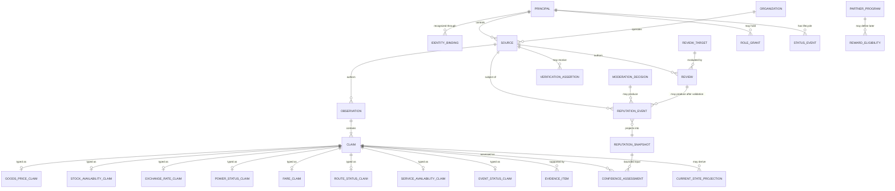
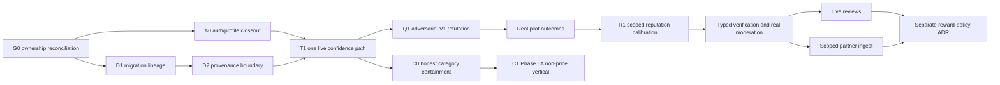

# Live Information and Earned Trust - Proposed Architecture Evolution

**Date:** 2026-07-17  
**Status:** PROPOSED ADDENDUM - not the architecture of record  
**Decision proposals:** [ADR-010](../adr/010-typed-live-local-information-platform.md)
and [ADR-011](../adr/011-earned-trust-graph-and-reputation.md)

## Read this first

[SERVICE-ARCHITECTURE.md](SERVICE-ARCHITECTURE.md), ratified by ADR-002, remains the
architecture of record. This file records the requested product-model and trust evolution
in enough detail to review. If the two documents disagree, the architecture of record
wins until an accepted ADR amends it.

This document does not authorize implementation.

The repository is currently under an integration freeze because:

- migration SQL, snapshots, journal, and TypeScript schema are not one reproducible
  lineage;
- synthetic prices are not durably distinguishable from observed field reports;
- the current search path contains a runtime-invalid column reference;
- category selection is partially wired while detail, contribution, map fallback, and
  data semantics remain Food/price-shaped;
- write-side trust derivation exists, but read-side UI and map heuristics still disagree;
- and active lanes overlap in `page.tsx`, `actions.ts`, profile, map, and migration files.

No Trust Graph DDL, category registry, generic filter form, review work, reward work, RLS
rollout, or broad UI refactor starts in this state.

## 1. Mission and product model

> **WetinDey helps people understand the current state of nearby reality before they
> leave.**

The promise remains:

> **Know before you go.**

Food price and availability are the V1 proof. They are not the universal ontology.

| Category capability | Primary signal | Supporting signals |
|---|---|---|
| Food Markets | Goods price | Stock availability, freshness, confidence |
| Fuel | Goods price | Fuel grade, availability, queue band, freshness |
| Cooking Gas | Refill or purchase price | Cylinder size, stock availability, freshness |
| Medicine Availability | Stock availability | Formulation, strength, optional price, confidence |
| Exchange Rates | Buy, sell, or reference rate | Market channel, trend, freshness |
| Power Status | On, off, intermittent, or unknown | Last confirmation, duration, nearby corroboration, confidence |
| Local Services | Service availability | Response time, validated reputation, moderated rating |
| Community Events | Event lifecycle status | Time, venue, organizer confirmation, freshness |

This table is a target vocabulary, not a list of live features.

## 2. Current-state correction map

| Area | Current repository truth | Required correction |
|---|---|---|
| Product identity | The architecture and About copy call WetinDey a food price map. | Lead with live local information; name Food as the current pilot vertical. |
| Category selector | Six pillars are selectable and partially affect search, popular rows, metadata, and header state. | Treat the selector as incomplete until every exposed category owns a complete typed vertical. |
| Catalog | `items`, variants, and sale units are goods-oriented. | Keep them for goods and medicines; do not represent currency pairs, power areas, routes, services, or events as items. |
| Observation | Current observations require item variant, unit, place, availability, currency, and optional price. | Preserve as Food compatibility; design typed claims only with the first real non-Food vertical. |
| Current read model | `offers_current` is a price/availability projection. | Preserve for Food; use `Current state projection` as the generic logical concept. |
| UI | Item cards, item detail, report price, Get It, and visit confirmation assume price and purchase. | Keep them explicitly Goods-specific. New signal families receive typed surfaces. |
| Search and ranking | Search/popular actions and cheapest sorting assume goods. | Each category capability owns query, filter, and sort semantics. |
| Map | Category affects some results, while fallback places and marker meaning remain broad/shared. | One category context must drive map and sheet from the same normalized result set. |
| SEO | Item JSON-LD hardcodes Food while non-Food seed rows can reach item/place surfaces. | Emit structured data only for a real subject type and implemented vertical. |
| Seed | Plausible random values at named places look like human observations. Power hours are price-shaped. | Quarantine synthetic data; never reinterpret stored prices as power duration. |
| Identity | Recognized contributions now resolve to `sources.user_id`. | Correct stale docs; do not mistake attribution for earned reputation. |
| Reputation | Recognized sources start at `75`; seeded anonymous Contributor is `98`. | Remove the inversion before reputation influences public confidence. |
| Trust | Writes call `assessTrust`; UI and map still use competing heuristics. | Make one read-side assessment authoritative before graph expansion. |
| Moderation | Status fields exist, writers approve automatically, and no moderator/audit surface exists. | Do not create reputation events or verification from fictional moderation. |
| Reviews | Schema exists without live actions, UI, moderation, or robust anonymous vote uniqueness. | Keep reviews quarantined until one complete vertical slice ships. |
| Legal/About | `about.how_intro` says price map; `about.how_report` says every price came from a person. Terms and privacy are owner-review drafts. | Hand off accurate platform, synthetic-data, privacy, and signal-specific language to the UI owner and counsel. |
| API | Product data uses Server Actions; `/api/v1` remains future-only. | Keep Server Actions. Design a public/partner API only for a real second consumer. |
| RLS | Current migrations define no RLS policies. | Treat query/action authorization as current; decide RLS with real actors and database-role behavior. |

## 3. Domain and data model

### 3.1 Shared logical envelope

An observation records:

- author source;
- provenance;
- observed and submitted times;
- collection method;
- location or area context where relevant;
- idempotency;
- moderation state;
- evidence references;
- and one or more compatible typed claims.

It does not carry one universal authoritative `value`.

### 3.2 Typed claim families

| Claim family | Required typed meaning |
|---|---|
| Goods price | Item variant, sale unit, amount/range, currency, place, price kind |
| Stock availability | Catalog subject, place, availability state, optional capacity qualification |
| Exchange rate | Currency pair, side, rate, market channel, quote time |
| Power status | Area/zone, on/off/intermittent/unknown, status start |
| Fare | Route/service, origin, destination, mode, amount, currency |
| Route status | Route/service, operating/disrupted/unavailable, segment, time |
| Service availability | Provider/listing, accepting-work state, next availability |
| Event status | Event, scheduled/postponed/cancelled/ongoing/ended, venue, time |
| Review | Subjective target evaluation; intentionally outside factual current-state claims |

The architecture rejects EAV, a universal `value + unit`, untyped filter arrays, and JSON
as the only authoritative claim representation.

### 3.3 Evolutionary logical ERD

This is a logical ERD, not V1 DDL. The final physical relationship between a common claim
row and typed detail tables is deliberately deferred. Existing Food records must not be
silently promoted into a generic observed-history model.

## 4. Category context, header, and filters

### 4.1 Target persistent-sheet header

The visual and focus order is:

> **Brand -> Selected category -> Contextual filter -> Add contribution -> Avatar**

Responsibilities:

| Control | Responsibility |
|---|---|
| Brand | Product identity and return to root discovery |
| Selected category | Displays and changes the active complete category capability |
| Contextual filter | Opens filters declared and enforced by that capability |
| Add contribution | Opens the capability's typed contribution flow |
| Avatar | Account, settings, About, privacy, terms, and support |

All rendered controls keep at least 44x44px targets, focus visibility, accessible labels,
and the same order on compact and regular layouts. The brand may compress visually on
narrow screens; controls do not reorder.

If Food is the only complete capability, the category slot may be a non-interactive
`Food` context label. A control with one real outcome must not pretend to be a selector.

### 4.2 One global category context

Changing category must:

1. invalidate prior in-flight results;
2. ignore late responses from the old category;
3. close or reset incompatible selected details;
4. clear incompatible search text;
5. restore the new category's normalized session filter state;
6. recompute the active-filter count;
7. update map and sheet from the same query context;
8. update contribution labels, fields, and validation;
9. preserve genuinely global location, radius, theme, and identity;
10. and never recast an unsaved draft as another claim type.

The current implementation does not meet this contract. Category scopes some top-level
reads, but narrowed offers, contribution items, detail state, fallback markers, and stale
response handling remain incomplete.

### 4.3 Filter state rules

- Filter state is keyed by category capability for the current session.
- Switching back restores that category's valid normalized state.
- Reset affects only the selected category.
- Apply updates map and sheet together.
- Empty results caused by filters offer `Clear filters`.
- The badge counts active non-default filter dimensions, not raw selected values.
- Sort, search text, selected category, and global location do not count.
- A filter not enforced by the server/query does not count and must not render.
- Future cross-session persistence requires a versioned parser and reset/migration policy.

### 4.4 Candidate filters and dependencies

These are candidate product requirements, not approved fields or immediate work.

| Category | Candidate contextual filters | Dependency or constraint |
|---|---|---|
| Food | Product type, brand, unit/pack, price range, stock, distance, freshness, confidence, verified seller, place type | Verification requires typed ADR-011 assertions |
| Fuel | Grade, price range, stock, queue band, distance, last confirmed, verified station | Queue semantics and station verification require field research |
| Cooking Gas | Refill/purchase, cylinder size, price range, stock, distance, last confirmed, verified seller | Delivery is excluded under ADR-001 unless separately amended |
| Power | On, off, intermittent, restored/interrupted recently, recency, confidence, nearby corroboration, radius, distribution area/feeder | Never show price filters; utility caveat required |
| Medicine | Name, strength, formulation, in stock, optional price, prescription requirement, distance, verified pharmacy, last confirmed | High-stakes health policy, pharmacy verification, and legal review required |
| Skincare | Product type, brand, skin concern, size, price, stock, seller authenticity assertion, distance, last confirmed | Authenticity requires a typed evidence policy, not a paid badge |
| Exchange | Currency pair, buy/sell/reference side, channel, rate range, distance, last updated, verified exchanger, transaction method | Financial-information caveat; no trade quote or payment flow |
| Services | Service type, available now, response time, optional price, distance, verified provider, earned trusted-provider status | Rating requires live moderated ADR-009 reviews |

### 4.5 Future typed capability definition

The conceptual capability definition contains:

- stable category id, display name, icon, and pillar;
- supported signal types;
- typed subject, query, filter state, result, contribution input, sort key, and marker;
- filter normalization and active-dimension calculation;
- search behavior;
- map conversion and legend;
- card presentation;
- contribution form and validation;
- sort semantics;
- trust adapter;
- and empty/loading/stale/offline/conflict/error language.

It must be an exhaustive typed union over real capabilities, not a generic object with
`field`, `operator`, `unknown`, or `Record<string, unknown>`.

No code contract is created until two capabilities are live and every consumer is wired.

## 5. Trust Graph and Reputation

### 5.1 Non-negotiable separation

| System | Output |
|---|---|
| Identity | Principal/source continuity |
| Reputation | Scoped validated history with uncertainty |
| Confidence | Claim-specific evidence assessment now |
| Verification | Typed assertion with issuer, policy, expiry, and revocation |
| Status | Participation lifecycle |
| Role | Authorization for a real protected operation |
| Recognition | Explainable earned label derived from reputation policy |
| Rewards | Separate future one-way eligibility decision |

No payment, sponsorship, subscription, perk, or promotion creates any trust output.

### 5.2 Bounded propagation

Confidence assessment order:

1. define the typed claim and context;
2. classify provenance;
3. apply validation and moderation admissibility;
4. apply the signal's freshness policy;
5. collapse correlated records into bounded independence groups;
6. read scoped reputation with sample size and uncertainty;
7. evaluate evidence method;
8. preserve conflict;
9. return qualitative band, reasons, provenance, independence summary, policy version,
   and calculation time.

Reputation cannot create evidence. Verification cannot validate every contribution.
Expired evidence remains expired. Confidence cannot reward its own author without a later
independent outcome.

### 5.3 Reviews

Reviews are subjective and have a separate credibility path. They do not feed offer or
current-state confidence directly. Helpful votes are not accuracy outcomes. Rating filters
remain blocked until review identity, duplicate-vote prevention, moderation, read/write
paths, and trustworthy aggregates are live.

### 5.4 Rewards

This proposal records only a firewall. Any reward program needs another ADR. Partners may
eventually consume explicit eligibility outcomes, but cannot write back to reputation,
verification, moderation, confidence, or organic rank.

## 6. Subsystem impact

| Subsystem | Evolution |
|---|---|
| Schema and migrations | Repair lineage first. Later use typed relational claims; no speculative all-category DDL. |
| Server Actions | Remain the V1 boundary. Resolve source and identity server-side; clients never set trust, reputation, verification, role, or moderation. |
| Search | Return a discriminated typed result per live capability. No search service until scale and consumers justify it. |
| Ranking | Apply admissibility, confidence, and freshness before capability-specific comparison. Never rely only on rating or cheapest price. |
| Map and sheet | Consume one selected category and one normalized query result. Marker and card status meanings must match. |
| Contributions | Typed per signal, atomic, idempotent, relationally valid, and abuse-resistant. No universal report form. |
| Moderation | Add only with a real actor. Decisions are append-only, attributed, reasoned, and auditable. |
| Profiles | Show safe self-explanation, not fraud scores or universal social scores. |
| Seller dashboards | Future factual accuracy and source history; no paid trust. |
| Contributor dashboards | Future contribution history, outcomes, uncertainty, and appeals. |
| Reviews | Deferred complete vertical under ADR-009 and ADR-011. |
| Verification | Typed assertions replace generic strings before any verified-only filter. |
| Analytics | Measure false-high rate, calibration, conflict resolution, freshness, provenance leakage, moderation reversal, and partner disagreement without exposing identity/location. |
| RLS | Future defense in depth. Current policy is Server Actions/query checks; no RLS policies are present. |
| Public/partner API | Deferred until a real second client or partner exists. Typed resources only. |
| Notifications | Future outcome or freshness reminders only after privacy and value are proven. |
| Achievements | Derived earned recognitions, never purchasable and never authorization by implication. |
| SEO | Emit only truthful live verticals and correct schema.org types. No unimplemented category pages. |
| Legal/About | Human-reviewed platform description, provenance disclosure, signal caveats, privacy facts, and no-guarantee language. |

## 7. Technical debt register

| ID | Debt | Gate |
|---|---|---|
| GOV-01 | Schema, SQL, snapshots, and migration journal are not one reproducible lineage | D1 database-lineage lane |
| DATA-01 | Synthetic and observed rows have no durable provenance boundary | D2 provenance lane |
| LIVE-01 | Six-category selector is partially wired over a Food-shaped data model | V1 containment before further expansion |
| LIVE-02 | Non-Food seed concepts are encoded as price-shaped item offers | Quarantine; never reinterpret |
| LIVE-03 | Item cards, detail, reports, sharing, and visit outcomes assume price/purchase | Keep Goods-specific; typed verticals later |
| LIVE-04 | SEO hardcodes Food while category data can be broader | Truth-core SEO correction |
| LIVE-05 | No category-scoped enforced filter contract or stale-response generation guard | Contextual capability lane |
| TRUST-01 | Anonymous seeded Contributor reliability `98` exceeds recognized contributor `75` | V1 trust correction |
| TRUST-02 | Write-side and read-side trust derivations disagree | One live assessment before reputation |
| TRUST-03 | `sources` conflates source kind, account binding, lifecycle, and a reputation-like scalar | V1.5 reputation design |
| TRUST-04 | No provenance, independence-group, policy-version, or calibration record | D2 then V1.5 |
| TRUST-05 | Moderation status exists without an actor, queue, audit, or honest writer | Real moderation gate |
| TRUST-06 | Generic verification string cannot support a truthful badge/filter | Typed assertions in V1.5 or later |
| REVIEW-01 | Reviews are schema-only; anonymous helpful-vote uniqueness and moderation are incomplete | Keep deferred |
| LEGAL-01 | About says price map and every price is human-observed; legal/privacy copy is draft and incomplete | Auth/UI plus human counsel handoff |

## 8. Evolution roadmap

| Release stage | Scope | Explicit exclusions |
|---|---|---|
| Freeze precondition | Reconcile owners, repair migrations, quarantine synthetic data, correct broken search | No graph/category/review/reward DDL |
| V1 | Honest Food price and stock vertical, one confidence path, atomic/idempotent writes, truthful SEO/share/About handoff | No learned public reputation, generalized roles, reviews, partner API, rewards |
| V1 containment | Expose only complete category capabilities; selected context is visible; header/filter work uses only enforced Food behavior | No empty registry or false category outcomes |
| V1.5 | After real outcomes: scoped reputation events/snapshots, typed verification, real moderation if an actor exists, self-explanation | No universal score, paid verification, or reward program |
| Phase 5A | Prove one non-price vertical and extract a typed capability only from two live implementations | No EAV, generic form builder, or speculative categories |
| V2 | Additional typed verticals, live moderated reviews, scoped partner ingest, defense-in-depth RLS | Reviews still do not become live-state evidence |
| Long term | Calibrated per-signal policies, multi-pillar composition, privacy-preserving APIs, separately approved external reward eligibility | No fulfilment, wallets, payments, purchased status, or opaque AI truth |

### Dependency graph

## 9. Lane plan and handoffs

| Lane | Status | Mission | Dependencies |
|---|---|---|---|
| Governance / Roadmaps | Active, docs only | Review ADR-010/011, architecture delta, freeze, and handoffs | Existing governance claim |
| D1 database lineage | Blocked until ownership transfer | Restore one reproducible migration history; no Trust Graph DDL | G0 |
| D2 provenance boundary | Planned | Separate synthetic, observed, partner, reference, and inferred data | D1 and ADR review |
| V1 truth core | Planned | One truthful Food path from evidence through UI, share, SEO, and outcome | A0, D1, D2 |
| Context header containment | Blocked | Target header order, visible honest category context, enforced Food filters only | UI/map/action owners release exact paths |
| Contextual category capability | Deferred Phase 5A | One non-price vertical plus typed capability extracted from two live implementations | ADR-002 Phases 0-4, V1 exit, clean migrations |
| R1 reputation calibration | Deferred V1.5 | Append-only events and scoped projections from real outcomes | Pilot outcomes and ADR-011 acceptance |
| Review vertical | Deferred | Identity, moderation, duplicate-vote safety, read/write/UI/tests | ADR-009/011 gates |
| Q1 release refutation | Read-only | Attempt to disprove every trust and category claim | Candidate release |

No future lane owns a path until it is activated and exact files are transferred. Current
auth/UI, map, trust hot-file, brand, and dirty migration claims remain protected.

### About, legal, and WetinDey-flow handoff

**Owner:** current auth/UI lane for `ProfileSheet.tsx`, `page.tsx`, and `strings.ts`, with
human owner/counsel approval.

Required corrections:

- replace `price map` as the platform identity;
- state Food price/availability is the current pilot;
- remove the false claim that every displayed price came from a person;
- disclose demonstration data until provenance makes it distinguishable;
- describe the flow as `Context -> Intent -> Typed local state -> Trust explanation ->
  Decision -> Outcome`;
- add signal-specific limitations for food/fuel price, medicine, exchange, power, services,
  and events before those capabilities launch;
- reconcile location, avatar, profile contact, retention, deletion, and processor claims
  with actual implementation;
- preserve anonymous browse and the fulfilment exclusion;
- and obtain native-language review rather than machine-translating legal or trust copy.

Acceptance requires factual product behavior, owner/counsel approval, an effective date,
controller/contact details, processor and retention facts, and no unsupported guarantee.

## 10. Refutation tests

The architecture is refuted if:

- a Power result renders naira, sale unit, cheapest sort, seller contact, or purchase;
- a Medicine in-stock report requires a price;
- an old Food response appears after switching category;
- map and sheet apply different filter state;
- a filter badge counts a constraint the query ignores;
- category switching reinterprets an unsaved draft;
- `Verified only` reads the current generic place string;
- rating filters use schema-only reviews;
- synthetic records earn trust, reputation, rewards, SEO confirmation, or pilot metrics;
- one source becomes multiple independent corroborators;
- reputation extends freshness;
- a reward or payment changes trust or organic rank;
- Cooking Gas exposes delivery without an accepted ADR-001 amendment;
- or a capability registry exists with one implementation or an unwired consumer.

The verifier defaults to refuted when evidence is missing.
