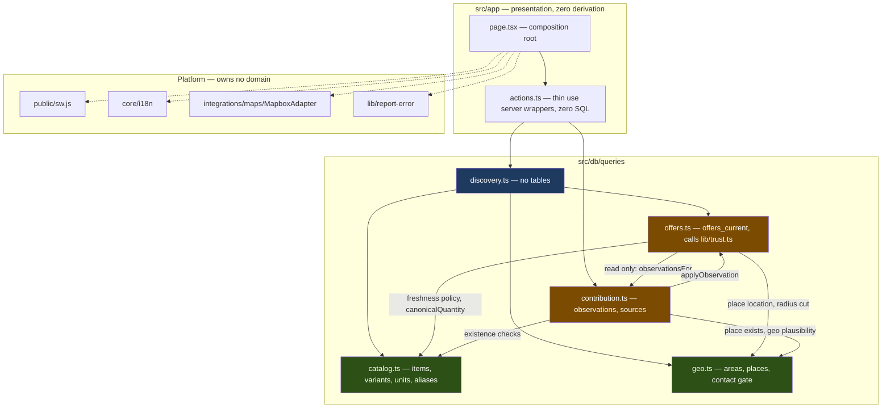
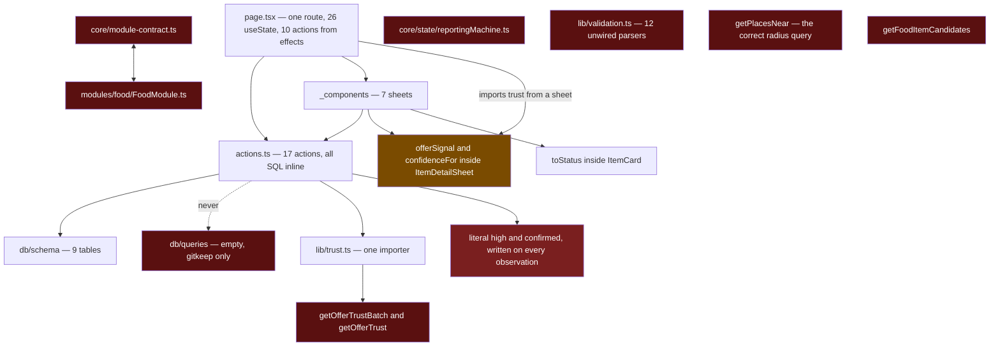
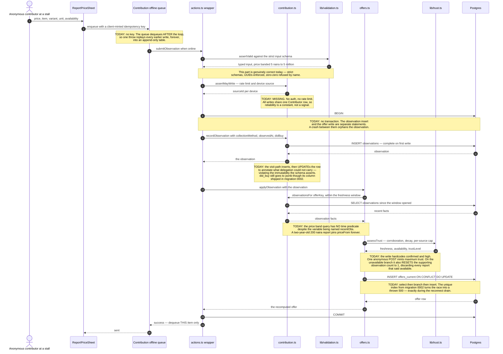

# WetinDey Service Architecture

**Date:** 16 July 2026
**Status:** **ACCEPTED — this is the architecture of record beneath accepted ADRs.** Ratified by [ADR-002](../adr/002-service-architecture-of-record.md) on 16 July 2026. Accepted ADRs are the decision authority and this document yields to them. Subject to accepted ADRs, where this document and another architecture or planning document disagree, this one wins. **Where this document and the code disagree about the current implementation, the code is evidence of what exists** and this document must be corrected; implementation drift does not silently supersede an accepted ADR.

Accepted with three qualifications, from ADR-002:

1. The target decomposition in sections 4-8 is **direction, not a build order**.
2. The roadmap in section 12 is accepted **including its refusals** — the *What to NOT do yet* list binds as hard as the phases.
3. **Boundary work is gated behind correctness work.** Section 12 Phase 5 may not begin until Phases 0-4 land. Reorganising code whose answers are wrong produces well-structured wrong answers.

Written against the working tree at `main` / `019f3f3`, which was dirty at authoring time; **line numbers must be re-verified at merge**.

---

## Read this first

Nine things. If you read nothing else, read these.

1. **`AGENTS.md` documents an architecture that does not exist.** It mandates that every capability implement `WetinDeyModule` (`src/core/module-contract.ts`). The contract has exactly one importer — its own orphaned implementation, `src/modules/food/application/FoodModule.ts`, which is backed by a five-item mock array. Capabilities implementing it: **zero**. The real application is `src/app/page.tsx` (~1,241 lines) plus `src/app/actions.ts` (~1,358 lines) doing everything directly. `src/db/queries/` — where the data layer is documented to live — contains one `.gitkeep`. Treat the docs in `docs/` as archaeology, not specification. `docs/APP-MAP.md` is confidently wrong about its own headline finding and cites files that are not on disk.

2. **Delivery and fulfilment are OUT, by decision (ADR-001, 16 Jul 2026).** Food **price and availability** are the current V1 vertical, not the universal product ontology. WetinDey's owner-directed mission is live local information: help a person understand nearby reality before leaving. Buyer and seller arrange any transaction themselves via "Contact seller." Do not design dispatch, courier, logistics, cart, checkout, or payments.

3. **This is a modular monolith on Vercel.** "Service" in this document means *a bounded module with an owner inside one deployment*. Not a process. Not a container. Proposing Kubernetes, a service mesh, an event bus, or separate deploys for a pre-launch PWA with 478 offers is a failure of judgement, not a display of thoroughness.

4. **The product's one claim is still not backed end to end.** "Know before you go" is a claim about evidence quality. The current tree now calls `assessTrust` on observation writes, but item detail and map markers still use competing UI heuristics and `getOfferTrustBatch` has no live UI caller. Synthetic seed rows are indistinguishable from observed reports, expired rows remain on important read surfaces, and offline cache age is not one authoritative signal. Everything else in this document is subordinate to fixing that.

5. **The shape of the fix is subtraction, and the biggest risk is writing more dead code.** This repo has produced two generations of orphans (`FoodModule`, then `src/lib/trust.ts` written to rescue it and orphaned identically) because passes were forbidden from editing their own call sites — the source says so in its own comments. Before adding anything, delete the fiction and add a tool that makes orphans fail CI.

6. **The category selector is ahead of the category architecture.** Six pillars are
selectable and partially affect search, popular results, metadata, and the header, while
the data model, item detail, narrowed offers, contribution flow, map fallbacks, outcomes,
and much of the copy remain Food/price-shaped. Proposed
[ADR-010](../adr/010-typed-live-local-information-platform.md) and
[ADR-011](../adr/011-earned-trust-graph-and-reputation.md) define the requested evolution.
Their detailed model is not accepted implementation scope. See
[LIVE-INFORMATION-AND-TRUST-EVOLUTION.md](LIVE-INFORMATION-AND-TRUST-EVOLUTION.md).

7. **Database desired state and rollout history are different artifacts.**
[ADR-014](../adr/014-pillar-baselines-and-release-migrations.md) is the decision authority:
canonical pillars describe the intended schema, while numbered Drizzle migrations record
forward release deltas. The exact applied `0000`-`0008` lineage is preserved. `0009` is
independently validated but has not been applied to a shared database; final ingestion
`0010` is also unapplied. A baseline is for an empty database only. Existing databases
receive pending deltas, and their remote ledger is never edited merely because repository
files changed. Operational guidance starts at [docs/database/README.md](../database/README.md).

8. **Browsing context is not physical self-location.** Accepted
[ADR-023](../adr/023-browsing-context-and-device-location.md) separates the area being
explored, the latest browser device fix, camera state, and selected place. The current
tree violates that boundary: one persisted coordinate can become search origin,
`Me`/avatar, route origin, and camera centre; outside-coverage fixes are discarded;
accuracy and browser capture time are dropped; and stale device points can persist.
Acceptance records architecture only. It authorizes no source edit or rollout.

9. **Information-to-action remains a proposal.** [ADR-024](../adr/024-progressive-information-to-action-seams.md)
proposes seller-approved contact, explicit allowlisted redirects, minimal disclosed
handoff payloads, and attributed provider-returned status. It does not supersede
ADR-001 while Proposed. There is no WetinDey cart, checkout, order, courier, delivery, or
tracking capability, and no service or schema should be invented in anticipation of one.

10. **Trusted People / Remote Presence remains a proposal.** [ADR-025](../adr/025-trusted-people-remote-presence.md)
is a separate relationship audience, not a Nearby snapshot or
public people directory. A remote viewer need not hold an ADR-016 lease or disclose a
location; the subject still requires the active 500 m, no-more-than-15-minute foreground
lease, and the remote adapter may not weaken Nearby's reciprocal audience, exact-location,
background, or retention rules. Mutual invite/accept, directional remote-view consent,
relationship-scoped profile-display consent, and the subject's active ADR-016 lease are all
required. ADR-016's reciprocal presence-profile consent remains independent and is not
broadened. No schema, migration, server, UI, provider, messaging, pilot, or rollout work
is authorized.

---

## 1. Product Summary

A Lagos **live local information** PWA whose current V1 vertical is Food price and availability. One question, asked well: *what is the current nearby state of the thing I need to decide about, and how much should I trust that answer?* The product's output is a decision, not a transaction. If the answer is wrong, the product has no reason to exist.

**Shipping shape.** Next.js App Router PWA on Vercel · Neon Postgres + PostGIS · Mapbox GL loaded from the runtime CDN, not a package dependency · anonymous browse · map-first root plus indexable `/item/[slug]` and `/place/[slug]` routes · Server Actions for product data plus the Auth proxy · modular monolith in name only.

> **CORRECTION, 16 July 2026 — this section was stale within hours of being written.**
> It originally read "no auth" and "Server Actions only — `find src -name "route.*"` → zero".
> **Both are now false.** An uncommitted change adds `@neondatabase/auth`, a route handler
> at `src/app/api/auth/[...path]/route.ts`, and `src/lib/auth.ts` / `auth-client.ts`.
>
> Per the precedence rule in [AGENTS.md](../../.agents/AGENTS.md), **the code wins and this
> document was the bug.** Do not "fix" the code to match the old text.
>
> That change is nonetheless **unresolved on scope**: it contradicts Bible Section 40.1
> *Anonymous browse — Accepted* and [ADR-002](../adr/002-service-architecture-of-record.md)'s
> refusal list. It needs a superseding ADR or it needs shelving. Tracked in
> [LANES.md](../../LANES.md) under *Open conflict — the auth lane*.
>
> Treat every other statement about auth, routes, or `user={null}` in this document as
> **suspect until re-verified**.

### The honest state

| | Documented | Actual |
|---|---|---|
| Architecture | Vertical modules implementing `WetinDeyModule` | Two god-files. Contract importers: 1, its own orphan. Implementations in use: 0. |
| Data access | `src/db/queries/` | One `.gitkeep`. Every SQL statement is inline in `actions.ts`. |
| Trust model | `src/lib/trust.ts` — source-weighted, per-source capped | Writes now call `assessTrust`, but item detail and map markers still use competing heuristics; the batched read action has no UI caller. One authoritative read model still does not exist. |
| Freshness | Domain layer, per-category windows | Computed in a React component — `offerSignal` in `ItemDetailSheet`, imported *back out* by `page.tsx` to colour map pins. |
| API | Ten `/api/v1` endpoints | **One** route handler — `src/app/api/auth/[...path]/route.ts`, the auth proxy ([ADR-003](../adr/003-identity-for-contribution-trust.md)). Zero of the ten documented `/api/v1` endpoints. All product data flows through Server Actions, which is correct. |
| Identity | Anonymous browse | Anonymous browse **plus optional email-OTP accounts**. Current writes resolve recognized contributors into `sources.user_id`; the remaining trust model is unsafe because the shared seeded anonymous Contributor reliability is `98`, recognized contributors start at `75`, and no earned outcome ledger exists. |

### Users

**Primary — the buyer, anonymous by design.** A Lagos resident deciding whether a trip to the market is worth it. Cost of a wrong answer: an hour, a bus fare, a wasted trip. Browsing requires no account, while optional email-OTP recognition exists for attribution. Bible Section 40.1 accepted **anonymous browse** deliberately. The same anonymous person may also *contribute* — reports a price, confirms a visit. That is the product's supply.

The inherited mistake: **Section 40.1 accepted anonymous *browse*. Anonymous *write* was never argued for.** It came along for the ride, and it is the single largest liability in the system.

**Secondary — three in the Bible; two exist in code as nothing at all.**

| User | Bible mandate | Reality |
|---|---|---|
| Traders / sellers | Vendor as a first-class object; a `vendors` table | No `vendors` table. Contact is denormalised onto `places` and nothing writes or reads it. `contactVisibility` defaults to `'private'` and no writer ever changes it. A trader cannot reach this product. |
| Ops / data team | An entire Bible chapter — field collection, supply mix, coverage targets | **Zero surface.** One route. Ops is a runbook with no screen. |
| Moderators | Corrections, audit, "every moderation action is audited" | The vocabulary ships and is a lie. `moderationStatus` defaults `'pending'`; **every** writer hardcodes `'approved'`. Nothing can ever be pending, nothing is ever moderated, and no audit table exists. |

**The unifying gap: nobody knows who wrote a row.** Every submission is attributed to one shared `'Contributor'` source row, so `sources.reliability_score_internal` is a constant, not a signal. No source identity → no rate limit, no reputation, no moderation subject, no audit actor, no idempotency key. Fix identity and four missing capabilities become cheap.

### Goals

**User goals**, in the order the app serves them: *what does food cost around here?* → *where is the thing I want, at what price?* → *can I believe this?* → *get me there* → *here's what I saw.*

**Business goal.** The north star is **Verified Decision Sessions** — item+unit selected → trusted result → decision action. **Zero of the Bible's 19 named events are emitted.** The only analytics is one cookieless `<Analytics />` tag, which is correct as far as it goes. The launch gates therefore have no data source: *you cannot currently tell whether the product works.*

The strategic bet is supply, not software. The Bible says it plainly: "Data is an operations problem before it is a machine-learning problem."

### Current workflows

1. **Land → browse (works).** Map mounts → `getPlaces()` returns the **entire places table**, unconditionally → `getPopularItems({lat,lng,radiusKm,limit})` ranks what is actually within radius. The radius from Settings is honoured throughout.
2. **Search → narrow → decide (works, and is the good part).** `searchFoodItems` fires per keystroke over canonical names, slugs and Nigerian-language aliases — ewa, shinkafa, dodo. `ItemDetailSheet` runs its own narrowing and publishes the narrowed set **upward**, so the map pins *are* the list. One query, one answer; pin and row cannot disagree about *which* offers exist. They can still disagree about freshness.
3. **Decide → go (partly works, with a privacy defect).** `GetItSheet` offers **Go
there** (platform-detected maps handoff), **Share/Copy** (three tiers, none silent), and
**Contact seller**. Opening the sheet—not tapping Go there—immediately sends the
overloaded exact origin and destination to Mapbox Directions. Share still says `Price
confirmed` for any timestamp and shares a Google Maps coordinate even though a canonical
`/place/[slug]` route exists. Contact seller is display-only: the server returns visibility
metadata but no consented channel, and the row has no action. Place-detail offer rows are
also informational and inert. ADR-001 remains binding; ADR-024 proposes but does not
authorize later seams.
4. **Go → confirm (surface and arming exist; public submission is contained).**
`GetItSheet` can arm a local visit and `takeDueVisit` can consume it for a one-time return
prompt. The confirmation UI and validation code remain, but the public write does not
currently close the evidence loop and must not be described as doing so.
5. **Report a price (works, with a permanently-corrupting bug).** Pickers + price + availability → `submitObservation` → append observation → recompute `offers_current`. Offline, it queues. The queue replays duplicates forever — see R5.
6. **Public review read is not privacy-safe.** `getReviewsForEntity` can return a stable
account identifier and can use account email as the public reviewer name. Public review
write is contained, but the read DTO still needs a separate fail-closed privacy
correction; neither identity field belongs in a public action response.

### Navigation and information architecture

**One map application root, two indexable content routes, no tab bar.** Interactive
discovery remains sheets over a persistent WebGL map; `/item/[slug]` and
`/place/[slug]` are read-only public pages.

```
/  (page.tsx — the primary map route)
├── Map (persistent, mounted once above the shell branch so
│        WebGL survives an iPad Split View drag)
│   ├── Location pill ──────────► LocationSheet
│   ├── Theme toggle            (duplicate of the one in Settings)
│   └── Recenter control        (moves the camera, NOT the data)
│
└── AdaptiveShell  ── the app's only width boundary, at 768px
    ├── CompactShell  → BottomSheet, 3 detents
    └── RegularShell  → one leading panel
         └── NavigationStack (identical in both size classes)
             ├── L0: brand · [+] Report · [avatar] · SearchField
             │       └── Popular list  |  Search results
             └── L1: Place detail → offers → [Get it]

Presented sheets (ModalSheet): ItemDetail · GetIt · ConfirmVisit ·
                               Location · Settings · Profile · ReportPrice
```

**The avatar is the app's only persistent navigation affordance.** No tab bar means everything that isn't "search the map" lives behind it. `ProfileSheet` is 33% functional — and honestly so; disabled-not-hidden shows the shape without shipping a dead link.

**IA smells that matter.** *The recenter trap*: the recenter control moves the camera and never writes `locationStore`, so the app's most obvious "find me" button finds you on the map and **not in the data**. The camera argument is documented and sound; the omission is not. Two controls look like "find me"; one changes the answer. *Dead-end instructions*: `ItemDetailSheet`'s empty state says "Widen the radius in Settings" from inside a modal that occludes the only path to Settings; the popular list's empty says "Be the first to report one" with the `+` button 800px away — while `AsyncList.empty.action` exists, unused, for exactly this.

### Existing UI/UX patterns

Apple HIG is law here and the discipline is real: **no routine decorative borders,
sheets not dropdowns, carets not arrows, less copy.** Focus outlines, forced-colors
outlines, information-bearing strokes, and a control outline required to preserve
affordance are not decorative borders.

`AdaptiveShell` mounts exactly one shell at 768px and renders the map alone on SSR rather than guessing at hydration. `BottomSheet` translates, never resizes, and publishes `--sheet-hidden` that the map and nav stack consume. `NavigationStack` uses **presence as depth** — no depth state — and keeps L0 mounted so scroll survives. `AsyncList` is the best component in the repo: it owns the fifth state nobody names, *refreshing while data is shown*, and degrades an error-with-data to a strip **above live rows** rather than destroying them. `SheetPicker` refuses to render a picker for ≤1 option, because a picker with one undeselectable row is a control that lies about having an outcome. `StatusBadge` may use a saturated status tone only for an actual asserted state and is always paired with a label so meaning survives greyscale. Authentic licensed/media color and separately owned domain and rating tones follow ADR-018; they do not make an ordinary control a status.

**Accepted visual architecture correction — [ADR-018](../adr/018-controlled-semantic-iconography.md).**
Primary surfaces and ordinary destinations, actions, navigation, inputs, and system
controls are monochrome or neutral. Authentic color remains valid for licensed flags,
attributed photography, and user-chosen avatars. A complete enabled domain may own a
domain tone, but domain, rating, and status are separate token families. Only an actual
asserted state may use `confirmed`, `caution`, `unavailable`, or `info`; disabled future
categories remain neutral, and rating has its own token.

The accepted `IconOrb` contract is circular and borderless at 28, 32, or 48 px,
decorative by default, paired with redundant text, and contained by an interactive parent
of at least 44 × 44 px when actionable. It must remain understandable in grayscale and
forced-colors and remove nonessential motion under reduced-motion preferences. It is not
a blanket wrapper or color rule for pills, cards, inputs, status badges, flags,
photography, avatars, or map markers.

This correction explicitly supersedes provisional universal green-accent, routine
separator, and border-as-containment guidance. Spacing, neutral surface contrast,
material, and restrained elevation establish hierarchy; accessibility-required focus
outlines and information-bearing strokes remain valid. ADR-017 continues to govern
Aboki FX's licensed local non-emoji SVG flag sprite and prohibition on remote flag
requests. These are accepted architecture rules, not evidence that the current runtime
implements them. The implementation lane is separate and unclaimed.

**Where the patterns break:** two of five lists ignore `AsyncList` and hand-roll their states (`ItemDetailSheet`'s error card has no retry at all). The search list has **no error path** while the popular list directly above it does — a database outage renders as *"Try a local name like 'ewa' or 'dodo'"*, the app blaming the user's vocabulary. The language picker is a lie: 215 i18n keys, one consumer; every dotted key has zero consumers; `ConfirmVisitSheet` forked its own dictionary; distance formatting hardcodes English `"away"` on the three surfaces where distance is read. `MapboxCanvas` declares `selectedPlaceId` as a **required** prop and destructures it as `_selectedPlaceId`, never using it — **no pin has ever rendered as selected.** The popular list ships `PhotoCredits`; the search list renders the same Wikimedia images with none — a licence breach by the codebase's own stated standard. Escape in a nested picker discards the whole form, because `ModalSheet` renders inline with no portal and both handlers sit on `document` where `stopPropagation` does not stop siblings.

---

## 2. Existing Services

Six areas of ownership. Five are domain modules; **Platform** owns no domain and is not a peer — it is named here because these concerns are currently *nobody's*, which is why it has the most orphans.

Nothing below is a directory today. All of it is a set of functions that share a subject.

### 2.1 Discovery

**Purpose.** Turn "what does food cost around here" into an answer, and the answer into a trip. The only area with a face, and the reason the others exist.

**Reality.** Discovery is `src/app/page.tsx` — one route, ~26 `useState`, ten server actions called directly from effects — plus four sheets each hand-rolling some of what Discovery would own once.

**Owns:** the route, the map layer and pins, the sheet header, search field, both result lists, the place detail panel, `ItemDetailSheet`'s narrowing loop, `GetItSheet`'s handoff.
**Owns no backend and no data**, and that is non-negotiable. It composes `searchFoodItems`, `getPopularItems`, `getPlaceOffers`, `getItemNarrowingOptions`, `getOffersNarrowed`, `getPlaceContactPolicy`. A Discovery action would be Discovery reaching into other people's data.
**Depends on:** Catalog, Geo, Offers. Nothing depends on it.
**Permissions:** public, anonymous. Correct.

**What is broken.** The search list has no error path. No pin renders as selected. Search results show CC-licensed photos with no attribution. Dead-end empty states. Domain logic lives in its sheets — `offerSignal` and `confidenceFor` are the app's only live trust model, and `page.tsx` imports `offerSignal` back out of a sheet to colour map pins.

**What is right.** `NarrowStep`'s refusal to render a single-option picker. `ItemDetailSheet` freezing `origin` at open so the list cannot re-rank under the finger, and publishing its narrowed set upward so pins and rows cannot disagree. `GetItSheet`'s three-tier share, treating `AbortError` as a completed interaction because copying after the user backed out would be the app overruling them.

### 2.2 Catalog

**Purpose.** Own what a thing *is called* and what it *is sold in*. Rice is Rice whether the user types "rice", "shinkafa" or "ọ̀kà"; a 50kg bag is not a paint bucket.

**Owns:** `ItemCard` (the row plus the slug-hashed Monogram fallback) and `PhotoCredits` — whoever owns the image owns the credit, because the credit must never drift away from the image it belongs to.
**Backend:** `searchFoodItems`, `getInitialSubmissionData`, `getItemNarrowingOptions`. Plus `getFoodItemCandidates` — **orphan, zero callers, delete.**
**Data:** `items`, `item_aliases`, `item_variants`, `units`. `units` is a **read-only shared kernel** — read by four surfaces, written only by the seeder.
**Depends on: nothing.** Catalog is the leaf. That is why it is the cheapest to extract first.

**What is broken.** Every keystroke is three leading-wildcard `ILIKE` seq scans; `pg_trgm` is not installed — honestly documented as a privilege decision, not a schema one. At ~87 aliases the planner does not care. `item_aliases.weight` is a ranking column that ranks nothing, and `normalizedAlias` — the column that would make matching case- and accent-stable — is dead beside it. `units.canonicalQuantity` and `dimension` are the **already-seeded** fix for a bug the code confesses to: cheapest-sort breaks the moment an item has variants in different units, which is what quoted Palm Oil across incomparable units and produced the ₦1,454–₦49,476 range that is arithmetically fine and factually nonsense. No migration needed; nothing reads the columns. `getInitialSubmissionData` ships the entire taxonomy to every client on boot — four unbounded full-table SELECTs, not even filtered to `items.active`.

### 2.3 Geo

**Purpose.** Own "where" without collapsing its meanings: browsing context, physical
device evidence, and place coordinates. Discovery owns camera composition; a selected
place is task state. Geo also owns the administrative tree a Lagosian actually says
("Ojo", not 6.46,3.19), the physical stalls, and—because it owns `places`—the consent
boundary around a real trader's contact value.

**Owns:** `LocationSheet`, the location pill, `MapNotice`, `MapRecenterControl`, `locationStore`, distance formatting.
**Backend:** `getAreaTree`, `getPlaces`, `getPlacesNear`, `getCoverageForPoint`, `getPlaceContactPolicy`.
**Data:** `areas`, `places` — **including the PII**: contact channel kind, contact channel value (E.164), contact visibility.
**Depends on: nothing.** Leaf.

**What is broken.**

- **One persisted coordinate still stands for four concepts.** `locationStore.position`
  is correctly provenance-tagged, but `page.tsx` strips that provenance and uses the
  coordinate for search, the `Me`/avatar marker, route origin, and camera. A
  default/manual/simulated browsing point can therefore impersonate physical identity.
  Device accuracy and browser timestamp are dropped, stale device fixes persist, and a
  valid outside-coverage fix is discarded rather than retained separately. ADR-023
  accepts the correction architecture; implementation is unclaimed.
- **`getPlacesNear` is the correct radius query — `ST_DWithin` on geography, index-served — and has zero callers, while `getPlaces` returns the whole table on every boot.** The comment above it says exactly this: "getPlaces() returns the whole table unconditionally; this is the query to use whenever a radius is in play." Nobody took the advice. The good implementation is dead and the crude one is live.
- **The PII gate is safe by omission, and the omission is one line from being reversed.** The schema states the rule correctly: *"The column being non-null is consent to store, never consent to publish."* Enforcement is entirely that `getPlaceContactPolicy` **happens not to SELECT the column** — so, to be precise and fair: **no number is on any wire today.** But `contactVisibility` comes back as a raw untyped string and the actual consent check is a string comparison in a client component. The trigger is not an attack; it is the ticket "make Contact seller work," which ADR-001 made inevitable. See R4.
- **`areas.parent_area_id` is a self-FK with no database constraint**, and three INNER JOINs depend on it. Every other FK is present in migration 0000; this one is absent. A dangling parent **silently drops neighbourhoods** — an inner join returns fewer rows, it does not error. That is exactly the silent-wrong-answer class the schema goes to war against everywhere else. The tree is seed-written today, so the constraint is safe to apply now and is what keeps it safe when it stops being seed-only.
- **The recenter trap** (above): camera moves, `locationStore` does not.
- **Two documented seq scans.** The schema says in writing that the GIST index *"deliberately does NOT help"* `getItemNarrowingOptions` and `getOffersNarrowed`, which compare `ST_DistanceSphere(location::geometry, origin) <= radius` — a function result against a constant, with a cast that abandons the geography index anyway. At 478 offers this is a note, not an emergency. See R8.
- **Duplicate geolocation stacks.** `LocationSheet` distinguishes insecure-context / no-API / permission-denied / position-unavailable / timeout, each with its own title, body and retry affordance, plus an `outside` state with a "Use {nearest} instead" escape. It is the best error handling in the codebase. `MapRecenterControl` collapses all of it into two strings and uses different options.
- **Four files cite `geographyPoint.fromDriver` as living in `src/lib/geospatial.ts`. It lives in the schema.** The cite is wrong in every instance.

**What is right.** `locationStore`'s **required** `provenance` field — `simulated |
manual | device | default` — is the correct evidence seed for ADR-023. `skipHydration`
plus effect-driven rehydrate is correctly reasoned for SSR. `LocationSheet` draws
single-child LGAs as the area row itself. `getAreaTree` fails closed on a broken
administrative chain. `getCoverageForPoint` accepts a world coordinate and can truthfully
say coverage is absent; the defect is that the caller then discards the physical fix.
`getPlaceContactPolicy` throws, with reasoning, on a missing row.

### 2.4 Contribution

**Purpose.** Take what a person saw and get it into the log — including from a phone with no signal, standing in a market.

**Owns:** `ReportPriceSheet` (fully controlled, zero local state — `page.tsx` holds all six fields and four status booleans), `ConfirmVisitSheet`, visit arming, both offline queues, the `+` button.
**Backend:** `submitObservation`, `submitVisitConfirmation`, `getVisitContext`. Plus `src/lib/validation.ts`.
**Data:** `observations`, `sources`.
**Permissions: anonymous write, unauthenticated, unrate-limited.** The single worst fact in the system.

**What is broken.**

- **One anonymous POST can blank a rival trader's inventory.** The code writes its own indictment: *"A competitor can blank a rival stall's inventory with a perfectly well-formed payload. That needs auth, not zod."* `submitVisitConfirmation({wasAvailable:false})` passes zod, then sets `availabilityState:'unavailable'`, `freshnessState:'unavailable'`, `trustLevel:'high'` and **resets** `supportingObservationCount` to 1 — discarding every report that backed "available". `grep -rni 'ratelimit'` returns one prose comment.
- **Every submission is attributed to one shared source row**, so `reliability_score_internal` is a constant, not a signal. Source-diversity weighting has nothing to weigh.
- **The offline queue replays duplicates forever, into an append-only table.** `page.tsx` loops `await submitObservation(item)` and calls `removeItem` **after** the loop, whole block in one try/catch. `submitObservation` throws on validation failure. Entry 3 of 5 fails → entries 1–2 are already committed, the throw skips `removeItem`, and the whole queue replays on the next reconnect. The poisoned entry never drains. No attempts counter, no TTL, **no idempotency key**. `observations` only grows, so the duplicates are permanent. Their live effect is narrower than commonly stated: they inflate `supportingObservationCount`, which the **live** consumer (`ItemDetailSheet`'s `confidenceFor`) *buckets* — duplicates can falsely clear its `reports >= 3` threshold and add a confidence bar. The uncapped `count * 10` formula everyone points at lives in `getFoodItemCandidates`, which is **an orphan with zero callers**. The bug is a bucket nudge in an unfixable log, not an uncapped score.
- **Two queues, one job, two levels of care.** `ConfirmVisitSheet`'s queue has a max-attempts cap and a staleness TTL and drops stale entries rather than replaying them as fresh — because `submitObservation` stamps `now`. It calls itself *"a workaround, not a design"*. The price queue has neither guard. One author reasoned about replay-after-reconnect; the other did not.
- **`observations` is documented as immutable and the visit path UPDATEs it.** The schema asserts "this table only ever grows"; `submitVisitConfirmation` UPDATEs the row it just inserted, to annotate `collectionMethod` and `rawPayload` — a compensating write that exists **only** because delegation to `submitObservation` cannot carry those fields. The code names its own fix: *"the clean fix is for submitObservation to accept collectionMethod / sourceId / observedAt, at which point the annotation step disappears."* It is right.
- **`did_buy` has had a column since migration 0002 and still goes into jsonb**, under a comment that still claims it has no column. The only evidence that a price was **paid** rather than **seen** stays un-aggregatable. The nullable three-state design (true / false / NULL = never asked) is correct — keep it, do not backfill a default.
- **`submitObservation` validates into `input` and writes from `data`.** Only `priceAmount` is read from the validated object; every other field written to the database comes from the raw parameter. Benign today (the schema neither transforms nor coerces); a trap primed to fire the moment any field gains a `.trim()`. The visit path already does the right thing. **One line.**
- **No transaction.** The observation insert and the offer write are separate statements. A crash between them leaves an observation with no offer.
- **`moderationStatus` is a state machine nothing can enter.** Defaults `'pending'`; every writer hardcodes `'approved'`. Readers correctly use `<> 'rejected'` rather than `= 'approved'`, because an equality filter would return zero sources for the seeder's rows. **Either wire it or delete the vocabulary** — a schema that looks moderated and isn't is worse than both alternatives.

**What remains useful inside the contained write code.** The input schemas are `.strict()`,
band price to ₦5–₦5,000,000, enforce UUIDs, and refuse (0,0) by name. The visit shape is
a discriminated union on `wasAvailable`; `getVisitContext` refuses a half-filled context;
and `armVisit`/`takeDueVisit` shape-check disk state. These are implementation assets,
not evidence that a public contribution currently succeeds or closes the loop.

### 2.5 Offers

*(Called "Pricing" in earlier drafts. It is **Offers**, everywhere, from here on.)*

**Purpose.** Own the one row that answers "what does it cost here, right now" — the read model the entire product is served from — and everything a user reads about that answer's quality.

**Reality.** Offers is a table and a code block. `offers_current` is **not** a Postgres materialized view; it is a hand-maintained table recomputed **inline inside a Contribution action**, ~1,000 lines from its readers.

**Owns:** `StatusBadge` — trust's public face, and not a generic pill.
**Backend:** `getPopularItems`, `getPlaceOffers`, `getOffersNarrowed`, plus the recompute block welded inside `submitObservation`, plus `getOfferTrustBatch` / `getOfferTrust` (**both orphans, zero callers**), plus `src/lib/trust.ts` (one importer, feeding those two orphans).
**Data:** `offers_current`. **The only genuinely contested table in the system.**
**Depends on:** Contribution (read-only), Catalog (units, freshness policy), Geo (place location, radius cut).

**The adjudication that matters.** `offers_current` is **derived by** Contribution and **consumed by** Discovery — which is exactly why neither may own it. Today `submitObservation`, a Contribution action, writes it directly: one function doing two areas' jobs, with no transaction. **This is the single boundary that, if drawn, makes the rest extractable.** `freshnessState` and `trustLevel` are Offers' columns holding trust's values; Offers is the sole authority for what they contain.

**Why trust is a module rule here and not its own service.** The experiment already ran. `getOfferTrustBatch` / `getOfferTrust` **are** a clean, batched trust API over a careful 527-line model — batched precisely so a per-pin round trip is impossible — and grep proves **nothing calls either**. That is not an accident of scheduling. A trust assessment is not a thing anyone wants: nobody opens the app to ask "how reliable is this claim?"; they ask "is there rice, at what price, near me?" and trust is *how that answer is qualified*. Every input to it is an offer's own field or an aggregate of the observations behind one offer key. A service whose output is meaningless without another service's aggregate is that service's domain logic wearing a port. Reputation and abuse control split the other way, to **Contribution** — reputation is a property of a Source, and a Source is Contribution's data. A single "Trust service" would have to own both `sources` and `offers_current`; a boundary that swallows both its neighbours is not a boundary.

**What is broken.**

- **Four trust models ship simultaneously and can disagree about the same offer on the same screen. The two good ones are dead.**

  | # | Model | Where | Status |
  |---|---|---|---|
  | 1 | `FoodModule.assess` | `src/modules/food/application/FoodModule.ts` | orphan, backed by a five-item mock array |
  | 2 | `assessTrust` | `src/lib/trust.ts` | orphan by proxy — correct, source-weighted, per-source capped |
  | 3 | `offerSignal` + `confidenceFor` | inside `ItemDetailSheet` | **live — in a React component** |
  | 4 | `toStatus` | inside `ItemCard` | live — reads `freshest` raw, never consults age |

  `AGENTS.md` forbids both live ones by name: the presentation layer "must never define domain database logic, calculate freshness windows, or invent confidence scores directly." `offerSignal` parses `expiresAt`, compares to now, and overrides the stored `freshnessState`. `confidenceFor` invents a confidence score. And `page.tsx` imports `offerSignal` **back out of a sheet** to colour map pins. The component's logic is not wrong — its own comment explains why it exists: *"a row can sit at 'confirmed' five days after it expired."* **The component is defending against its own server actions.** It is in the wrong file, and the right file is already written.
- **Trust is hardcoded on every write.** `freshnessState:"confirmed", trustLevel:"high"` unconditionally, on both the update and the insert branch. **The product's central claim is currently backed by a string literal.** The Bible says confidence combines source reliability, freshness, **corroboration**, evidence, precision and conflict. One anonymous report is `likely_available` at best.
- **The price band is computed over all history. The variable is named `recentObs` and the comment says "Fetch recent prices."** There is **no time predicate**. `Math.min(...prices)` / `Math.max` therefore span **every observation ever recorded** for that triple, in a table that only grows. A ₦200 rice report from two years ago pins `priceFrom` at ₦200 **forever**, and no subsequent report can raise the floor. This is the Palm Oil class of bug that `getPopularItems` was rewritten to fix — except baked into the stored offer, where the reader cannot see or fix it. It also spreads unbounded state into memory: `Math.min(...prices)` on a long-lived triple will eventually exceed the spread argument limit and throw.
- **The unique index shipped; the upsert did not.** The schema correctly identifies the read-select-then-insert race and adds a unique index in migration 0002, honestly noting it *"turns silent divergence into an error at the moment it happens."* But the code is unchanged — select, branch, update-or-insert, **no `.onConflictDoUpdate`**. Two concurrent reports for the same triple both miss the select; the loser throws an unhandled unique violation and **the contributor's report is lost with a 500 instead of being merged** — precisely during the reconnect batch drain, when concurrency peaks.

**What is right.** `getPopularItems` is the most sophisticated and most correct SQL in the app: three CTEs computing the price range **within the modal unit** — written specifically to kill the Palm Oil range — and `ST_DWithin` on geography, index-served. **The right pattern exists in the same file, hundreds of lines above the two predicates that get it wrong.** `getOffersNarrowed` uses the *same expression* for the distance and the radius, which is a genuinely careful choice given that spheroid and sphere differ by ~0.3% and would otherwise produce a "5.0 km inside a 5 km radius" artefact. `trust.ts` is a **port**, not a duplicate, documented line by line: it adds what `FoodModule` lacked — per-source capping, so *"three reports from one source cannot equal three from three"* — and it weights `sms` and `scraper` collection methods in advance, *so that the day they start writing they do not silently default*. `getOfferTrustBatch`'s moderation filter deliberately matches its distinct-source count *so the two numbers cannot contradict each other in the same panel*. Careful, correct, dead.

### 2.6 Platform — owns no domain

**Purpose.** Everything that is not a domain but every domain needs. **Platform is not a peer of the five modules and never becomes one.** It is a name for the shell, the design system and the infrastructure seams, so that they have an owner instead of being nobody's. When the UI and backend maps below say "Platform", they mean *no domain module owns this, and none should*.

**Owns:** every design-system component · `src/core/i18n/` · theme context · `useMediaQuery` · the global stores · `SettingsSheet` · `ProfileSheet` · `layout.tsx` · both error boundaries · `public/sw.js` · `src/lib/report-error.ts` · `src/integrations/maps/MapboxAdapter.ts` · `src/app/sitemap.ts` · `src/db/index.ts`. **`page.tsx` is Platform's — as a composition root only.** It should end up holding the shell, the sheet mounts and the wiring, and **nothing that knows what a naira is.**

**`actions.ts` is not owned; it is a manifest.** Each of its 17 exports belongs to exactly one module. It should become thin `"use server"` wrappers over `src/db/queries/*`, split along the five domains **the file already separates with its own banner comments**.

**Integrations.** Vercel Analytics — one cookieless tag, no cross-site tracking, **the correct amount of analytics for a pre-launch anonymous PWA**. Sentry ingest over one `fetch` with no SDK, deliberately, for Nigerian mobile data. Mapbox CDN.

**What is broken.**

- **215 i18n keys, one consumer, and a fork.** Every dotted key has zero consumers. `ConfirmVisitSheet` forked its own dictionary. `LocationSheet` admits it: *"English on purpose… waiting on the sheet's own i18n pass."* The dictionary comments still cite `AreaPickerSheet.tsx` — **a file that does not exist on disk**. The extraction landed; the adoption did not. Adopt the dictionary in the six sheets, or remove the picker. A control that offers three languages and delivers one is worse than English.
- **`ThemeProvider` gates first paint of the entire app on hydration**, hiding all children until a `useEffect` fires. The blocking head script it references already resolved the theme class before paint — that is why the map can pick its basemap at construction. The gate defends against a flash the script makes impossible and charges the LCP budget for it, against a p75 target of ≤2.5s on mid-range Android over Lagos connections. **Delete it.**
- **`report-error` declares three scopes for call sites that do not exist** — `'server-action'`, `'map'`, `'reporting'`. Two callers total, both error boundaries. `grep 'catch' src/app/actions.ts` → **zero hits**, so a throw in a server action reaches the user as a digest and goes nowhere. The queues log to bare `console.error` — the exact pattern the file was written to eliminate. **A silently-dropped price report is invisible today by construction.**
- **Escape in a nested picker discards the whole form.** `ModalSheet` renders inline with no portal; `SheetPicker` mounts a `ModalSheet` inside the parent's; both listen on `document`, and `stopPropagation` does not stop other listeners on the same node — that requires `stopImmediatePropagation`. Reproduces for any keyboard user across four pickers in the report form and two in `ItemDetailSheet`. Fix with a module-level open-sheet stack, which also fixes focus restore.
- **Three state libraries, one live consumer each.** `xstate` → only `reportingMachine.ts`, which has **zero importers**. `@xstate/react` → imported by **nothing**. `jotai` → two atoms, one consumer. `zustand` → two stores, real consumers. And the i18n module pointedly uses none of them. **This is accretion, not layering.** Cut `xstate` + `@xstate/react` — **harvest `reportingMachine`'s offline-queue design first**, it is the correct model for Contribution's queue. Fold the atoms into `page.tsx`. Land on `zustand` alone; it is the only one with the `persist` story `locationStore` needs.
- **Dead surface.** `Card.tsx` — zero importers, carrying a careful comment about a bug nobody can hit. `ListRowSkeleton` — zero importers. Seven dead props. Five identical naira formatters. Four segmented controls. Two Banners. `OfferCardSkeleton` traces a row that **no longer exists** and is used for rows it does not match — different fill, radius, shadow and height, so rows shove on arrival, against the standard card skeleton set for itself.
- **Ten `.gitkeep`-only directories** under `src/core/` and `src/integrations/` mirror the module contract's slice names exactly. **They are the negative space left by the contract nobody implemented.** An agent listing `src/core/` sees the Bible's architecture reflected back and files new code where nothing imports. **Delete them, do not fill them.**

**What is right.** **`public/sw.js` (~442 lines) is the strongest engineering in the repository.** It refuses to touch Mapbox `/v4/` tiles because `mapbox-gl` owns that cache (verified 100% duplication otherwise); it namespaces its activate sweep so it cannot wipe Mapbox's bucket; it re-issues cross-origin `no-cors` requests as CORS to get a readable status rather than caching opaque 404s forever; it stamps insertion time to honour Mapbox's 30-day retention ceiling. It lives in `public/` while `src/core/offline/` is empty — **so nothing owns it. Platform owns it, starting now.** `global-error.tsx` explicitly does **not** copy the layout's blocking script, because a React-inserted script never executes and would have flashbanged dark-mode users. `MapboxAdapter` is the one honoured architectural rule: a real vendor seam, used only by the canvas. `report-error` made the right architectural call and was just never finished.

### 2.7 Homeless concerns — named, because they belong to nobody

| Concern | Reality | Where it must land |
|---|---|---|
| **Authorization** | Optional recognition exists, but application-owned scoped seller/operator authorization does not. No role assignment, permission matrix, suspension/revocation, or audit boundary implements ADR-022. | Future ADR-022 P1 after Food/contribution gates. A cross-cutting server precondition, not a service. |
| **Idempotency** | `grep -rni 'idempot'` → one unrelated seed comment. | Contribution. One client-minted UUID plus a unique constraint fixes replay and the Bible's idempotency requirement in one stroke. |
| **Stale treatment** | `grep lastSync` → nothing. Unimplemented. | Offers. The most serious gap, because it inverts the product's one promise. |
| **Media / evidence** | `@vercel/blob` is **not in `package.json`**; no evidence table; the media folder is a `.gitkeep`. | Nowhere in V1. It is listed as an **Accepted** decision with zero implementation — the most misleading drift class there is. Move it to Open by ADR. |
| **Analytics** | Two empty folders, one tag, **zero of 19 events**. | Each module emits its own. Instrument the five that gate launch and drop the other fourteen. |
| **Identity** | Optional email-OTP recognition and profiles exist; anonymous browse remains accepted. Authentication does not prove business, place control, role, consent, or accuracy. | Attribution now; future ADR-022 assignments remain application-owned and separately gated. |
| **The module framework** | A closed orphan pair, backed by a mock array, mandated by `AGENTS.md`, implemented by nothing. | **Delete.** See R1. |

---

## 3. Missing Services

Ranked by urgency. "Missing" means: no code owns this concern, and the product cannot honestly launch without it. Everything here is a module inside the monolith. Nothing here is a deployment.

### M1 — Contribution integrity — **BLOCKING PILOT**

**Missing:** any concept of *who wrote a row*. No auth, no rate limit, no per-device source, no idempotency key. Every submission shares one `'Contributor'` row, which makes reliability a constant rather than a signal.

**Urgency:** see Section 2.4 and R3. One anonymous POST, no rate limit, no recovery, no forensics.

**Scope discipline — this is not accounts.** A signed device cookie mints one `sources` row. That is the whole feature. Contributor reputation and abuse controls become *possible* the moment a source row exists; none of them are possible now, and none require a user table.

**Cheapest closure of the destructive case:** require **two distinct sources** before an `unavailable` flip earns `trustLevel:'high'`. The Bible already says conflicting evidence must surface a conflict, not certainty. That single rule kills the sabotage vector with no identity work at all. Do it first; add the device source second.

### M2 — Idempotency on the offline write path — **BLOCKING PILOT**

**Missing:** a client-minted key on every queued report, and a constraint to enforce it.

**Urgency:** the queue replays duplicates forever into an append-only table, for the users on bad connections — i.e. the users the product exists for. See Section 2.4 and R5.

**Fix:** one UUID per queued report; a **new nullable column** on `observations` with a **partial unique index `WHERE key IS NOT NULL`**; **no backfill** — historical rows, including whatever duplicates already exist, stay NULL and stay indexed-out. Dequeue per-item on success. This closes the duplicate bug and the Bible's idempotency requirement together, and it is the precondition for M1's per-device source being meaningful. Do not let this become the third index that ships without its write path.

### M3 — Stale treatment for cached data — **BLOCKING PILOT**

**Missing:** last-sync time displayed, and a stale treatment that stops a cached result retaining a green "available now" presentation. `grep lastSync` → nothing. No implementation of any kind.

**Urgency:** this inverts the product's only promise. The service worker serves a cached shell on a dead connection with no age signal, so a user in Festac opens WetinDey offline and reads a confidence badge rendered from three-day-old data. That is not a degraded WetinDey — **it is precisely the market rumour WetinDey exists to replace, with a nicer typeface.**

**Why it is cheap.** The machinery exists on both sides and nothing connects it: `sw.js` already stamps a cached-at header, built for Mapbox's retention ceiling; `trust.ts` already keeps freshness and availability as **two separate answers** precisely so a stale treatment is expressible. The model is ready; the wire is missing.

### M4 — Food moderation and audit — **current debt; ADR-022 phases separately**

**Missing:** the moderation vocabulary ships and is a lie (Section 2.4). No decisions table, no audit log, so no row records who decided — while the Bible requires that every moderation action is audited and sets a maximum moderation delay as a pilot SLA.

**Food moderation decisions need an actor and audit trail.** A generic decision record
with no accountable reviewer is a table of nulls. However, ADR-022 supersedes the old
“one module or none” sequencing: its P1 audits assignment and permission lifecycle before
P2 seller verification, moderation, and appeals. Those reviewer actions then use the
same governed actor/reason/audit contract. Neither phase waits for activation of the
future `moderator` role, and neither authorizes an unscoped moderation module or guessed
table pair.

**And the honest outcome is probably deletion.** There is no moderator. Until there is, **stop hardcoding `'approved'` or delete the vocabulary.** A schema that *looks* moderated and is not is the worst of the three states, because the next reader trusts it.

### M5 — Operator surface — **POST-PILOT, unless it writes something**

**Missing:** any operator-facing screen. The app has one route; an entire Bible chapter of operations has zero code footprint.

**Demoted deliberately.** An `/admin` that cannot moderate (M4 has no moderator), has no
ops write path, and has no audit log is a read-only dashboard over 478 rows — and this
document's own position is that Neon's SQL console *is* the reporting service. **Build it
when it has a write path to own:** coverage status, contact consent, moderation decisions.
When authorized, ADR-022 requires application-owned scoped permissions, separation of
duties, suspension/revocation, and audit; an env flag, provider claim, or generic
`isOperator` check is not sufficient.

**Boundary rule when it lands:** `/admin` renders other modules and owns **zero** domain logic. If it writes SQL, the module failed.

### M6 — Trader consent gate — **BEFORE anyone wires "Contact seller"**

**Missing:** a gate. Today the number is safe **by omission** — the query happens not to select the column. That is not enforcement; it is luck with a good comment. The consent check itself lives in a client component, and `contactVisibility` crosses the wire as an untyped string.

**The trigger is not an attack — it is someone doing the assigned work.** "Make Contact seller work" is exactly the commit that adds the channel value to that SELECT, and it is a commit somebody *will* be asked to make, because ADR-001 cut fulfilment and made "Contact seller" the entire exit from discovery.

**Fix, ~80 lines:** one server-side `resolveContact(placeId)` returning a discriminated union — a channel value only on the `public` branch, and on every other branch **no field to leak**. `contactChannelValue` is not a field on any type that crosses the port. `contactVisibility` becomes a `pgEnum`, not `varchar(50)`. **A convention cannot hold PII; a function signature can.**

**Governance correction — [ADR-022](../adr/022-earned-seller-and-role-onboarding.md).**
The resolver is necessary but no longer sufficient. Contact publication follows proved
place control and a current scoped permission, then a separate affirmative, revocable
consent for one place, channel, exact value, and audience. Seller onboarding, business
verification, or an owner/manager/staff assignment never implies publication. Withdrawal
must remove the value from public reads immediately. ADR-022's P2 owns that lifecycle
only after its P1 authorization boundary and the Food/contribution migration gates pass.

### M7 — Launch-gate instrumentation — **BEFORE the launch decision. Five events, not nineteen.**

**Missing:** the north star is unmeasurable. Zero events emitted. The launch gates are numbers nothing produces.

**Scope:** `search_started`, `results_loaded`, `result_opened`, `report_submitted`, `directions_started`. Delete the other fourteen from the Bible. The empty analytics folders should be **deleted, not filled**.

### M8 — Error visibility — **90% built; finish, do not found**

**Missing:** call sites. `report-error` already made the right architectural call and declares three scopes nothing uses; `actions.ts` has zero catch blocks. This is not a new module; it is a rule: **every catch ends at `reportError`.**

### M9 — Expiry sweep — **LATER, and possibly never**

`expiresAt` is a column nothing enforces, which is *why* a React component recomputes freshness. A nightly cron sweep would kill that leak at the source. **But do not build it yet:** wiring `getOfferTrustBatch` makes freshness derived-at-read, which makes the cron optional. Building the cron first solves a problem the correct wiring dissolves.

### REJECTED — do not re-litigate

| Service | One-line reason it does not fit |
|---|---|
| **Payments / Billing / Subscriptions** | No money changes hands. ADR-001; Bible Section 2.5. Nothing to bill for; no recurring anything. |
| **Cart / Checkout** | Explicitly out. This is a price-and-availability app, not commerce. |
| **Delivery / Dispatch / Courier / Logistics** | ADR-001: buyer and seller arrange it themselves. |
| **Orgs / Teams / generic Multi-tenancy** | ADR-022 accepts resource-scoped assignments, not an organizations/teams product or generic tenant platform. |
| **Mandatory accounts / gated browse** | Optional recognition exists, but anonymous browse remains accepted. Seller or operator onboarding must not gate public reading. |
| **Generic Authz / RBAC engine** | Superseded in part by ADR-022: bounded application-owned role assignments are accepted after Food/contribution gates; a generic policy engine, provider-metadata authority, or `if (isOperator)` shortcut remains rejected. |
| **Session management** | A signed device cookie is not session management — folded into M1. |
| **Notifications / Messaging** | Nothing to notify about, no identity to notify, and buyer↔seller happens off-platform. |
| **Activity feed** | A public gamified leaderboard is forbidden. A feed is a leaderboard in a coat. |
| **Search service** | Search is a *slice* of Discovery; Postgres until measured limits. The real fix at ~87 aliases is `CREATE EXTENSION pg_trgm` plus a GIN index. |
| **API gateway / `/api/v1`** | Zero route handlers exist and zero external consumers want them. Server Actions are correct. Retitle those Bible sections "not built". |
| **Webhooks** | Nobody is listening. |
| **Message bus / durable queue** | Durable queues must not become a hard dependency without an ADR. Five in-process modules do not need a broker. |
| **Kubernetes / service mesh / separate deploys** | Modular monolith on Vercel. Proposing this for a pre-launch PWA is the failure mode, not thoroughness. |
| **Media / evidence upload** | Photos are deferrable; `@vercel/blob` is not even a dependency. Move it from Accepted to Open by ADR. |
| **AI / price prediction** | The product's value is *fresh human observation*. An LLM guessing rice prices is the exact failure mode WetinDey replaces. |
| **Feature flags / remote config** | One team, one branch, instant deploys. Flags coordinate people who cannot talk to each other. |
| **BI / reporting** | Neon has a SQL console. That *is* the reporting service. |
| **Backup / recovery service** | Neon has PITR; `observations` is append-only and `offers_current` is derivable. One runbook, no code. |
| **Monitoring / logging service** | Vercel gives request logs free. Once M8 is wired, marginal pre-launch value is zero. |
| **Privacy / compliance service** | ADR-022 makes seller evidence, contact consent, withdrawal, audit, and retention cross-cutting obligations. They require governed boundaries and evidence, not a standalone service box. |
| **Vendor module** | Vendor-as-object and the `vendors` table are **obsoleted by ADR-001**. Contact is denormalised onto `places`. Strike `vendors` from the Bible. |
| **`WetinDeyModule` / plugin engine** | The Bible's own words: *"Do not build a generic plugin engine before Food works."* One importer, zero users, two orphan generations. **Delete.** |
| **Trust as its own service** | Already built and already rejected by reality — a clean batched trust API with zero callers. It is Offers' domain rule. |
| **Availability as its own service** | Availability *is* a claim about item, place and time — that is the definition of an Offer, not a peer. |
| **Location & Coverage as its own service** | Owns no data. It is Geo's read surface. |
| **Seller Contact as its own service** | ADR-022 expands the consent lifecycle but still does not justify a separate process or module. The public resolver stays at the place read boundary; authorization, consent, audit, and retention keep their owning boundaries. |
| **Market Operations as a service** | That Bible chapter is a runbook, not a codebase. Its entire code footprint is a `sources` row per channel and an import that calls `recordObservation({collectionMethod:'scraper'})`. |
| **Settings service** | Exists, correctly scoped to theme, locale and radius. |
| **Maps/location integration** | Exists as `MapboxAdapter` and is one of the better parts of the codebase. |
| **Security as a service** | Security is not a service box. `vercel.json` ships static headers and a CSP that still permits `'unsafe-inline'`. [ADR-020](../adr/020-per-request-nonce-content-security-policy.md) accepts one later request-boundary nonce policy, not a second service or a second enforcement owner. |

**Account deletion is a cross-boundary saga, not a Profile button.**
[ADR-021](../adr/021-account-deletion-lifecycle.md) requires fresh OTP/re-auth, persisted
idempotent phases, server-only exact-branch Neon administrative Auth deletion, then
retryable application, Presence, and Blob cleanup. Auth absence is not completion.
`user_profiles` and ordinary account-linked `problem_reports` are deleted; every exact
`avatars/{userId}.` object is deleted; `sources.user_id` becomes `NULL`; observations
remain unchanged. Presence purges account-resolvable state and retains only approved
minimal time-bounded safety tombstones with details cleared.

The saga owns deterministic retry/manual states and minimal redacted audit. No current
surface or provider boundary implements this contract, so an enabled self-delete control
or completion claim would be false.

**Seller stewardship is scoped authorization, not Auth metadata or seller trust.**
[ADR-022](../adr/022-earned-seller-and-role-onboarding.md) separates authentication,
business verification, place control, role permissions, contact consent, seller
accuracy, Food confidence, and public badges. WetinDey owns current assignments and
checks subject/resource/action scope server-side with deny-by-default semantics. Only a
short-lived application session claim may cache a resolved assignment, and it cannot
authorize after suspension or revocation. Auth-provider metadata never carries role
authority.

Owner, manager, and staff are place-scoped roles with different permissions. Verification
and appeals require independent reviewers; support cannot impersonate or approve; audit
records reasons and state changes without raw evidence or contact values. Later
moderator, field-operator, support, and community roles reuse the mechanism only through
separate least-privilege and abuse review. This is not a vendor service, teams product,
generic policy engine, reputation shortcut, or fulfilment boundary.

---

## 4. Recommended Services

**Five modules. Not twelve.** Plus Platform, which owns no domain and is not a peer.

### Where they live

**`src/db/queries/` — the seam that already exists and has held nothing but a `.gitkeep` for the repo's entire life.** Five table-scoped modules. `actions.ts` stays as the port: thin `"use server"` wrappers with zero SQL. `page.tsx` becomes a composition root.

```
src/db/queries/
  catalog.ts        items, item_aliases, item_variants, units
  geo.ts            areas, places, all PostGIS, resolveContact
  contribution.ts   sources, observations, both writes
  offers.ts         offers_current — sole writer — plus assessTrust
  discovery.ts      composition only; owns no tables
src/lib/trust.ts    stays where it is; offers.ts is its only caller
src/app/actions.ts  thin "use server" wrappers; zero SQL
src/app/page.tsx    composition root; zero derivation
```

**No `src/services/`. No `index.ts` ports. No `domain/` skeleton.** This is deliberate and it is a change from earlier drafts. A five-file `queries/` layer plus one ESLint rule achieves every enforceable property a `src/services/*/index.ts` port structure would — one owner per table, no cross-module table access, no SQL in the presentation layer — at zero new vocabulary and zero new folders. And prescribing `domain/{items,units,freshness-policy}.ts` for code that does not exist yet **is the `.gitkeep` failure, prescribed by the document that indicts it.** A file appears when there is code for it.

**Enforced by one ESLint `no-restricted-imports` rule per module**, because a boundary a linter cannot see is a comment, and this repo already has a folder full of those:

- Nothing outside `queries/offers.ts` may import `offersCurrent`.
- Nothing outside `queries/contribution.ts` may import `observations` or `sources`.
- Nothing outside `queries/geo.ts` may import `places` or `areas`.
- Nothing outside `queries/catalog.ts` may import `items`, `itemAliases`, `itemVariants`, `units`.
- `src/app/**` may not import from `src/db/schema` at all.

### Dependency rules

Catalog and Geo are **leaves** — they import nobody, which is what makes the graph provably acyclic. Contribution is upstream of Offers by *data* and calls it by *function*; it never touches `offers_current`. Discovery depends on everything and nothing depends on it.

The one edge that looks like a cycle and is not: **Contribution → Offers** (a call) versus **Offers → Contribution** (a read). Different directions of a real relationship — Contribution *asks* Offers to recompute; Offers *pulls* the facts it needs. Neither reaches into the other's tables. If that ever becomes Contribution writing `offers_current` directly, the boundary is dead — which is exactly the state today.

---

### 4.1 Catalog

| | |
|---|---|
| **Answers** | "What food is this, and in what units is it comparable?" |
| **Owner** | Data/taxonomy — the seeder is its only writer, and that is correct. |
| **UI** | `ItemCard`, `PhotoCredits`. |
| **Data** | `items`, `item_aliases`, `item_variants`, `units`. |
| **Integrations** | Wikimedia — stored, never fetched at runtime. |
| **Depends on** | **Nothing.** Extract it first. |

**Exports:** `searchItems(query, locale)` · `narrowingOptions(itemId, center, radiusKm)` · `submissionTaxonomy()` · `toCanonicalQuantity(unitId, amount)` · `freshnessPolicyFor(itemId)`.

**Hard rules.**
- Catalog knows nothing about places, offers, prices or geography. It needs none today; grep confirms it.
- `units` is a **read-only shared kernel** — every module reads it through Catalog, only Catalog writes it. Declaring it shared is what *prevents* a bad dependency; owning it exclusively is what would force one.
- **Catalog owns the freshness policy and never evaluates it.** The hardcoded 72h window in `trust.ts` moves here and becomes per-category, per the Bible's table: perishable ≤6h, staples ≤24/72h, packaged ≤72h/7d.
- **`imageUrl` may never be returned without its attribution in the same object.** `ItemCard`'s own comment states the rule: CC BY / BY-SA only hold if the credit appears with the image.

**Later.** `pg_trgm` plus a GIN index when the `ILIKE` scans become a measured limit. Wire `normalizedAlias` and `weight`. Wire `canonicalQuantity` to fix the cheapest-sort bug. Categories and per-category policies land here, not in Offers.

### 4.2 Geo

| | |
|---|---|
| **Answers** | "What context is being browsed, what physical fix is actually known, where can this person go, do we cover it — and may we share this trader's contact?" |
| **Owner** | Field operations. Places are a field decision, not a taxonomy decision. |
| **UI** | `LocationSheet`, `locationStore`, the location pill, `MapNotice`, `MapRecenterControl`, distance formatting. |
| **Data** | `areas`, `places` — **including the PII**. |
| **Integrations** | Mapbox via `MapboxAdapter`, browser Geolocation, PostGIS. |
| **Depends on** | **Nothing.** Leaf. |

**Exports:** `areaTree()` · `placesNear(browsingContext, radiusKm)` ·
`resolvePoint(point, radiusKm)` · `distanceFrom(browsingContext, place)` · named
`deviceLocation` admission/freshness operations · **`resolveContact(placeId) →
{kind:'public', channel} | {withheld:'private'} | {withheld:'none'}`**.

**Hard rules.**
- **One radius predicate, owned here.** `ST_DWithin(location, origin::geography, r)` for the **cut**; `ST_Distance` (geography, also spheroid) for the **displayed number**. Both spheroid, both index-friendly, no artefact. **No caller writes PostGIS.**
- **`contactChannelValue` may never leave this module except on the authorized public
  branch.** `resolveContact()` is the only server-side door; every withheld/error branch
  has no value field.
- **Places and Items meet at an Offer and nowhere else.** Geo never reads items, variants or prices, and today it does not need to.
- `areas.parent_area_id` gets a real self-referencing FK.
- **Geo owns named location meanings; Discovery owns camera composition.** Search accepts
  browsing context. Personal markers, Presence, and exact routing accept only admitted
  fresh device evidence. Recenter refreshes device state and calls Discovery to move the
  camera without replacing browsing context.

**Later.** Area boundary geometry when coverage needs polygons. A trader self-service write path for `contactVisibility` — which is precisely why the gate must be a function boundary *before* that ships.

### 4.3 Contribution

| | |
|---|---|
| **Answers** | "What did a person actually see, and who were they?" |
| **UI** | `ReportPriceSheet`, `ConfirmVisitSheet`, visit arming, the `+` button, and the form state currently sprawled across `page.tsx`. |
| **Data** | `observations`, `sources`. Plus M4's tables if the vocabulary is kept. |
| **Integrations** | `localStorage` — **one** queue, not two — and `navigator.onLine`. |
| **Depends on** | Catalog (variant/unit existence), Geo (place existence, geospatial plausibility), Offers (recompute). |

**Exports:** `recordObservation(tx, input) → observation` · `mintSource(deviceId) → sourceId` · `assertMayWrite(input)` · **read-only for Offers:** `observationsFor(offerKey, since) → ObservationFact[]`.

**Hard rules.**
- **Contribution never writes `offers_current`.** The hardest rule in the design and the one the code most violates today.
- **`observations` is append-only. No exceptions.** Widening `recordObservation` to accept `collectionMethod` / `sourceId` / `observedAt` / `didBuy` kills the annotate-after-insert UPDATE, restores immutability, lands `did_buy` in the column it has had since migration 0002, **and** gives the offline queue the `observedAt` it needs to stop timestamping a market visit with the moment the queue drained. The code already specifies this fix in its own words.
- **One read port, plain objects.** `trust.ts` already got this right — *"Deliberately plain — no Drizzle types."* Nobody else selects from `observations`.
- **`sources.reliabilityScoreInternal` never crosses the wire.** The column name says so.
- **One queue.** Harvest `reportingMachine`'s offline-queue design, then delete the file and drop `xstate`.
- Existence checks go through module functions, never a cross-boundary join.

**Later.** Contributor reputation — impossible today, since one shared source row makes reliability a constant. The Bible's four-way supply mix (verified vendors, trained contributors, community reports, public data) is just a `sources` row per channel plus an import calling `recordObservation` with the right collection method. `trust.ts` already weights `sms` and `scraper` in advance *"so that the day they start writing they do not silently default."* That was the right call and it is all the architecture Market Ops needs.

### 4.4 Offers

| | |
|---|---|
| **Answers** | "What does it cost here right now, and how good is that answer?" |
| **UI** | `StatusBadge` — trust's face; not a generic pill. |
| **Data** | `offers_current`. **Sole writer.** |
| **Depends on** | Contribution (read only), Catalog (freshness policy, unit canonicalisation), Geo (place location). |

**Exports:** `applyObservation(tx, observation)` *(the only write door)* · `candidatesFor(itemId, variantId?, unitId?, origin, radiusKm, sort, limit)` · `popular(center, radiusKm, limit)` · `placeOffers(placeId)` · `trustFor(offerKeys[])`.

**Hard rules.**
- **One upsert.** `INSERT … ON CONFLICT (item_variant_id, unit_id, place_id) DO UPDATE`. The index shipped in migration 0002 for exactly this; the upsert is what it was for. Collapses three round trips to one on the hottest write and stops the reconnect drain losing reports to 500s.
- **Nothing outside Offers derives freshness, availability or confidence.** That deletes `offerSignal`, `confidenceFor`, and `toStatus`. **Four models that can disagree about the same offer on the same screen become one**, and domain logic leaves `src/app/` — the direct fix for the `AGENTS.md` rule that is currently violated twice.
- **No offer is written at `trustLevel:'high'` because someone POSTed.** One anonymous report is `likely_available` at best; a lone unavailability flip is `conflicting`, not `high`. That rule closes M1's destructive case as a side effect.
- **The price band is windowed.** Apply Catalog's per-category window. One line. It makes the variable name true.
- **Cross-unit comparison only via `canonicalQuantity`.** If quantities are not canonicalisable, Offers **refuses the comparison** rather than emitting a nonsense range — the Bible's *"better than inventing a kilogram conversion,"* applied to price.
- Offers reads observations only via Contribution's read function. It never joins the table.
- `src/lib/trust.ts` moves nowhere. `queries/offers.ts` becomes its only caller. Its per-source cap over `FoodModule`'s model is exactly the corroboration the Bible specifies, and it is right.

**Later.** The full seven-state availability enum — the DB has two today, so the Bible's documented states are literally unrepresentable. Price kinds and outlier treatment. Materialised-view promotion if `offers_current` ever outgrows a hand-maintained table. It will not soon; 478 rows.

### 4.5 Discovery

| | |
|---|---|
| **Answers** | "Given what this person wants, what should they do?" — present a decision, not a database dump. |
| **UI** | `ItemDetailSheet` **minus** the trust functions, `GetItSheet`, `SearchField`, the map layer minus the recenter control, both result lists, the place detail panel. |
| **Data** | **None.** Discovery is a composition module. That is a feature. |
| **Integrations** | Mapbox, `navigator.share`, clipboard, maps handoff. |
| **Depends on** | Catalog, Geo, Offers. Nothing depends on it. |

**Hard rules.**
- **Discovery writes nothing, ever.**
- **Discovery presents; it does not decide quality.** It may sort by confidence; it may not compute it.
- Composes through module functions — it never writes SQL joining Catalog, Geo and Offers tables.
- **Every input validated at the edge.** All 15 read actions are public HTTP endpoints and 12 written, reviewed parsers sit unwired. See Section 7 for exactly which endpoints get which parser.
- **Search is a Discovery entry point, not a module.** Splitting it creates a module whose only consumer is the other half of itself, threading the same context — locale, origin, radius, alias vocabulary — across a boundary for no gain.
- **A query `origin` means browsing context, not physical self-location.** Exact device
  origin may cross a provider boundary only under ADR-023 freshness and disclosure.
- **ADR-024 remains Proposed.** Discovery may not grow speculative contact, redirect,
  order, courier, tracking, or provider-status services. A later accepted seam must own
  one wired call site and its failure/disablement path.

**Debt it inherits and must clear.** The discarded `selectedPlaceId` prop. The search list's missing error path. The dead-end empty states. The missing photo credits on the search path.

**Later.** A clarification engine — harvest `getClarifications` and `formatSummary` from `FoodModule` before deleting it. Trigram ranking once `pg_trgm` lands. Personalised ranking only if the data ever justifies it.

---

## 5. Service Dependency Diagram

### Target



### Actual, at HEAD



Red = orphan, verified by grep. Note the shape: two nodes and no middle. `module-contract` and `FoodModule` form a closed pair pointing at each other and at nothing else. `page.tsx` imports its trust model *from a sheet component* — the arrow points the wrong way through the entire stack, and `AGENTS.md` forbids it by name.

---

## 6. UI Ownership Map

Every surface, its owner, and — where the two disagree — the eviction required. **"Platform" here means: no domain module owns this, and none should.**

Line numbers are omitted deliberately. This document's own verdict on `docs/APP-MAP.md` is that a confident, file:line-cited map of a tree that no longer exists is worse than no map — and this document was written against a dirty working tree. Symbols and files are stable; lines are not.

| # | Surface / state | Owner | File | Status |
|---|---|---|---|---|
| 1 | `HomePage` — map application root | **Platform** *(composition root only)* | `src/app/page.tsx` | **Violated.** Currently owns all five modules' logic. `/item/[slug]` and `/place/[slug]` are separate read-only public routes. |
| 2 | `AdaptiveShell` — the 768px branch | Platform | `AdaptiveShell.tsx` | live |
| 3 | `CompactShell` | Platform | `CompactShell.tsx` | live |
| 4 | `RegularShell` | Platform | `RegularShell.tsx` | live |
| 5 | `BottomSheet` | Platform | `BottomSheet.tsx` | live |
| 6 | `NavigationStack` | Platform | `NavigationStack.tsx` | live |
| 7 | `ModalSheet` | Platform | `ModalSheet.tsx` | **Broken.** Renders inline, no portal; nested Escape closes the whole form. Dead `action` prop. |
| 8 | `SheetPicker` | Platform | `SheetPicker.tsx` | live; victim of #7 |
| 9 | `AsyncList` | Platform | `AsyncList.tsx` | live; 2 of 5 lists ignore it |
| 10 | `ListRow` / `ListGroup` | Platform | `ListRow.tsx` | live |
| 11 | `Button` / `Input` / `Skeleton` family | Platform | `Button.tsx`, `Input.tsx`, `Skeleton.tsx` | partial — 7 dead props; `ListRowSkeleton` orphaned |
| 12 | `Card` | — | `Card.tsx` | **orphan — delete.** Zero importers. |
| 13 | `NigeriaLogo` | Platform | `NigeriaLogo.tsx` | live |
| 14 | Route + global error boundaries | Platform | `error.tsx`, `global-error.tsx` | live; the only two `reportError` call sites |
| 15 | `SettingsSheet` | Platform | `SettingsSheet.tsx` | partial — the language segmented control changes one header |
| 16 | `ProfileSheet` — the navigation hub | Platform | `ProfileSheet.tsx` | partial — 4 of 6 rows disabled. Honest. |
| 17 | `Avatar` | Platform | in `ProfileSheet.tsx` | live; always the figure branch |
| 18 | Theme toggle, map chrome | Platform | `page.tsx` | **Duplicate** of the Settings toggle. Two surfaces, one setting. |
| 19 | i18n dictionary — 215 keys | Platform | `src/core/i18n/strings.ts` | **Broken.** One consumer. Every dotted key has zero consumers. `ConfirmVisitSheet` forked its own dict. Comments cite a deleted file. Platform owns the dictionary and the mechanism; **each module is accountable for adopting its own keys** — nobody was, which is why the extraction landed and the adoption did not. |
| 20 | Service worker | Platform | `public/sw.js` | live, unowned today. **Platform owns it.** It must not stay homeless after `src/core/offline/` is deleted. |
| 21 | Map layer + `MapboxCanvas` | **Discovery** | `page.tsx`, `MapboxCanvas.tsx` | partial — `selectedPlaceId` is a **required prop, destructured and discarded**; `page.tsx` passes `detailPlaceId` into a void. No pin has ever rendered as selected. |
| 22 | `MapLoader` | Discovery | `MapLoader.tsx` | live; the failure card correctly says the list survives |
| 23 | Sheet header — brand, `+`, avatar, search | Discovery | `page.tsx` | live; the avatar is the app's only persistent nav |
| 24 | `SearchField` | Discovery | `SearchField.tsx` | partial — dead `onFocus` / `onBlur` |
| 25 | Popular items list + 4 states | Discovery | `page.tsx` | live; empty state has no action button |
| 26 | Search results list | Discovery | `page.tsx` | **Broken.** No `error`, no `onRetry`; the handler has no catch. A DB outage renders as *"Try a local name like 'ewa'"*. |
| 27 | Place detail panel | Discovery | `page.tsx` | live; pushed in both size classes |
| 28 | `ItemDetailSheet` — the narrowing loop | Discovery | `ItemDetailSheet.tsx` | live |
| 29 | `offerSignal` + `confidenceFor` | **Offers** | in `ItemDetailSheet.tsx` | **Violated.** A freshness window and a confidence score computed in a client component and imported back out to colour pins. **Delete; the model already exists in `lib/trust.ts`.** |
| 30 | `ItemDetailSheet` hand-rolled load/error/empty | Discovery | `ItemDetailSheet.tsx` | partial — no retry on error; empty state sends the user to Settings from inside a modal that occludes it |
| 31 | `GetItSheet` — lookup becomes a trip | Discovery | `GetItSheet.tsx` | **Privacy defect.** Merely opening sends overloaded exact origin plus destination to Mapbox; ADR-023 requires explicit fresh-device admission and disclosure. |
| 32 | Contact seller row | **Geo** | in `GetItSheet.tsx` | **Display-only.** No consented value crosses the server boundary. ADR-022 consent is required; ADR-024 remains Proposed. |
| 33 | Share / Copy + manual fallback | Discovery | `GetItSheet.tsx` | Three fallbacks work, but copy overstates `Price confirmed` and bypasses the existing canonical place route. |
| 34 | `ItemCard` — the list row | **Catalog** | `ItemCard.tsx` | live. *It renders an Offers badge; it does not own it. A component may compose two modules' outputs — the one-owner rule is about tables and modules, not pixels.* |
| 35 | `toStatus` | **Offers** | in `ItemCard.tsx` | **Violated.** Reads `freshest` raw, never consults age. **Third** trust derivation. Delete. |
| 36 | `PhotoCredits` | **Catalog** | in `ItemCard.tsx` | **Licence breach.** Rendered under the popular list only; search shows the same images with no credit. One line. |
| 37 | `StatusBadge` / `StatusDot` | **Offers** | `StatusBadge.tsx` | live; always label-paired so meaning survives greyscale |
| 38 | `LocationSheet` — the administrative tree | **Geo** | `LocationSheet.tsx` | live |
| 39 | Geolocation states — 4 problems plus `outside` | Geo | `LocationSheet.tsx` | live; **best error handling in the codebase** |
| 40 | `MapRecenterControl` | **Geo** | `MapboxCanvas.tsx` | **Duplicate + trap.** It collapses #39's errors and moves only the camera. Under ADR-023 Geo refreshes device evidence while Discovery receives a camera callback; browsing context does not change. |
| 41 | Location pill | Geo | `page.tsx` | live |
| 42 | `MapNotice` | Geo | `page.tsx` | live; the app's only toast-shaped thing |
| 43 | `locationStore` — position + **provenance** | Geo | `locationStore.ts` | provenance is sound, but the persisted position is overloaded across browsing, personal marker, camera, and routing; ADR-023 requires separation |
| 44 | `ReportPriceSheet` | **Contribution** | `ReportPriceSheet.tsx` | live; fully controlled, zero local state |
| 45 | Report submit states | Contribution | `page.tsx` | partial — **four independent booleans**, not a machine. `reportingMachine` models exactly this and is dead. The try/catch wraps write *and* refresh, so a flaky refresh reports "Submission failed" after a committed write. |
| 46 | Price-report offline queue | Contribution | `page.tsx` | **Broken.** Dequeue after the loop → duplicate replay forever. No attempts cap, no TTL, no idempotency key. |
| 47 | `ConfirmVisitSheet` — intended closing-loop surface | Contribution | `ConfirmVisitSheet.tsx` | UI and local arming exist; public submission is contained |
| 48 | Visit arming — 90s dwell / 4h expiry | Contribution | `ConfirmVisitSheet.tsx` | live; `takeDueVisit` consumes the arm so the question is asked once |
| 49 | Visit submit states | Contribution | `ConfirmVisitSheet.tsx` | present in contained code; not a live-write completion claim |
| 50 | Visit-confirmation offline queue | Contribution | `ConfirmVisitSheet.tsx` | live; has the attempts cap and staleness TTL **#46 lacks** |
| 51 | The stale-data treatment | **Offers** | — | **Missing.** No last-sync anywhere. `sw.js` already stamps a cached-at header and nothing reads it. |

**Two queues, one job, two levels of care.** #50's author reasoned about replay-after-reconnect; #46's did not. That is not a style difference — it is a permanent data-corruption bug in an append-only table, and it exists because no module owned the queue.

---

## 7. Backend Ownership Map

All 17 exported server actions. Each belongs to exactly one module. **No shares, no exceptions** — this rule is about modules and tables, not about which component paints which pixel.

| Action | Owner | Reads | Writes | Validated? | Verdict |
|---|---|---|---|---|---|
| `searchFoodItems` | **Catalog** | `items`, `item_aliases` | — | **No** | live; three leading-wildcard `ILIKE` per keystroke, `pg_trgm` not installed |
| `getInitialSubmissionData` | **Catalog** | `places`, `items`, `item_variants`, `units` | — | n/a *(no input)* | live; four unbounded full-table SELECTs to every client on boot, not even filtered to active items |
| `getItemNarrowingOptions` | **Catalog** | `item_variants`, `offers_current`, `places`, `units` | — | **No** | live; documented seq scan |
| `getFoodItemCandidates` | Catalog | — | — | **No** | **ORPHAN — delete.** Zero callers. Home of the uncapped `count * 10` that nothing evaluates. |
| `getAreaTree` | **Geo** | `areas` self-joined ×3, `places` | — | n/a | live; whole tree in one round trip so the sheet can drill without a second query |
| `getPlacesNear` | **Geo** | `places` | — | **No** | **ORPHAN.** The **correct** radius query — `ST_DWithin` on geography, index-served. Nothing calls it. Wire it; retire `getPlaces`. |
| `getPlaces` | Geo | `places` | — | n/a | live — **whole table, unconditionally, on every boot**. The crude one runs; the good one is dead. |
| `getCoverageForPoint` | **Geo** | `areas`, `places` | — | **No** | live; correctly uses a world coordinate parser so a Nigerian in London gets an honest answer |
| `getPlaceContactPolicy` | **Geo** | `places` | — | **No** | **partial — replace.** Returns `contactVisibility` as a raw string; the PII gate is enforced only by not selecting the value column. Becomes `resolveContact(placeId)` returning a discriminated union. |
| `submitObservation` | **Contribution** *(+ calls Offers)* | `sources` | **`observations`**, **`offers_current`** | **Yes** | **Two modules in one function.** No transaction. Validates into `input`, writes from `data`. The price band has **no time predicate** despite the variable being named `recentObs`. |
| `submitVisitConfirmation` | **Contribution** | `sources` | **`observations`** ×2, `offers_current` | **Yes**, discriminated union | Does three jobs, then **UPDATEs the observation it just inserted** to annotate what delegation could not carry — violating documented immutability. Sets `trustLevel:'high'` on an unavailability flip from one anonymous POST. |
| `getVisitContext` | **Contribution** | `offers_current`, `places`, `item_variants`, `items`, `units` | — | **No** | live; correctly refuses a half-filled context. Genuinely good offline-first design. |
| `getPopularItems` | **Offers** | `offers_current`, `places`, `items`, `item_variants`, `units` | — | **No** — `limit` uncapped | live; the most sophisticated and most correct SQL in the app. Uses `ST_DWithin` on geography — **the right pattern, hundreds of lines above the two that get it wrong.** |
| `getPlaceOffers` | **Offers** | `offers_current`, `item_variants`, `items`, `units` | — | **No** | live; index-served |
| `getOffersNarrowed` | **Offers** | `offers_current`, `item_variants`, `units`, `places`, `observations` | — | **No** | live; **the core discovery read.** `sort` indexes an object literal; `limit` uncapped; seq scan on the radius. |
| `getOfferTrustBatch` | **Offers** | `observations`, `sources` | — | **No** | **ORPHAN.** Batched precisely so a per-pin round trip is impossible. Careful, correct, dead. **Wire this first — it is the whole fix for R2.** |
| `getOfferTrust` | Offers | via the batch | — | **No** | **ORPHAN.** Dead wrapper around a dead batch. |
| — | **Discovery** | — | — | — | **Owns zero actions.** It composes. A Discovery action would be Discovery reaching into other people's data. |

### Validation coverage — 12 parsers, 15 unvalidated endpoints, and the three that get nothing

`src/lib/validation.ts` is 451 reviewed lines exporting 12 typed parsers with **zero call sites**. Two of 17 endpoints are guarded — the two writes. The recurring "~15 one-line edits" claim needs the arithmetic said out loud:

| Endpoint | Parser | Note |
|---|---|---|
| `searchFoodItems` | search query | length-bound the string |
| `getItemNarrowingOptions` | item id + origin + radius | |
| `getPopularItems` | origin + radius + limit | **caps `limit`** |
| `getOffersNarrowed` | narrowing input | **caps `limit`, closes the `sort` key hole** |
| `getPlacesNear` | places-near input | already written for it |
| `getCoverageForPoint` | point + radius, 500km cap | cap exists, unapplied |
| `getPlaceContactPolicy` | place id | subsumed by `resolveContact` |
| `getVisitContext` | offer id | parser exists, unwired |
| `getPlaceOffers` | place id | **no parser today — needs a one-line UUID parse** |
| `getPlaces` | — | **deliberately none: it is being deleted** |
| `getInitialSubmissionData` | — | **deliberately none: it takes no input.** Its problem is the unbounded response, not the request. |

So: 12 parsers, 15 unvalidated endpoints, **two deliberate exemptions and one small addition**. Say it that way in the ticket.

### Supporting modules

| Module | Owner | Verdict |
|---|---|---|
| `assessTrust` + the freshness policy | **Offers** *(policy moves to Catalog)* | 527 correct lines; one importer, feeding two exports nobody calls. The hardcoded 72h window belongs in Catalog, per-category. |
| Zod schemas + `assertValid` | **Contribution** *(writes)* / edge of each read | 2 of 17 endpoints guarded. See above. |
| `haversine`, `formatDistance` | **Geo** | partial — `formatDistance` hardcodes English `"away"` on the three surfaces where distance is read |
| `reportError` | Platform | partial — two call sites; three scopes declared and unused; `actions.ts` has **zero** catch blocks |
| `MapboxAdapter` | Platform | live; the one honoured architectural rule |
| `sw.js` | Platform | live; the strongest engineering here, and currently owned by nobody |
| `FoodModule`, `module-contract`, `reportingMachine` | — | **Delete.** Harvest `getClarifications` / `formatSummary` → Discovery, and the offline-queue design → Contribution. |
| **`src/db/queries/`** | all five | **Empty. `.gitkeep` only.** This is where every module's SQL was always meant to go. **The seam is empty, not wrong** — which is why this costs a refactor and not a rewrite. |

---

## 8. Data Ownership Map

Nine tables. One writer each — a rule violated exactly once today, and that violation is the architecture's central defect.

| Table | Owner | PII | Writers *today* | Writers *target* | Verdict |
|---|---|---|---|---|---|
| `items` | **Catalog** | No — Wikimedia photo plus CC attribution | seeder | seed / ops | live. Attribution is stored beside the URL "so a credit can never drift away from the image". |
| `item_aliases` | **Catalog** | No | seeder | seed / ops | partial. `normalizedAlias` and `weight` seeded, **never read** — matching hits the raw column. A ranking column that ranks nothing. |
| `item_variants` | **Catalog** | No | seeder | seed / ops | live; the busiest FK in the app |
| `units` | **Catalog** — **read-only shared kernel** | No | seeder | seed / ops | partial. `canonicalQuantity` / `dimension` seeded, unused — **and they are the already-seeded fix for a cheapest-sort bug the code confesses to.** Every module reads this; only Catalog writes it. |
| `areas` | **Geo** | No | seeder | seed / ops | partial. **`parent_area_id` is a self-FK with no DB constraint** while three INNER JOINs depend on it. A dangling parent silently *drops* neighbourhoods. |
| `places` | **Geo** | **YES — an E.164 phone number for a real trader**, gated by `contact_visibility`, default `private` | seeder | Geo only, via ops | **partial — highest-risk table.** The rule is stated correctly in the schema and enforced by a query *happening not to SELECT the column*, with the actual check in a React sheet. `contact_visibility` is `varchar(50)`, not an enum. Both channel columns shipped in migration 0002 and are read by nobody. |
| `sources` | **Contribution** | Borderline — the table that *would* hold contributor identity. Today holds none, and that is a property worth protecting. | seeder — **exactly 3 rows** | Contribution, one row per device | **partial.** Every anonymous write is attributed to the one shared `'Contributor'` row, so `reliability_score_internal` is a **constant, not a signal**. That field **must never cross the wire**. |
| `observations` | **Contribution** | Indirect — `raw_payload` is unvalidated jsonb and is the natural place for PII to leak in unnoticed | writes **and an UPDATE**, seeder | Contribution, **INSERT only** | **Immutability violated.** The schema asserts "this table only ever grows"; the visit path UPDATEs a row it just inserted. `did_buy` has had a column since 0002 and still goes into jsonb under a comment that is now false. `moderation_status` defaults `pending`; every writer hardcodes `approved`. |
| `offers_current` | **Offers** | No | **inside `submitObservation`, a Contribution action** | **Offers only, via one upsert** | **THE contested table, and the boundary that matters.** Derived by Contribution, consumed by Discovery — which is why neither may own it. Not a materialized view; a hand-maintained table recomputed inline. The unique index shipped in 0002 and there is **still no `ON CONFLICT`**, so the race it was built to surface now throws a 500 — during the reconnect drain, when concurrency peaks. `freshnessState` / `trustLevel` are Offers' columns holding trust's values, and today they are the literals `"confirmed"` / `"high"`. |

**Missing tables the Bible specifies and I would not build in the current correctness
phases:** `vendors` (obsoleted by ADR-001 — strike it), `evidence` (Food evidence media
remains separately governed), `trust_assessments` (a cache of a pure function — invent it
and you own an invalidation problem you created), and `search_events` (instrument five
events, not nineteen). ADR-022 supersedes the old “audit only when a moderator exists”
rule: its future P1 requires scoped assignment/lifecycle audit before P2 seller
verification, moderation, or appeals. No current lane may invent those tables or their
migration shape.

**The rule that makes the rest enforceable:** one ESLint `no-restricted-imports` per module, as listed in Section 4. A boundary a linter cannot see is a comment.

---

## 9. Cross-Service Communication

**Direct typed function calls. In-process. Synchronous. Same transaction. No bus, no queue, no contract interface — and no event vocabulary.**

Earlier drafts of this document named three events, gave them payload schemas, and drew an emitter/consumer table — then admitted they were function return values inside one transaction. **A return value with a type is a return value.** `recordObservation()` returns an observation; `applyObservation(tx, obs)` takes it. There is no `ObservationRecorded`. There is no `OfferRecomputed` — and its supposed consumer, cache revalidation, **does not exist**: `grep -rn "revalidateTag\|revalidatePath\|unstable_cache" src/` returns zero hits. Naming an event with an emitter, no consumer, and a Bible cite is designing in an orphan, which is the exact failure this document spends four sections indicting.

The **one** genuinely asynchronous thing in the design is the optional expiry sweep (M9), and it is a Vercel Cron route, not a bus.

| Mechanism | Verdict | Why |
|---|---|---|
| **Direct module function calls** | **Yes** | `trust.ts` already proves a plain function boundary is sufficient — it takes plain objects and deliberately refuses Drizzle types. That was the right call and it should be the pattern. |
| **A `WetinDeyModule`-style contract interface** | **No** | Ran the experiment. One implementer, zero users. Its trust type collapses freshness and availability into one enum — a shape `trust.ts` rejects as *"two columns wearing a trenchcoat"*. |
| **An event bus / durable queue** | **No** | Durable queues must not become a hard dependency without an ADR. Five in-process modules do not need a broker. |
| **HTTP between modules** | **Absolutely not** | Same process, same request. |

### The functions — the only doors

```
catalog.searchItems(query, locale)            catalog.freshnessPolicyFor(itemId)
catalog.narrowingOptions(itemId, origin, r)   catalog.toCanonicalQuantity(unitId, amount)
catalog.submissionTaxonomy()

geo.placesNear(origin, radiusKm)              geo.resolveContact(placeId)   ← the PII door
geo.areaTree()                                geo.distanceFrom(origin, place)
geo.resolvePoint(point, radiusKm)

contribution.recordObservation(tx, input)     contribution.assertMayWrite(input)
contribution.observationsFor(offerKey, since) ← Offers' ONLY read of observations
contribution.mintSource(deviceId)

offers.applyObservation(tx, observation)      ← the ONLY write door to offers_current
offers.candidatesFor(intent, context)         offers.popular(origin, radiusKm, limit)
offers.placeOffers(placeId)                   offers.trustFor(offerKeys)
```

`geo.resolveContact` returns `{kind:'public', channel}` or `{withheld:'private'}` or `{withheld:'none'}`. **`contactChannelValue` is not a field on any type that crosses it.** A convention cannot hold PII; a function signature can.

### Flow A — Price lookup, the read path

```mermaid
sequenceDiagram
    autonumber
    actor U as User in Festac
    participant UI as ItemDetailSheet
    participant A as actions.ts wrapper
    participant D as discovery.ts
    participant C as catalog.ts
    participant G as geo.ts
    participant O as offers.ts
    participant T as lib/trust.ts
    participant DB as Postgres and PostGIS

    U->>UI: taps Rice
    UI->>A: getOffersNarrowed with itemId, origin, radiusKm
    A->>A: parse input — caps limit, rejects unknown sort key
    Note over A: TODAY: unvalidated. sort indexes an object literal;<br/>limit is uncapped; radiusKm is checked only greater than zero.
    A->>D: candidates for intent
    D->>C: narrowingOptions for itemId
    C->>DB: variants and units sold within radius
    DB-->>C: rows
    C-->>D: variants plus units plus counts
    D->>O: candidatesFor with variantId, unitId, origin, radius
    O->>G: radius predicate
    G-->>O: "ST_DWithin on geography — index-served"
    Note over O,G: TODAY: ST_DistanceSphere with a geometry cast.<br/>The schema documents it as a deliberate seq scan.
    O->>DB: offers_current joined to places, cut by radius
    DB-->>O: offer rows
    O->>T: assessTrust with observations, policy, now
    T->>DB: observationsFor via the contribution read function
    DB-->>T: distinct-source facts
    T-->>O: freshness, availability, confidence, distinctSources
    Note over O,T: TODAY: this whole leg is dead. getOfferTrustBatch<br/>has zero callers. offerSignal recomputes it in the sheet.
    O-->>D: ranked candidates carrying a trust verdict
    D-->>A: decision summary
    A-->>UI: narrowed offers
    UI->>UI: render StatusBadge from the verdict
    Note over UI: TODAY: renders from offerSignal, while page.tsx<br/>imports that same function for map pins and ItemCard<br/>uses a third derivation. All three can disagree.
```

**Read the notes.** Every divergence between target and HEAD clusters on one leg: the trust assessment. The module graph is *nearly right already* — Discovery composes, Offers reads, Catalog and Geo answer. What is missing is that **the trust verdict never travels.** It is recomputed at the last possible moment, in a browser, by a component that does not trust the column it is reading.

### Flow B — Public price report, the write path



The wrapper becomes an orchestration, not a god-function:

```ts
// src/app/actions.ts — thin
export async function submitObservation(raw: unknown) {
  const input = assertValid(submitObservationInput, raw, "submitObservation");
  await contribution.assertMayWrite(input);            // M1: device source + rate limit
  return db.transaction(async (tx) => {
    const obs = await contribution.recordObservation(tx, input);
    await offers.applyObservation(tx, obs);
    return { success: true, observationId: obs.id };
  });
}
```

**Three defects die at that one seam, which is how you know it is the real one:** the **race** (one upsert against an index that already exists), the **atomicity hole** (one transaction, no window where an observation exists with no offer), and the **immutability-violating annotate-UPDATE** (a complete row on first insert, `did_buy` in its column).

**Why not merge Contribution and Offers?** Opposite invariants. Observations are append-only and must never change; `offers_current` is mutable by definition and must change. One module cannot hold "never UPDATE" and "always UPDATE" as its rule — **and the code proves it: the moment they shared a function, the immutable table got an UPDATE.** That is a boundary derived from a defect rather than from a diagram.

---

## 10. Service Maturity Score

0–5 per axis. **0** = does not exist, or exists and is provably unreachable. **5** = production-ready. Where an axis is meaningless — an unreachable module has no scale story worth scoring — it is marked `—` rather than given a flattering number.

| # | Area | Compl. | Scale | Maint. | Sec. | Ext. | **Overall** | One-line justification |
|---|---|:--:|:--:|:--:|:--:|:--:|:--:|---|
| 1 | **Persistence / schema** | 4 | 4 | 5 | 3 | 4 | **4** | Nine honestly-commented tables whose decisions were verified against live data — docked because `src/db/queries/` holds only a `.gitkeep`, `areas.parent_area_id` has no DB constraint, and 0002 shipped three dead columns. |
| 2 | **Offline shell** (`sw.js`) | 4 | 5 | 4 | 4 | 3 | **4** | The best engineering in the repo — refuses Mapbox tiles because `mapbox-gl` owns that cache, namespaces its sweep, re-issues `no-cors` as CORS to avoid caching opaque 404s — but the offline-truthfulness requirement is unimplemented and nothing owns the file. |
| 3 | **Map integration** (`MapboxAdapter`) | 4 | 4 | 4 | 4 | 3 | **4** | The one honoured architectural rule: a real vendor seam, used only by the canvas — docked for the discarded `selectedPlaceId` and for shipping a provider the Bible still lists as an open decision with no ADR. |
| 4 | **Catalog** | 3 | 2 | 4 | 3 | 3 | **3** | Works and breaks nothing, but search is three leading-wildcard `ILIKE`s with `pg_trgm` not installed, the taxonomy ships whole to every client, and `canonicalQuantity` — the seeded fix for a bug the code confesses to — is never read. |
| 5 | **Discovery UI** | 4 | 3 | 2 | 2 | 3 | **3** | The strongest product work and a real liability at once: genuine HIG discipline and the best list-state primitive in the repo, on top of a one-route god-file that imports its trust model back out of a sheet component. |
| 6 | **Platform** | 3 | 3 | 3 | 1 | 2 | **2** | A museum of correct answers nobody asked: 215 i18n keys with one consumer, 451 reviewed validation lines guarding 2 of 17 endpoints, a well-argued error sink with two call sites and three declared-unused scopes. |
| 7 | **Geo** | 3 | 2 | 3 | 1 | 2 | **2** | `locationStore`'s required provenance and `LocationSheet`'s four-way error taxonomy are the best design work here — capped by a PII gate that is safe only by omission and checked in a client component, and by the correct radius query being dead while the whole-table one runs. |
| 8 | **Contribution** | 3 | 1 | 2 | 0 | 1 | **1** | Both public writes are genuinely validated and the discriminated union correctly closes a real back door — and then: no auth, no rate limit, no idempotency, a queue that replays duplicates forever into an append-only table. |
| 9 | **Offers** | 2 | 2 | 1 | 0 | 1 | **1** | The read model the entire product is served from, hand-maintained inline inside a write action a thousand lines from its readers, stamping `trustLevel:"high"` on every row, with a unique index and no `ON CONFLICT`, and a price band with no time predicate. |
| 10 | **Trust** (`lib/trust.ts` + the two batch actions) | 0 | — | — | 0 | — | **0** | 527 correct, source-diversity-weighted, per-source-capped lines with **zero callers**. The live model is the string literal `"high"`, patched at render time by a React component. Scale, maintainability and extensibility are not scored: they are not properties of code no user can reach. |
| 11 | **Identity / Contact** | 0 | — | 1 | 0 | 0 | **0** | Optional recognition and profiles exist, but ADR-022 scoped authorization, place-control proof, contact-publication consent, and audit do not. “Contact seller” — the affordance ADR-001 relies on — still cannot fire. |
| 12 | **Analytics** | 0 | — | — | 3 | 0 | **0** | Two empty folders and one tag; zero of nineteen events, so the launch gates have no data source. Security scores 3 only because cookieless-and-absent leaks nothing. |
| 13 | **Media / evidence** | 0 | — | — | — | 0 | **0** | `@vercel/blob` is not a dependency, no evidence table, no code — an **Accepted** decision with zero implementation, which is the most misleading drift class in the constitution. |
| 14 | **Module framework** | 0 | 0 | 0 | 0 | 0 | **0** | A closed orphan pair backed by a five-item mock array, mandated by `AGENTS.md`, implemented by nothing, and actively generating dead code. Negative value. |

**The mean is not the story. The shape is.** The two ends are healthy — schema 4, service worker 4, UI 3 — and the middle is 0–1. WetinDey is a good database and a good interface with **no service layer between them**. And the area that carries the product's entire claim scores **0 on completeness** while its code is among the most carefully written in the repository. That is the most precise description of this codebase's pathology available.

---

## 11. Architectural Risks

Ranked by *expected damage before launch*, not by severity in the abstract.

### R1 — The documentation mandates an architecture that does not exist

| | |
|---|---|
| **Impact** | Critical — it is the *cause* of R2, of R3's orphaned validators, and of every other orphan in the tree |
| **Likelihood** | **Certain. It is firing right now, on every pass.** |
| **Blast radius** | Every future agent-hour. Compounds monotonically. |

`AGENTS.md` requires every capability to implement `WetinDeyModule`. `grep -rn "module-contract" src/` returns exactly **one** line — the contract's own orphaned implementation, backed by a five-item mock array that could never have served the live product. Ten `.gitkeep`-only directories render the Bible's architecture back as folders. An agent that lists the tree sees the doctrine reflected at it and files code where nothing imports.

**The mechanism is confessed in the source.** From `actions.ts`: *"The import sits here rather than at the top of the file because this section was appended and the existing import block was off limits to this pass."* And: *"They do not replace `supportingObservationCount * 10` … that line is owned by another surface this pass may not edit."* **An agent forbidden from editing its own call site cannot ship a live capability.** That is how `trust.ts` — 527 lines written specifically to rescue the first orphan — became the second orphan, identically.

`docs/APP-MAP.md` is the same disease in the other direction: it asserts four sheets are an unreachable "island" and calls it *"the headline finding."* `page.tsx` imports and renders all four. `AreaPickerSheet.tsx` does not exist on disk and is cited six times by APP-MAP, three times by the accessibility doc, and once in the i18n dictionary's comments. **A confident, file:line-cited map of a tree that no longer exists is worse than no map** — it will send the next agent to land an island that already landed.

**Mitigation.** Delete the contract, `src/modules/`, and the ten empty directories — the Bible authorises it in its own words: *"Do not build a generic plugin engine before Food works."* Rewrite `AGENTS.md` to describe what ships. Rewrite `APP-MAP.md` against HEAD or delete it. And then **mechanise the rule, because a norm in a markdown file is exactly the thing this document says does not work:**

> **An agent that adds a capability must be allowed to edit its call site. If it cannot, it must not add the capability.**

**Enforce it with `knip` (or `ts-prune`) in CI, failing the build on unused exports.** Run against this repo today it flags, mechanically and without a human reading anything: `FoodModule`, `module-contract`, `trust.ts`'s exports, `getOfferTrustBatch`, `getOfferTrust`, `getFoodItemCandidates`, `getPlacesNear`, `Card.tsx`, `ListRowSkeleton`, `reportingMachine`, the 12 validators, the seven dead props, `@xstate/react`. **One dev-dependency closes the entire orphan class and keeps it closed.** Every orphan in this document was found by hand; none of them survive a tool.

### R2 — The product's one claim is not backed by code

| | |
|---|---|
| **Impact** | **Existential** — not expensive, existential |
| **Likelihood** | Certain; already true in production semantics |
| **Blast radius** | Every badge, every pin, every price range in the app |

Three independent mechanisms produce a **confident wrong answer**, and a confident wrong answer is worse than the market rumour this product exists to replace.

1. **Trust is a string literal.** Every observation writes `freshnessState:"confirmed", trustLevel:"high"` unconditionally. Four models ship simultaneously (Section 2.5); the two good ones are dead; the landing card, the offer row and the map pin can each disagree about the same offer.
2. **The price floor is pinned by the oldest report ever filed.** No time predicate, under a comment that says "recent", into a variable named `recentObs`, in a table that only grows.
3. **Offline shows green from cache with no age signal.** `grep lastSync` → nothing. `sw.js` already stamps the header; nothing reads it.

**Mitigation.** Derive trust on write via `assessTrust`. Call `getOfferTrustBatch` from `ItemDetailSheet`'s existing fetch — it was batched for exactly this. Delete `offerSignal`, `confidenceFor`, `toStatus`, and `FoodModule`. Add the window to `recentObs`. Read the cached-at header and degrade stale badges. **Four models → one; no new abstraction invented.** And add a vitest file over `assessTrust` — it is a pure function over plain objects and the single most testable thing in the repository.

### R3 — Pilot-day sabotage: one POST blanks a rival stall

| | |
|---|---|
| **Impact** | Critical — a trader's livelihood, and the trust of every trader watching |
| **Likelihood** | High. Day one, the first time a competitor finds the app. |
| **Blast radius** | Any offer, by anyone, with no record of who |

The code writes its own indictment: *"A competitor can blank a rival stall's inventory with a perfectly well-formed payload. That needs auth, not zod."* One well-formed `{wasAvailable:false}` sets unavailable, unavailable, **high**, and resets the supporting count to 1 — discarding every report that backed "available". No rate limit. Every write shares the single `'Contributor'` source, so no forensics exist after the fact.

Section 40.1 accepted **anonymous browse**. Anonymous *write* was never argued for — it was inherited.

**Mitigation.** Do not build accounts. (a) Per-device rate limit on the two writes. (b) A real `sources` row per device so reliability becomes usable. (c) **Cheapest, and it closes the destructive case on its own:** require two distinct sources before an `unavailable` flip earns `trustLevel:'high'`.

### R4 — A trader's phone number is one `SELECT` from public

| | |
|---|---|
| **Impact** | Critical, and non-recoverable — reputational, and NDPR-shaped |
| **Likelihood** | Medium-high, and the trigger is **someone doing the assigned work** |
| **Blast radius** | Every trader with a number on file, permanently |

**Stated precisely, because the precise version is the one that survives scrutiny: no number is on any wire today.** `getPlaceContactPolicy` selects the place id, the visibility flag, opening information and address. The value column is never selected. The system is **safe by omission**.

That is the whole problem. The schema states the rule correctly — *"The column being non-null is consent to store, never consent to publish"* — and then enforces it with luck. The visibility flag crosses the wire as an untyped string, and the actual consent decision is a string comparison **in a client component**. One line in one SELECT reverses it, and that line is implied by a ticket somebody *will* be asked to write, because ADR-001 cut fulfilment and made "Contact seller" the entire exit from discovery.

**Mitigation, before anyone wires contact.** The value column never appears in a query result. One server-side `resolveContact(placeId)` returning a discriminated union with **no field to leak** on the withheld branches. `contactVisibility` becomes a `pgEnum`. ~80 lines. **A convention cannot hold PII; a function signature can.**

### R5 — Permanent data corruption via the offline queue

| | |
|---|---|
| **Impact** | High — and **undoable is the operative word**; `observations` only grows |
| **Likelihood** | High, in the field, on bad connections — i.e. this product's actual users |
| **Blast radius** | The evidence log itself, which is the system's source of truth |

Dequeue-after-the-loop plus a throwing validator means a poisoned entry replays every earlier write on every reconnect, forever. No attempts counter, no TTL, no idempotency key. The live harm is a **bucket nudge**: duplicates can falsely clear the `reports >= 3` threshold in `ItemDetailSheet`'s `confidenceFor` and add a confidence bar. (The uncapped `count * 10` formula frequently blamed for this lives in `getFoodItemCandidates` — **an orphan with zero callers**. Do not repeat the stronger claim; it does not survive a grep, and the true one is bad enough: a permanent, unfixable corruption of the log that the whole trust model reads.)

Compounding: the unique index from migration 0002 turned the select-then-insert race into a **thrown 500** with no upsert — and the batch drain after reconnect is precisely when concurrency peaks. The contributor's report is lost with an error.

`ConfirmVisitSheet`'s queue has both guards this one lacks. Two queues, one job, two levels of care.

**Mitigation.** M2's key and partial unique index. Dequeue per-item on success. `ON CONFLICT DO UPDATE`. One queue module with the attempts cap and TTL.

### R6 — Merge contention in two god-files

| | |
|---|---|
| **Impact** | High — throughput, and it *manufactures* R1 |
| **Likelihood** | Certain on any parallel workstream |
| **Blast radius** | Every future change |

`actions.ts` plus `page.tsx` **are** the application. There is no seam at which a module could own a table. Collisions get resolved by *not touching the other surface*, which produces orphans, which is R1. This does not improve on its own.

**Mitigation.** Populate `src/db/queries/` along the boundaries `actions.ts` **already marks with its own banner comments**. This is cheap because the seam is *empty*, not *wrong*. Do **not** resurrect the module contract to do it.

### R7 — The launch gates have no data source

| | |
|---|---|
| **Impact** | Medium-high — you cannot currently tell whether the product works |
| **Likelihood** | Certain at the moment the launch decision is taken |
| **Blast radius** | The go/no-go itself |

Zero of nineteen events emitted. One automatic-pageview tag.

**Mitigation.** Instrument the five that gate the decision. Drop the other fourteen. Delete the empty analytics folders rather than filling them.

### R8 — Scale, ranked last deliberately

| | |
|---|---|
| **Impact** | Low today |
| **Likelihood** | Low — **unless R3 fires first** |
| **Blast radius** | Query latency |

The schema states plainly that the GIST index *"deliberately does NOT help"* the two hot predicates, which compare a function result to a constant with a cast that abandons the geography index anyway. **At 478 offers the planner does not care and will not for a long time.** The only thing that makes this urgent is R3's uncapped `radiusKm` and `limit`, which turn a benign seq scan into one-request amplification. **Fix the validators; schedule the predicates.**

Note also: the `sort`-indexes-an-object-literal bug belongs **here**, not with R3/R4. The attacker controls a *key name*, not SQL text — `sort:'toString'` resolves to a function, which the query builder's template will reject or throw on. There is no path from that key to attacker-authored SQL. It is a **500, not an injection**: an availability bug, worth its one-line fix, filed next to the uncapped `limit`. Overclaiming it is how a reader loses confidence in everything else in this document.

Proposing infrastructure for any of this today would be the failure, not the diligence.

---

## 12. Recommended Roadmap

**Pre-launch product. 478 offers. One team. No users.** The sequencing rule: *what stops us shipping a wrong answer, then what stops the pilot being sabotaged, then what stops the next agent writing dead code.* Architectural purity is not on this list except where it is the cheapest route to one of those three.

Every phase is independently shippable and has an exit criterion someone can check.

### Phase 0 — Stop the bleeding (days)

**Goal.** Make the repository stop generating dead code. First, because it is the *cause* of most of what follows, and because every hour spent later while it is unfixed risks producing orphan #3.

- **Add `knip` (or `ts-prune`) to CI, failing on unused exports.** This is the phase's most important line. It mechanises the standing rule and catches the orphans nobody has found yet, not just the four already named.
- Delete `src/core/module-contract.ts` and `src/modules/` — harvest `getClarifications` and `formatSummary` into Discovery first.
- Delete the ten `.gitkeep`-only capability directories under `src/core/` and `src/integrations/`. **Reassign `public/sw.js` to Platform explicitly** so it does not stay homeless when `src/core/offline/` goes.
- Rewrite `AGENTS.md` to the real shape: `actions.ts` is the port, `src/db/queries/` is the module layer, `src/lib/*` is domain logic, `src/db/schema` is the model, `src/integrations/*` is the vendor seam.
- Rewrite `APP-MAP.md` against HEAD **or delete it**. Same for `../product/USER-FLOW.md`'s status table; delete its "Request delivery" line — ADR-001 killed it.
- Cut `xstate` + `@xstate/react` + `reportingMachine.ts` — **harvest its offline-queue design first.** Cut `jotai` into `page.tsx` state. Land on `zustand` alone.
- Delete `Card.tsx`, `ListRowSkeleton`, `getFoodItemCandidates`.
- Adopt the standing rule in `AGENTS.md`: **an agent that adds a capability must be allowed to edit its call site, or it must not add the capability.**

**Exit.** `knip` passes in CI and fails on a deliberately-added unused export. `grep -rn "module-contract\|FoodModule\|xstate\|jotai" src/` returns nothing. `AGENTS.md`'s architecture matches `find src -type d`, with no empty capability folders. Build is clean; bundle is smaller.

### Phase 1 — Make the answer true (days)

**Goal.** The badge on the screen reflects the evidence behind it. This is the product; without it there is nothing to launch.

- Wire the parsers per Section 7's table — including the one new UUID parse for `getPlaceOffers`, and the two deliberate exemptions. Closes the `sort` key hole, the uncapped `limit`, and the `radiusKm` amplification. **Highest value per keystroke in the repo.**
- Have `submitObservation` derive `freshnessState` / `trustLevel` via `assessTrust` instead of hardcoding.
- Call `getOfferTrustBatch` from `ItemDetailSheet`'s existing offer fetch. Delete `offerSignal`, `confidenceFor`, and `ItemCard.toStatus`.
- Add the freshness window to the `recentObs` query. One line; it makes the variable name true.
- **Run a one-off recompute over all `offers_current` rows.** Windowing the query fixes *new* writes; a pinned floor stays pinned until that exact triple is re-observed, and `priceMin` is *stored*. It is a script over 478 rows. Without it, Phase 1 fixes the future and ships the corrupt present.
- Assign `data = input;` after validation in `submitObservation` — mirrors what the visit path already does, closes a primed trap.
- Retire `getPlaces` in favour of `getPlacesNear` — **moved here from Phase 0 deliberately, because it is a behaviour change, not a delete.** `locationStore` uses `skipHydration` and rehydrates in an effect, so at first paint the radius may be the default, not the user's. **The answer:** boot with the persisted radius read synchronously from storage where available, and otherwise render the first paint from the default radius and re-fetch once on rehydrate — the map is already re-fetching on radius change, so this is one extra call on cold start, not a new mechanism. Say which one you chose in the PR.

**Exit.** **A vitest file over `assessTrust` passes** — it is a pure function over plain objects, it carries the product's only claim, and it is the artefact that proves this phase landed. Exactly one function in the codebase computes freshness or confidence. A 5-day-old offer renders amber on the landing card, the offer row **and** the map pin. `grep` finds no trust derivation in `src/app/_components` or `src/design-system`. A seeded ₦200 observation from 2024 no longer pins the price floor — **including on rows that already exist.**

### Phase 2 — Make the pilot survivable (1–2 weeks)

**Goal.** A competitor cannot blank a stall, and a trader's phone number cannot leak. The two failures that end a Lagos pilot on day one and cannot be undone by a patch.

- Per-device rate limit on both writes. A signed device cookie → one `sources` row. **Not accounts.**
- Require **two distinct sources** before an `unavailable` flip earns `trustLevel:'high'`.
- `resolveContact(placeId)` — server-side, discriminated union, the value column never a field on any returned type. `contactVisibility` → `pgEnum`. Delete the client-side check.
- Implement ADR-020's single per-request nonce CSP. In the same enforcing change, remove
  the static CSP from `vercel.json`; retain the other static security headers. Nonce all
  three raw layout scripts and the parser-inserted Mapbox script, give Next 15.5.20 the
  byte-identical policy on cloned request headers and the response, and make nonce-bearing
  HTML dynamic, private, and `no-store`. Preview report-only evidence, environment
  separation, exact Blob image-origin admission, and independent security refutation are
  gates. No duplicate middleware, proxy, route, or platform CSP may enforce beside it.
- Wire `report-error`'s three declared-unused scopes. Today a silently-dropped price report is invisible by construction.

**Exit.** A scripted flood of well-formed `wasAvailable:false` POSTs from one device does not change any offer's `trustLevel`. `grep -rn "contactChannelValue" src/` returns hits only inside `resolveContact`'s implementation. A thrown server action produces an event ID.

### P0 account deletion lifecycle — after corrected Presence `0012`

Account deletion follows ADR-021 and does not share a migration number or implementation
claim with Presence or Contribution. Corrected `0012` must first be applied and proved on
the exact target. The controller then assigns the next available migration after
reconciling the separate contribution `0013+` packet.

1. **P1 persistence/provider:** deletion request/phase/audit state, exact-target guards,
   server-only Neon branch administrative deletion, and idempotent workers.
2. **P2 cleanup:** profile, source delinking, ordinary problem-report removal, exact-prefix
   Blob deletion, Presence deletion/tombstones, retries, redacted audit, and purge.
3. **P3 user/release:** short-lived challenge plus existing OTP/re-auth, truthful
   request/status/partial-failure/completion UI, and full end-to-end evidence.

No public deletion UI exists until all three pass in the authorized environment.

### Earned seller and extensible role onboarding — after Food truth and contribution integrity

[ADR-022](../adr/022-earned-seller-and-role-onboarding.md) reserves no migration number
and authorizes no implementation. Before seller P1, ADR-015 observed-only Food truth must
be wired and independently proved on live write/read surfaces, the exact target lineage
must be reconciled, corrected Presence `0012` must be applied and proved, and the
separately controlled contribution-integrity migration at `0013` or later must be applied
and proved with attributed, idempotent, moderated writes and outcome evidence.

1. **P1 authorization foundation:** controller-assigned schema/migration, app-owned role
   templates and scoped assignments, server-side resource/action checks, suspension and
   revocation, separation of duties, and redacted audit. No seller UI or public contact.
2. **P2 onboarding and consent:** business and place-control claims, owner/manager/staff
   workflows, moderation and independent appeal, explicit
   per-place/per-channel/per-value/per-audience contact publication and withdrawal, and
   scope-safe dashboards. Contact stays unavailable until its resolver and consent
   lifecycle pass independently.
3. **P3 earned accuracy and later roles:** only after sufficient independently evaluated
   outcomes, publish a narrow expiring non-purchasable accuracy assertion, then add one
   separately reviewed future role at a time. Seller history never automatically raises
   Food confidence or converts seller claims into observed evidence.

Every phase receives fresh exact paths, migration allocation, privacy/security/trust
refutation, and release authority. Nothing in this roadmap permits fulfilment.

### Proposed Trusted People / Remote Presence — after Presence and contribution gates

[ADR-025](../adr/025-trusted-people-remote-presence.md) is a separate relationship
audience and reserves no migration number. It cannot read Nearby tables directly or turn a
browsing point into a person marker. The future sequence is:

1. **P0 governance:** keep the feature flag and database kill switch off; approve safety,
   privacy, legal, retention, rate, deletion, provider, and independent-refutation gates.
2. **P1 relationship lifecycle:** prove opaque invite/QR/exact-handle resolution with
   expiry/rotation/rate budgets, mutual accept, directional remote-view and separate
   relationship-scoped profile-display consent, revoke/block/report, deletion, idempotence,
   RLS, and non-enumeration without any marker.
3. **P2 remote projection:** after direct ADR-016 lease evidence, use only a
   Presence-owned adapter to expose one relationship-scoped 500 m centroid and card
   actions. The viewer need not hold a Nearby lease; the subject must. Only a boolean or
   coarse relative freshness indication crosses the boundary—never a precise timestamp.
4. **P3 optional viewer disclosure:** separately consented truthful broad viewer location,
   never a fabricated Festac peer marker. Messaging or external action requires a later ADR.

No phase authorizes schema, migration, server, UI, provider, pilot traffic, deployment, or
rollout. Markers and cards must not feed `locationStore`, `Me`, route origin, device
evidence, camera/browsing context, trust, contact, follower, or popularity surfaces.

### Phase 3 — Make the field data trustworthy (1–2 weeks)

**Goal.** What a contributor recorded in a market with no signal arrives once, complete, and correctly timestamped. Corruption here is permanent, which is why it outranks all remaining structure work.

- Widen `recordObservation` to accept `collectionMethod` / `sourceId` / `observedAt` / `didBuy` — the fix the code already specifies. Kills the annotate-after-insert UPDATE, restores immutability, lands `did_buy` in its column, and gives the queue the `observedAt` that stops it timestamping reports with the moment the queue drained.
- **Idempotency, with its migration shape stated:** a client-minted UUID per queued report; a **new nullable column** on `observations`; a **partial unique index `WHERE key IS NOT NULL`**; **no backfill.** Historical rows — including whatever duplicates already exist — stay NULL and stay indexed-out. **Ship the write path in the same PR as the index.** This repo has already shipped two indexes whose write paths never arrived; do not make it three.
- Replace select-then-branch with `ON CONFLICT DO UPDATE`.
- Dequeue per-item on success; unify both queues behind one module with an attempts cap and a TTL.
- Wrap each write path in `db.transaction()`.
- Add the missing self-FK on `areas.parent_area_id`.

**Exit.** Replaying the same queued report twice produces one observation row. Two concurrent reports for the same triple both succeed. `did_buy` is non-null on visit confirmations. Killing the process mid-write leaves no orphan observation.

### Phase 4 — Honest offline, and instrument the gate (days)

- App reads `sw.js`'s existing cached-at header; degrade every badge past the stale window; print last-sync. The machinery exists on both sides and nothing connects it.
- Emit **five** events, not nineteen. Amend the Bible to drop the rest.
- Give the search handler a catch and pass `error` / `onRetry` to the search `AsyncList`.
- Pass `PhotoCredits` to the search list. One line, and by the codebase's own standard the current state is a licence breach.

**Exit.** An offline device with 3-day-old cache shows no green badge and states its sync time. The launch gates can be read off a dashboard.

### Phase 5 — Draw the boundaries (2–3 weeks) — **only after Phases 0–4**

**Goal.** Give every future pass a seam to work in, so R6 stops manufacturing R1.

Populate `src/db/queries/` with the five modules of Section 4, along the boundaries `actions.ts` already marks with banner comments. `actions.ts` becomes thin `"use server"` wrappers. `page.tsx` becomes a composition root that knows what a sheet is and not what a naira is. Adopt the i18n dictionary in the six sheets that forked or ignored it, module by module — or remove the language picker.

Enforce with the ESLint `no-restricted-imports` rules of Section 4.

**Exit.** No file outside `queries/offers.ts` imports `offersCurrent`. No file outside `queries/contribution.ts` imports `observations` or `sources`. `src/app/**` does not import from `src/db/schema` at all. `actions.ts` contains zero SQL.

### Phase 6 — Amend the constitution to the code (days, can run alongside)

Three overdue ADRs — **Drizzle**, **Mapbox**, **the freshness window** — all three shipped and load-bearing while the Bible still lists them **open**, which invites an agent to re-decide them and rewrite working code. Move "Vercel Blob for media — Accepted" to **Open**. Retitle the external-API chapter "Future external API — not built". Amend the data chapter to the nine real tables and **strike `vendors`** (obsoleted by ADR-001). Amend the testing chapter to state what V1 actually ships. Note the UUID version deviation rather than "fixing" the schema and breaking every FK.

**Exit.** No open decision is contradicted by shipped code. No Bible section specifies a table or endpoint that does not exist without saying so.

### What to NOT do yet — explicitly

| Don't build | Why not |
|---|---|
| **Microservices, K8s, service mesh, separate deploys** | Modular monolith on Vercel. Proposing distributed infra for a pre-launch PWA is a failure, not thoroughness. |
| **Seller accounts / auth / RBAC before ADR-022 gates** | Optional recognition does not authorize seller access. Do not implement roles before Food truth, corrected `0012`, contribution-integrity `0013+`, controller-assigned migration, and exact P1 scope; anonymous browse remains accepted. |
| **A search service** | At ~87 aliases the answer is `CREATE EXTENSION pg_trgm` plus a GIN index — and not even that yet. |
| **The `ST_DWithin` migration on the two seq-scan predicates** | R8. At 478 offers the planner does not care. Phase 1's validators de-fang it. Schedule it; don't panic. |
| **Media / evidence / Blob** | Photos are deferrable. When it lands it drags EXIF stripping, content hashing, size caps and IndexedDB with it — all reasons to defer. Amend the Bible instead. |
| **IndexedDB for the queue** | localStorage is defensible for text-only payloads at this size. Pin the migration to media, not to now. |
| **Generic moderation UI or audit before its governed phase** | There is no moderator today. Stop hardcoding `'approved'` or delete the false vocabulary. ADR-022 nevertheless requires assignment/lifecycle audit in P1 and seller verification/moderation/appeal in P2; do not defer those until a future moderator role, and do not build them outside exact phased claims. |
| **An operator surface** | M5, demoted. Until M4 gives it something to write, it is a read-only dashboard over 478 rows — and Neon's SQL console already is that. |
| **The other 14 analytics events** | Five gate the decision. The rest is instrumentation for questions nobody is asking yet. |
| **`/api/v1` route handlers** | Zero external consumers. Server Actions are correct. |
| **Feature flags, webhooks, notifications, BI, AI pricing** | One team, one branch, anonymous users, no money — and an LLM guessing rice prices is the exact failure mode WetinDey exists to replace. |
| **A trust *service*** | The experiment already ran: a clean batched trust API with zero callers. Trust is a pure function inside Offers. Do not give it a table. |
| **An event bus, or event names for function return values** | There is nothing asynchronous here except one optional cron. |

---

**The through-line.** Phases 0–2 are days-to-two-weeks and they are the difference between a product that answers *correctly* and one that answers *confidently*. Phase 5 — the part that looks most like architecture — is deliberately fifth, because a beautifully bounded module that stamps `trustLevel:"high"` on a two-year-old price is still lying to a woman in Festac about the cost of rice.

---

## 13. Proposed evolution: typed live information and earned trust

The owner has directed two product corrections:

1. WetinDey is a live local information platform, not a universal price app.
2. Its long-term moat is earned, verifiable community trust, not purchasable status.

The detailed decisions remain Proposed in ADR-010 and ADR-011. The review model, logical
ERD, correction inventory, trust boundaries, filter model, debt register, dependency
graph, legal handoff, and release phases are in
[LIVE-INFORMATION-AND-TRUST-EVOLUTION.md](LIVE-INFORMATION-AND-TRUST-EVOLUTION.md).

This section is the architecture-of-record pointer. The addendum is not a second
architecture of record.

### 13.1 Current containment

The existing category selector is a partial capability. Until a category has a typed
subject, signal, query, contribution flow, filters, map semantics, trust explanation,
outcome, and real provenance, it must not be treated as a live vertical merely because a
category row or selector option exists.

The integration freeze remains in force. No category, Trust Graph, reputation, review,
RLS, partner, reward, or generic filtering schema is authorized before migration lineage,
provenance, search correctness, and hot-file ownership are reconciled.

### 13.2 Candidate Phase 5A - prove contextual capability with one non-price vertical

**Gate.** Phases 0-4 are complete; migration history is reproducible; synthetic data is
quarantined; ADR-010 and ADR-011 are accepted; and all required UI, map, action, validation,
and schema paths have explicit owners and handoffs.

**Goal.** Make selected category one global interaction context and prove that WetinDey can
render one non-price local-state capability without routing it through item, sale-unit,
price, offer, seller, or purchase semantics.

**Required behavior.**

- Header order: Brand, Selected category, Contextual filter, Add contribution, Avatar.
- Food plus exactly one complete non-price capability.
- Category-scoped, strictly parsed filter state.
- Atomic context switching across map, search, sheet, filters, contribution, sort, marker
  semantics, and empty-state copy.
- A typed capability extracted only after two live implementations exist.
- One shared trust explanation contract without one shared primary-signal formula.

**Exit.** A category switch cannot leave results, markers, filters, drafts, sort, or copy
from the prior capability. The non-price vertical works without currency, sale unit,
price range, seller contact, or purchase. Every filter is enforced server-side and every
capability export has a live caller. An adversarial reviewer defaults the phase to refuted
when evidence is incomplete.
