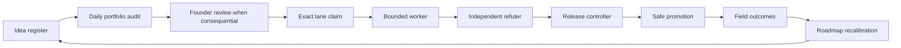

# WetinDey Operating System

**Status:** Founder-directed operating policy  
**Owner:** Dr. Dyrane Alexander  
**Operating controller:** Codex Controller  
**Current launch phase:** WetinDey Food Truth & Pilot Operations  
**Companion register:** [PORTFOLIO-AND-IDEA-REGISTER.md](PORTFOLIO-AND-IDEA-REGISTER.md)

## 1. Purpose

This document defines how WetinDey chooses work, assigns authority, executes bounded
changes, proves quality, promotes safely, and learns from field outcomes.

The operating model is Apple-inspired in one useful respect: durable functional expertise
owns standards, while temporary cross-functional groups own product outcomes. It is
startup-sized. A "chief" is an accountability hat, not a promise of a department,
executive title, or headcount. One qualified person or agent may hold several functional
hats. The independent refuter for an outcome must still be separate from its worker.

WetinDey exists to help a person understand the current state of nearby reality before
they leave. The current and sole launch phase proves that promise through Food price and
availability. Organization, software, data, maps, growth, and operations all serve that
truth outcome.

## 2. Non-negotiable operating doctrine

1. Dr. Dyrane is the Founder and final product authority.
2. The Codex Controller is the operating CEO/controller, not WetinDey's legal or corporate
   CEO and not a human corporate officer.
3. Functions own standards, specialist quality, and long-term capability.
4. Temporary squads own a bounded outcome, deadline, and evidence package.
5. `LANES.md` owns current path exclusivity. A plan, idea, ADR, squad, or conversation
   does not grant edit rights.
6. Consequential choices return to the Founder before implementation.
7. Accepted ADRs govern durable decisions. Proposed ADRs authorize review, not code.
8. Correctness, provenance, safety, and pilot operations come before category expansion
   or organization refactoring.
9. A worker cannot verify its own substantive work. An independent refuter defaults to
   `REFUTED` when evidence is thin.
10. A release is not safe because code exists, a build is green, or a commit landed.
    Promotion requires evidence tied to the exact candidate and target.
11. Synthetic, sample, inferred, reference-only, or demonstration data cannot become
    evidence of live Food truth or field success.
12. No function or squad may introduce fulfilment, delivery, dispatch, tracking, cart,
    checkout, or payment without a superseding accepted ADR.
13. Scope is added explicitly or not at all. Automation may surface choices; it may not
    silently make them.

## 3. Authority and precedence

### 3.1 Founder

Dr. Dyrane:

- sets product purpose, principles, risk appetite, and launch standard;
- makes final consequential product choices;
- accepts, rejects, or directs superseding ADRs;
- authorizes public launch phases, shared-environment migrations, and other actions that
  require exact human authorization;
- resolves irreducible cross-functional tradeoffs;
- remains the human authority for corporate, financial, employment, legal, and public
  commitments.

Final product authority does not mean silently bypassing the decision record. When an
accepted ADR must change, the Founder directs a superseding ADR before affected
implementation begins.

### 3.2 Codex Controller as operating CEO/controller

The Codex Controller:

- turns Founder direction into a coherent portfolio and operating sequence;
- runs the portfolio audit and prepares the Founder / Operating CEO review packet;
- checks that approved outcomes have narrow lanes, accountable functions, dependencies,
  non-goals, and proof plans;
- assigns bounded workers only within authorized paths;
- commissions independent refutation;
- reconciles handoffs and submits exact candidates to the release controller;
- monitors field and operating metrics;
- proposes roadmap recalibration to the Founder.

The Codex Controller is not the legal CEO. It cannot sign, bind, represent, employ, spend
for, or make regulated commitments on behalf of WetinDey. It cannot infer authorization
to access a shared database, migrate a target, push, deploy, process sensitive data, or
make a legal claim. It cannot override the Founder, an accepted ADR, exact lane ownership,
or a fail-closed safety gate.

### 3.3 Functional chiefs

A functional chief is accountable for standards and specialist judgement in one function.
The chief may execute work, but does not gain ownership of every related repository path.
Every implementation still needs a lane.

### 3.4 Source-of-truth order

For product and technical truth:

1. The code is evidence of what currently exists.
2. Accepted ADRs are the durable decision authority.
3. The accepted architecture of record governs beneath accepted ADRs.
4. The Bible and other plans provide constitution and context beneath those authorities.
5. Proposed ADRs and portfolio ideas are proposals only.

For coordination truth:

1. `LANES.md` is the current exclusive path-ownership contract.
2. The release controller is the current promotion authority within its explicit policy.
3. A roadmap or idea register cannot override either one.

When sources disagree, the mismatch is recorded and escalated. The auditor does not
"resolve" it by editing scope.

### 3.5 Durable memory and exact transfer state

When reconstructing work across tasks or branches, use this hierarchy without allowing a
lower artifact to impersonate a higher one:

1. Code is the final evidence of current implemented behavior.
2. Accepted ADRs govern durable decisions.
3. The accepted architecture of record describes the current system beneath code and
   accepted ADRs.
4. Git identifies immutable deltas and ancestry; it does not prove semantics or runtime
   truth.
5. `LANES.md` records current path locks, gates, and coordination state.
6. Department worklogs preserve durable rationale, process, implementation memory, and
   disclosed uncertainty.
7. A branch handoff packet records one exact pre-commit evidence tuple and, after
   commit, its reported base/head transfer state.

Pre-commit review binds to base SHA, canonical candidate-tree SHA-256, and a sorted exact
path list. The final commit SHA is reported after commit and need not self-reference inside
its own bytes. Department logs and handoff packets grant no path, decision, migration,
release, provider, push, or deployment authority. Their contract and reconciliation
procedure live in [DEPARTMENT-WORKLOG-PROTOCOL.md](DEPARTMENT-WORKLOG-PROTOCOL.md).

### 3.6 Active locks versus historical lane evidence

Root `LANES.md` is the required authoritative human coordination claim/index for current edits. It contains active exact human path claims, pathless blockers, and queued gates only, while remaining advisory to Git, filesystem, runtime, and platform enforcement rather than a technically enforced lock. Completed lane evidence is preserved under `docs/operations/lanes/history/` with a source snapshot commit and extracted record SHA-256; archives and department worklogs never grant a current claim. A handoff reconciles the active root index first, then cites an archive record only as historical evidence.

## 4. Current phase firewall

The only launch phase is:

> **WetinDey Food Truth & Pilot Operations**

The phase sequence is truth-correct Food reads and writes, safe release evidence, bounded
Food field operations, seller stewardship, controlled Food pilot outcomes, and only then
roadmap reconsideration.

Until the Food truth, safety, release, and operating gates are met:

- no additional category becomes a launch promise;
- no non-Food concept is forced through item, unit, price, offer, or seller semantics;
- no category capability registry or speculative module is created;
- no Yelp-like reviews, ratings, community feed, or reputation program launches;
- no paid, sponsored, or reward-driven status affects trust;
- no Lagos-wide coverage claim replaces bounded, measured pilot coverage.

Aboki FX, Nearby Presence, Reviews, and other named concepts may have tightly bounded
discovery, prototype, correction, or safety-containment squads. That does not make them a
launch phase, approved category, committed roadmap item, or active implementation lane.

## 5. Functional organization

Functions are permanent homes for standards and craft. Squads borrow their specialists;
they do not dissolve functional accountability.

These are the interim accountable holders at the current startup size. The Founder changes
an assignment through an explicit operating decision. An acting-chief assignment does not
claim repository paths. When the Controller is also a lane's worker, Quality/Release and
the independent refuter remain separately occupied.

| Function | Interim accountable chief | Chief's charter | Standards and owned questions | Food phase accountability |
|---|---|---|---|---|
| Product & Portfolio | Codex Controller | Choose the right problems in the right order | Product thesis, portfolio register, outcome framing, sequencing, non-goals, Founder packets | Keep one launch phase, expose tradeoffs, prevent silent scope |
| Human Interface | Dr. Dyrane | Make uncertainty calm, legible, and actionable | Dyrane UI/UX, Apple HIG adaptation, map-and-sheet coherence, interaction, content hierarchy, visual detail | Truthful freshness, coverage, conflict, empty, stale, offline, and action states |
| Consumer App | Codex Controller | Deliver the complete end-user experience | PWA behavior, state continuity, performance, offline behavior, client/server boundaries | One coherent Food journey from intent through decision and outcome |
| Data/Truth Platform | Codex Controller | Preserve semantic and evidentiary correctness | Typed claims, provenance, admissibility, freshness, conflict, projections, source independence | The same admissible Food truth on every live read and write surface |
| Trust & Safety | Codex Controller, with Founder authority for policy | Prevent trust inflation and harmful participation | Abuse controls, moderation policy, conflict handling, verification boundaries, reputation separation, appeals | No false-high confidence, fake moderation, paid trust, or circular validation |
| Maps/Location | Codex Controller | Maintain honest spatial context | Location permission, area selection, map/list/sheet synchronization, geospatial semantics, graceful map failure | A person can understand where evidence applies without hidden location assumptions |
| Platform/Database/SRE | Codex Controller | Keep the service and data safe and operable | Next.js/Vercel/Neon platform, migration lineage, reliability, observability, incident and recovery practice | Exact-target compatibility, safe data evolution, availability, and recoverability |
| Quality/Release | Dedicated Codex Release Controller instance; a fresh refuter remains separate | Refute claims and control promotion | Evidence design, test strategy, accessibility and browser proof, independent refutation, release controller | No candidate advances on self-review, static confidence, or missing artifacts |
| Security/Privacy/Legal | Dr. Dyrane, with qualified human counsel for legal conclusions | Bound harm and unsupported claims | Threat models, authorization, data minimization, retention, consent, legal copy, counsel handoff | Location, seller, contributor, evidence, and account behavior match approved facts |
| Food Operations | Dr. Dyrane until a Food operator is appointed | Operate the Food truth supply | Field collection, source review, item/variant/unit mapping, place quality, freshness, disputes | Dense, current, auditable truth for a bounded geography and catalog |
| Seller/Community Operations | Dr. Dyrane until a seller operator is appointed | Steward consented participation | Seller onboarding, contact consent, corrections, response handling, community operations policy | Safe seller correction and contact without fulfilment or invented consent |
| Localization/Accessibility | Codex Controller, with native-language and disability reviewers | Make the product usable across language and ability | Nigerian language review, plain language, keyboard, screen reader, motion, contrast, text scaling | Trust and action language remains understandable without color, English fluency, or precision tapping |
| Growth/Analytics | Codex Controller | Measure useful decisions, not attention | Event semantics, privacy-preserving instrumentation, experiment discipline, funnel and retention analysis | Verified Decision Sessions, outcome confirmation, wasted-trip learning, and coverage demand |

## 6. Lean mapping from Apple's functional model

This is an inspiration map, not a claim that WetinDey has Apple's scale, reporting lines,
or hundreds of specialists.

### 6.1 Complete Founder department crosswalk

The Founder-provided department inventory is authoritative input to this operating model.
Every listed department is classified below. The classification describes current
organizational posture, not a new team, title, lane, roadmap commitment, or permission to
hire.

| Classification | Meaning |
|---|---|
| Active now | The responsibility is required in the Food truth and pilot phase and has an explicit WetinDey functional home now; it need not be a standalone team. |
| Shared specialist | WetinDey retains the decision and accountability internally but brings in qualified human expertise when the question arises. |
| Future | Preserve the capability as a future organizational concern, but do not staff, activate, or create work for it during the current phase. |
| Not applicable until hardware exists | WetinDey is currently a software service and has no physical-device program to justify the discipline. |

| Founder-listed department | Classification | WetinDey functional home | Current boundary |
|---|---|---|---|
| Executive Leadership | Active now | Founder plus Codex Controller | Dr. Dyrane holds final product and human corporate authority. The Controller orchestrates operations but is not the legal CEO or a corporate officer. |
| HI Design | Active now | Human Interface | Founder-led product interaction, information hierarchy, visual design, content hierarchy, and Apple HIG adaptation across the map-and-sheet experience. |
| Software | Active now | Consumer App | The live PWA and complete Food user journey; no speculative module reorganization. |
| Frameworks | Future | Platform/Database/SRE | Use and govern current frameworks now, but do not create a standalone framework team or proprietary framework before repeated product needs justify it. |
| System Software | Future | Platform/Database/SRE | No operating-system, firmware, driver, or device-runtime product exists. Reassess only if platform depth or hardware scope materially changes. |
| Security | Active now | Security/Privacy/Legal plus Trust & Safety | Threat modeling, authorization, abuse resistance, secrets, data boundaries, and incident containment are current gates. |
| AI/ML | Future | Data/Truth Platform | No AI/ML organization is active. Future models must never turn synthetic, inferred, or generated output into observed local truth or earned trust. |
| Developer Tools | Active now | Platform/Database/SRE plus Quality/Release | Repository tooling, evidence harnesses, local workflows, and release diagnostics support current delivery; this is a responsibility, not a product line. |
| Cloud | Active now | Platform/Database/SRE | Vercel, Neon, storage, environments, target identity, observability, recovery, and cost discipline. |
| Maps | Active now | Maps/Location | Location permission, area context, spatial semantics, map/list/sheet agreement, and graceful map failure. |
| Services | Active now | Consumer App plus Data/Truth Platform | Server Actions and service boundaries serving authoritative Food reads and writes; no fulfilment services. |
| App Store/release | Active now | Quality/Release | Evidence-linked promotion, PWA release readiness, and future store requirements. No App Store submission is implied while WetinDey remains a PWA. |
| Operations | Active now | Food Operations plus Seller/Community Operations | Field truth collection, source review, catalog/place stewardship, seller consent, corrections, disputes, and bounded pilot execution. |
| Reliability | Active now | Platform/Database/SRE | Availability, latency, offline recovery, migration compatibility, incident response, restore evidence, and fail-closed behavior. |
| QE | Active now | Quality/Release | Test strategy, direct behavior evidence, accessibility/browser proof, independent refutation, and escaped-defect learning. |
| Privacy | Active now | Security/Privacy/Legal | Data minimization, consent, retention, location and identity boundaries, processor facts, and qualified-counsel handoffs. |
| Accessibility | Active now | Localization/Accessibility plus Quality/Release | Keyboard, screen reader, focus, motion, contrast, text scaling, touch targets, and task-completion evidence. |
| Localization | Active now | Localization/Accessibility | Plain language and Nigerian-language readiness with native-language review; no agent invents local-language copy. |
| Marketing | Active now | Product & Portfolio plus Growth/Analytics | Truthful positioning, pilot communication, demand learning, and launch claims. No broad acquisition campaign or unsupported coverage promise. |
| Developer Relations | Future | Product & Portfolio | Reassess when WetinDey exposes a supported external developer platform, API, SDK, or contributor ecosystem. Internal repository coordination is not Developer Relations. |
| Finance | Shared specialist | Founder with qualified finance/accounting support | Budget, accounting, tax, controls, and financial commitments require an authorized human; the Controller cannot spend or bind WetinDey. |
| Legal | Shared specialist | Security/Privacy/Legal | The Founder owns the handoff and approved posture; qualified human counsel supplies legal conclusions and regulated advice. |
| People | Shared specialist | Founder with qualified people/employment support | Hiring, employment, contractor, performance, and workplace commitments remain human decisions. No agent is a legal employee or people officer. |
| BI | Active now | Growth/Analytics | Decision-quality, coverage, field outcome, operational-load, reliability, and portfolio-flow reporting; no vanity dashboard or hidden worker scoring. |
| Product Management | Active now | Product & Portfolio | Product thesis, outcome framing, sequencing, non-goals, decision packets, field learning, and Founder review. |
| Program Management | Active now | Product & Portfolio, operated by the Codex Controller | Cross-functional sequencing, dependency and risk control, plan-to-lane reconciliation, handoffs, evidence flow, and decision follow-through without noisy task proliferation. |
| Hardware disciplines | Not applicable until hardware exists | No current functional home | Industrial/product hardware design, silicon, electrical, mechanical, wireless/RF, camera/imaging, acoustics, sensors, hardware manufacturing engineering, hardware QE, and hardware supply chain remain inactive unless the Founder authorizes a physical-device program. |

An Active-now classification does not create a lane. A Future classification does not
create discovery work. A Shared-specialist classification does not authorize the
Controller to retain, instruct, or impersonate a regulated professional. Hardware
disciplines remain absent rather than being folded into software roles.

### 6.2 Lean functional pattern

| Apple-inspired pattern | WetinDey adaptation | Startup constraint |
|---|---|---|
| Deep functional expertise | Thirteen explicit functional accountability hats | One person or agent may hold several hats |
| Functional leaders own craft | Chiefs define standards and approve functional evidence | Chiefs do not automatically own repository paths |
| Cross-functional product work | Temporary outcome squads borrow the needed functions | A squad exists only for one bounded result |
| Directly responsible individual | One squad lead and one lane owner are named | The lead may be the worker, never its sole refuter |
| Integrated product review | Founder reviews consequential end-to-end choices | A short decision packet replaces presentation theatre |
| Design is product, not decoration | Human Interface participates from framing through field outcome | UI cannot hide weak evidence with polish |
| Operations is a product capability | Food and Seller Operations sit beside software functions | Field truth is not delegated to an imaginary future team |
| Privacy and quality are built in | Security/Privacy/Legal and Quality/Release hold real gates | Neither becomes a final checklist at launch |
| Few priorities, high detail | One launch phase with bounded work in progress | Interesting ideas remain visible without becoming work |

When one person holds several hats, decisions are still labeled by hat. This makes hidden
conflicts visible and preserves the requirement for a separate refuter.

## 7. Temporary outcome squads

### 7.1 Squad rule

A squad is a temporary coalition, not a new permanent department. It receives:

- one measurable user or operating outcome;
- one accountable squad lead;
- participating functions and named functional chiefs;
- a fixed timebox or exit event;
- exact dependencies and non-goals;
- exact lane references for every edit;
- a decision and ADR inventory;
- an independent refuter;
- a release route;
- a field measurement plan;
- a dissolution or handback condition.

Functions continue to own standards and specialist development. The squad owns integration,
pace, and the outcome. When the outcome is achieved, parked, or refuted, specialists return
to functional priorities and all paths are explicitly released or handed off.

The squad lead is accountable for the bounded outcome after chartering. For every
substantive candidate, the squad lead, bounded worker, independent refuter, and dedicated
Codex Release Controller are four separately occupied people or agent instances. Functional
chief hats may be combined; these four delivery and assurance roles may not be combined.

### 7.2 Operating squad roster

The squad lead coordinates the outcome; the bounded worker is named separately in each
activated lane. "Fresh refuter" means a person or agent that did not produce the candidate.

| Outcome squad | Status and accountable lead | Timebox or exit event | Core functions | Refuter, release, and field evidence | Lane posture |
|---|---|---|---|---|---|
| Food Truth | Current launch outcome; Codex Controller | Until the Stage 0 truth gate and Founder disposition | Product & Portfolio, Consumer App, Data/Truth Platform, Trust & Safety, Quality/Release, Food Operations | Fresh refuter per candidate; Release Controller; cross-surface truth, false-high, outcome, and wasted-trip evidence | Only exact paths currently granted by `LANES.md` |
| Food Pilot Operations | Gated next outcome; Dr. Dyrane until a Food operator is appointed | Activates after the truth gate; dissolves or resets at bounded-pilot disposition | Food Operations, Seller/Community Operations, Data/Truth Platform, Growth/Analytics, Security/Privacy/Legal | Fresh operational and release refuters; Release Controller; coverage, correction, seller, successful-errand, and operator-load evidence | No implementation paths until separately activated in `LANES.md` |
| Aboki FX | Launch parked; Codex Controller leads portfolio discovery only | Next explicit Founder portfolio disposition, otherwise remains parked | Product & Portfolio, Human Interface, Data/Truth Platform, Security/Privacy/Legal | Fresh refuter for any authorized prototype; Release Controller if promotion is separately authorized; no Food launch metric credit | No lane or launch authority implied |
| Nearby Presence | Containment completed; `0012`, Contribution `0013`, and shared-target `0014` are independently passed/applied on Preview and Production; runtime remains default-off | Until the bounded design is reviewed and the Founder separately authorizes or declines a next stage | Maps/Location, Trust & Safety, Security/Privacy/Legal, Platform/Database/SRE, Quality/Release | Fresh privacy/abuse refuter and Release Controller remain required; counsel, safety responder, rate budgets, retention, lifecycle, exposure, abuse, and deletion evidence remain gates | Migration PASS authorizes no pilot traffic or public rollout; any later work requires exact lanes, the default-off app flag, database kill switch, two-account Festac allowlist, privacy/safety evidence, and separate pilot authorization |
| Reviews | Launch parked and integrity containment only; Codex Controller acting as Trust & Safety chief | Until Stage 4 prerequisites receive a new Founder review | Trust & Safety, Seller/Community Operations, Security/Privacy/Legal, Quality/Release | Fresh identity/moderation/abuse refuter; Release Controller; no community field launch before gates | No lane or launch authority implied |

This roster creates operating accountability, not repository ownership. `LANES.md` alone
says whether any squad currently has authorized paths.

## 8. The exact operating cadence

### Step 1: Idea

Every uncommitted possibility starts in the
[Portfolio and Idea Register](PORTFOLIO-AND-IDEA-REGISTER.md). Capture the problem,
beneficiary, hypothesis, evidence grade, current phase relevance, risks, dependencies, and
next discovery action.

An idea is not a promise, roadmap item, lane, ADR, implementation, or release.

### Step 2: Daily portfolio audit

The daily portfolio auditor compares all documented plans against the current
`LANES.md`. It reads the register, roadmap and architecture plans, ADR status, release
records, and current lane claims. It prepares a Founder / Operating CEO review packet.

The auditor may identify:

- a documented active plan with no lane;
- a lane with no approved outcome or expired scope;
- overlapping or orphaned ownership;
- proposed ADR language being treated as accepted;
- completed code with missing independent evidence;
- release evidence that does not match the exact candidate;
- non-Food or community scope leaking into the Food launch phase;
- a field blocker that changes portfolio priority;
- a stale, duplicate, or contradictory documented plan.

The auditor does not silently add an idea, advance a stage, claim a lane, accept an ADR,
assign a worker, edit a roadmap, or authorize a release. It proposes explicit deltas in the
packet. A human or authorized controller records the resulting decision after review.

### Step 3: Founder review for consequential choices

The Founder reviews choices that change:

- product scope, phase, or public promise;
- domain meaning or a shared interaction contract;
- trust, confidence, moderation, verification, reputation, or reward policy;
- category launch or Yelp-like community scope;
- external APIs, maps architecture, databases, migrations, or deployment posture;
- privacy, security, legal, retention, consent, or regulated behavior;
- a difficult-to-reverse architecture or material operating commitment;
- a tradeoff where functions cannot protect all critical outcomes.

The packet presents a recommendation, alternatives, evidence, reversibility, affected ADRs,
risks, and the exact decision requested. Silence is not approval. Consequential approval is
recorded, and an ADR is written or superseded when repository policy requires one.

Routine, reversible discovery inside an already approved boundary may be decided by the
accountable functional chief and reported in the next packet.

### Step 4: Lane claim

Only after the outcome and decisions are ready does the controller request or record an
exact lane in `LANES.md`. The claim names:

- owner and bounded worker;
- exact paths;
- mission and expected outcome;
- dependencies and exclusions;
- decision and ADR basis;
- evidence and refutation plan;
- handoff and release condition.

A lane is a lock, not permission to widen scope. If required paths are owned elsewhere,
the work waits for an explicit handoff.

### Step 5: Bounded worker

The worker edits only claimed paths, preserves concurrent work, and owns the complete live
slice promised by the lane. New code must reach a real call site in the same change.

The worker produces an implementation handoff containing:

- exact candidate commit or tree;
- exact changed paths;
- behavior claimed;
- decisions and assumptions;
- evidence produced;
- checks not run or behavior not proven;
- migration, privacy, accessibility, and operational effects;
- residual risks and explicit non-goals.

When work must continue in another task or branch, the worker also records the durable
rationale in the one lane-owned functional-home log and prepares
[the exact branch handoff packet](BRANCH-HANDOFF-TEMPLATE.md). The receiver performs
read-only reconciliation of ancestry, the full diff path set, migration/provider/
deployment state, the independent verdict, conflicts, and current `LANES.md`. Current
`LANES.md` and applicable safety gates alone govern edits. Receiver acknowledgement is a
separate append-only follow-up record/commit under its own exact log lane after receipt;
it never unlocks editing. Neither artifact widens either worker's lane.

### Step 6: Independent refuter

The refuter receives the lane, decisions, candidate, claimed behavior, proof plan, and
non-goals. The refuter:

- is not the worker;
- is read-only unless given a separate repair lane;
- tries to disprove the claim rather than confirm effort;
- checks the exact candidate and relevant environment;
- reports `REFUTED` when evidence is missing, stale, indirect, or self-produced;
- records actionable findings and residual uncertainty;
- ties a `NOT_REFUTED` verdict to immutable evidence where practical.

A refutation finding returns to a bounded repair lane. The original worker does not
silently patch outside that process.

### Step 7: Release controller

The release controller reconciles the exact candidate with `LANES.md`, handoffs,
independent evidence, migration compatibility, security/privacy/legal gates, and current
push authority. One blocker produces `NO PUSH`.

Documentation-only work does not bypass the controller because a push may deploy the
entire current `HEAD`. The controller never interprets a local commit as permission to
push or deploy.

### Step 8: Safe promotion

Promotion follows the narrowest authorized route:

1. preserve the exact reviewed candidate;
2. apply separately authorized exact-target data changes before dependent code when
   required;
3. promote only to an authorized environment;
4. verify target identity and rollout order;
5. observe safety, truth, and service guardrails;
6. expand exposure only when evidence permits;
7. stop and preserve evidence when a gate fails.

Shared database access, migration, push, production deployment, destructive work, and
rollback each require their own current authority. A rollback is a new release, not a
substitute for prevention.

### Step 9: Field outcomes

The squad measures what happened to people and operations, not just whether software
rendered:

- Was the Food item and exact unit present?
- Was the displayed state still current?
- Did the trip succeed or waste time and transport cost?
- Did the seller correction improve a later answer?
- Was coverage honestly represented?
- Did conflicts, abuse, privacy issues, or operational debt emerge?

Only admissible real outcomes inform Food truth, reputation learning, and launch metrics.
Demonstration and synthetic activity remains excluded.

### Step 10: Roadmap recalibration

Product & Portfolio and the Controller compare field outcomes with the phase hypothesis.
They recommend to the Founder:

- continue;
- narrow;
- repair;
- resequence;
- park;
- reject;
- or graduate the phase.

The authorized roadmap owner records the decision. The daily auditor never performs this
step autonomously. Recalibration returns new possibilities to the idea register rather
than silently creating lanes.

## 9. Artifact contract: intent is not execution

| Artifact | Question it answers | Authority it grants | What it cannot do |
|---|---|---|---|
| Idea register | What might be worth learning or doing? | Visibility and a next review action | Commit scope, reserve paths, or promise delivery |
| Roadmap | In what sequence may approved outcomes be pursued? | Portfolio intent and dependency order | Claim a path, settle an ADR, or prove readiness |
| Lane | Who may edit exactly which paths for what bounded mission? | Temporary exclusive path ownership | Change product policy or imply release |
| ADR | What durable consequential decision governs? | Decision authority when accepted | Implement itself, claim paths, or prove behavior |
| Implementation | What changed in the product or operations? | A candidate result inside its lane | Prove correctness or authorize promotion |
| Release evidence | What was independently proven about an exact candidate and target? | Input to a release decision | Replace missing authority or widen scope |
| Release decision | May this exact candidate be promoted now? | `PUSH`, `NO PUSH`, or a narrower authorized promotion | Rewrite product scope or migration history |
| Field outcome | What happened after real use or operation? | Evidence for learning and recalibration | Automatically change trust, reputation, or roadmap |
| Department worklog | Why and how did a functional home proceed, and what remains known or unknown? | Durable append-only rationale, process, implementation memory, and next action | Claim paths, override code/ADRs/architecture, prove runtime truth, or authorize integration |
| Branch handoff packet | What exact base/head state is offered to a named receiver? | A reviewable transfer record after receiver reconciliation | Grant a lane, prove correctness, mutate external state, or remain valid after the candidate changes |

No artifact may impersonate the next one.

### 9.1 Department memory and branch reconciliation

Use one append-only file per active functional home under [`departments/`](departments/README.md), not a shared hot log. A bootstrap entry records full base SHA, canonical candidate-tree SHA-256, sorted exact paths, exact lane text, evidence ID, and refuter ID. The worker/controller reports the commit SHA afterward; the entry does not self-reference.

Before integration, the receiver proves ancestry, candidate hash, changed paths, external state, verdict tuple, conflicts, and current lane. Receiver acknowledgement is a separate append-only follow-up commit after receipt under its own log lane. It is never a pre-edit requirement and grants no path. Any changed tuple or unresolved fact defaults to `REFUTED`.

## 10. Decision rights and RACI

**RACI:** `R` does the work, `A` is answerable for the decision, `C` must be consulted,
and `I` is informed. `AC` is the named acting chief in Section 5, `SL` the squad lead, `W`
the bounded worker, `IR` the independent refuter, `RC` the release controller, and `FO`
the relevant field operator. Each row has one accountable role.

| Decision or action | Founder | Controller | AC | SL | W | IR | RC | FO |
|---|---|---|---|---|---|---|---|---|
| Capture or triage an idea | I | A/R | C | I | I | I | I | C |
| Authorize bounded reversible discovery | I | C | A | R | I | I | I | C |
| Change product scope, phase, or public promise | A | R | C | I | I | C | I | C |
| Accept or supersede an ADR | A | R | C | I | I | C | I | C |
| Set a consequential shared interaction direction | A | C | R by Human Interface | C | I | C | I | C |
| Resolve routine interaction craft inside an accepted boundary | I | I | A by Human Interface | C | R | C | I | C |
| Change truth, confidence, or trust policy | A | C | R by Data/Truth and Trust & Safety | C | I | C | I | C |
| Approve security, privacy, or legal posture | A with qualified human counsel where required | C | R by Security/Privacy/Legal | C | I | C | I | C |
| Prioritize the roadmap | A | R | C | I | I | I | I | C |
| Charter a routine bounded squad inside an approved phase | I | A/R | C | C | I | I | I | C |
| Charter a consequential or new-phase squad | A | R | C | C | I | I | I | C |
| Own a chartered squad's bounded outcome | I | C | C | A | R | I | I | C |
| Claim or hand off an exact lane | I | A/R | C | C | I | I | I | I |
| Execute a bounded implementation | I | I | A | C | R | I | I | C |
| Refute an exact candidate | I | I | A by Quality/Release | I | I | R | C | C |
| Decide `PUSH` or `NO PUSH` under standing policy | I | C | C | I | I | C | A/R | I |
| Authorize a shared migration or production action | A through exact authorization | C | R by Platform/Database/SRE | C | R inside an exact lane | C | C | I |
| Activate or expand a controlled Food pilot | A | R | C | C | I | C | C | R |
| Recalibrate from field outcomes | A | R | C | C | I | C | I | C |
| Make a corporate, financial, employment, or legal commitment | A or a legally designated human | No authority | C where relevant | I | I | I | I | I |

One person or agent may occupy multiple functional-chief hats, and the record identifies
the hat used. For substantive work, `SL`, `W`, `IR`, and `RC` are four separately occupied
people or agent instances. The dedicated Codex Release Controller may not lead the squad,
produce the candidate, or supply its refutation.

## 11. Meeting and automation cadence

Async evidence is the default. A "meeting" may be a written packet plus an explicit
decision when only one human is required.

| Cadence | Forum or automation | Owner | Required output | Autonomous limit |
|---|---|---|---|---|
| Hourly when enabled | Git release-controller review | RC | Exact `PUSH` or `NO PUSH` record | Cannot create correctness, lane ownership, migration authority, push authority, or deployment authority |
| Daily | Portfolio auditor | Controller | Founder / Operating CEO review packet with plan-to-lane deltas | Read-only analysis; cannot add scope or change status |
| Daily during field activity | Food truth operations pulse | Food Operations | Coverage gaps, stale areas, disputes, safety issues, today's bounded priorities | Cannot change public truth policy or widen geography |
| Twice weekly | Founder / Controller portfolio review | Founder | Recorded decisions, requested ADRs, priority changes, and explicit non-decisions | Silence and absence never approve |
| Weekly | Functional integration review | Controller with FCs | Cross-functional blockers, standards conflicts, lane candidates, evidence needs | Does not replace lane or Founder authority |
| Weekly during pilot | Field outcome and coverage review | Food Operations and Growth/Analytics | Outcome cohort, coverage honesty, wasted trips, corrections, operator load | Synthetic/sample activity excluded |
| Per lane | Kickoff, handoff, independent refutation | SL, W, IR | Bounded charter, implementation handoff, verdict | Worker cannot self-approve |
| Per candidate | Release review | RC | Exact evidence-linked promotion decision | One uncertainty means `NO PUSH` |
| Monthly or at phase exit | Strategy and roadmap recalibration | Founder and Controller | Continue, narrow, repair, resequence, park, reject, or graduate | No new launch phase without explicit Founder decision |
| Immediate | Incident and stop-work escalation | First observer, Controller, relevant FC | Preserved evidence, containment, owner, next decision | No force operation or silent rollback |

### Daily Founder / Operating CEO packet

The packet is short and decision-oriented:

1. Current launch phase and top outcome.
2. Changes since the prior packet.
3. Portfolio-to-`LANES.md` discrepancies.
4. Active lane health, blocked handoffs, and work-in-progress count.
5. Consequential decisions requested, each with recommendation and alternatives.
6. Refutations, release blockers, incidents, and missing evidence.
7. Food truth, coverage, safety, and operating metric movement.
8. Proposed roadmap changes, clearly marked as proposals.
9. Explicitly deferred scope.

## 12. Escalation rules

### 12.1 Stop immediately and preserve evidence

Stop work and alert the Controller plus the relevant chief when any of these appears:

- overlapping or unexpected path ownership;
- an unauthorized shared database, migration, push, deploy, secret, destructive, or force
  operation;
- possible data loss, privacy exposure, account or location leakage, or security incident;
- a public false-high, stale-as-current, synthetic-as-live, or materially inconsistent
  truth claim;
- a proposed ADR treated as accepted;
- a release candidate that differs from the refuted candidate;
- evidence of user, seller, contributor, or operator harm.

Containment may proceed only inside an explicitly authorized safety lane. Preserve logs and
facts without collecting unnecessary sensitive data.

### 12.2 Escalate to the Founder before proceeding

Pause for a Founder decision when:

- the choice is consequential under Step 3;
- two functions cannot satisfy their standards simultaneously;
- the current Food phase would gain a new outcome, geography, category, or public promise;
- a gate would be waived, redefined, or bypassed;
- a legal/counsel question changes product behavior;
- field evidence invalidates the phase hypothesis.

### 12.3 Resolve within the function

The accountable chief may resolve reversible craft choices within accepted decisions,
lane scope, and quality standards. Record material assumptions in the worker handoff and
surface recurring choices in the next portfolio packet.

### 12.4 Never escalate by widening

An escalation does not permit extra files, a speculative abstraction, an adjacent feature,
or an unapproved workaround. Narrow, wait, hand off, or return to the portfolio.

## 13. Quality bar

### 13.1 Ready for a lane

An outcome is lane-ready only when it has:

- an Approved portfolio decision or an explicitly authorized containment reason;
- a named user or operator problem and measurable outcome;
- current-phase relevance;
- decisions and ADR status identified;
- exact paths and current owners checked;
- dependencies, non-goals, privacy/security/legal effects, and migration effects;
- a complete live-slice plan;
- a separate refuter and evidence plan;
- a release route and field measurement plan.

### 13.2 Ready for refutation

A candidate is ready for refutation only when:

- the worker has stopped editing the exact candidate;
- changed paths match the lane;
- behavior claims are specific;
- evidence and known gaps are disclosed;
- empty, loading, error, stale, offline, denied, conflict, and abuse states are addressed
  where applicable;
- light/dark, keyboard, screen reader, reduced-motion, touch-target, and text-scaling
  obligations are addressed where applicable;
- data semantics, source provenance, privacy, security, legal copy, and operational
  effects are addressed where applicable;
- no new export or architecture is left unwired.

### 13.3 Ready for promotion

A candidate is promotion-ready only when:

- the independent verdict is not refuted for every applicable claim;
- evidence belongs to the exact candidate and environment;
- all lane paths are handed off or released;
- the release controller's strict criteria pass;
- exact-target migration compatibility and authorization pass when applicable;
- no critical residual risk is hidden by a build, static check, or documentation claim;
- rollout, observation, containment, and forward-repair plans are explicit.

### 13.4 Ready to call the field outcome complete

Software completion is not outcome completion. A Food outcome closes only when bounded
real-world evidence shows whether the decision was useful and truthful, operating burden
is understood, harms and disputes are controlled, and the Founder accepts the next
portfolio disposition.

## 14. Operating metrics

Targets are set after a trustworthy baseline exists. The operating system does not invent
precision before instrumentation. Every metric names its source, admissible population,
window, owner, and limitation.

| Metric family | Measures | Core measures | Guardrail |
|---|---|---|---|
| North star | Useful trusted decisions | Verified Decision Sessions | Do not report until the event and admissibility path exist |
| Truth | Whether the answer deserved belief | False-high rate, stale-as-current rate, provenance leakage, cross-surface disagreement, conflict visibility | Synthetic/sample/reference activity excluded |
| Field outcome | Whether the trip worked | Successful errand rate, wasted-trip rate, one-tap confirmation rate, time-to-outcome | No hidden continuous location tracking |
| Coverage | Where WetinDey can answer honestly | Fresh admissible coverage by geography, catalog, unit, and time; honest no-answer rate | Breadth never substitutes for freshness or source quality |
| Food operations | Cost and health of truth supply | Observation review time, source mix, mapping backlog, dispute age, correction resolution | Operator throughput cannot auto-approve unsafe data |
| Seller operations | Safe seller participation | Consented-contact coverage, correction response, confirmed correction outcome, abuse rate | Payment or status cannot raise trust |
| Trust & safety | Harm and manipulation | Conflict rate, duplicate/correlation rate, moderation reversal, abuse reports, privacy/security incidents | No universal reputation or hidden fraud score |
| Quality & release | Confidence in change | Refutation rate, escaped blocker rate, evidence completeness, failed promotions, incident recovery | A green build alone is never counted as proof |
| Reliability | Service and data operability | Availability, action failure, latency, offline recovery, migration compatibility, data repair events | Exact target and user-impact window required |
| Portfolio | Focus and flow | Active WIP, idea aging, approved-to-lane lead time, blocked days, plan-to-lane drift | More active work is not success |
| Growth | Repeated useful value | Qualified activation, verified-decision repeat, outcome-return rate, bounded-area retention | Page views and raw signups are diagnostics, not the north star |
| Accessibility/localization | Equitable task completion | Keyboard and screen-reader completion, language comprehension, text-scale failures, accessibility defects | Automated checks do not replace manual use |

### 14.1 Food pilot gate dashboard

The Founder / Operating CEO packet reports:

- bounded geography and catalog definition;
- fresh admissible coverage and honest gaps;
- false-high and wasted-trip evidence;
- conflicts, corrections, and dispute backlog;
- seller contact consent and correction health;
- contribution integrity and source independence;
- privacy, security, accessibility, and legal blockers;
- release evidence completeness and current promotion posture;
- operator workload and sustainability;
- explicit reasons not to expand.

No metric individually opens the pilot or a new category. The Founder decides against the
whole gate, with independent evidence and current operating capacity.

## 15. Operating-system change control

This document may be improved through a path-scoped governance lane. A change that alters
product scope, domain meaning, shared interaction, trust, external infrastructure, privacy,
security, or another ADR-governed choice requires the corresponding Founder decision and
ADR process.

The operating system must remain smaller than the work it governs. Remove ceremonies that
do not improve decisions, safety, quality, or learning. Do not remove authority,
independent refutation, or evidence merely to make work appear faster.
